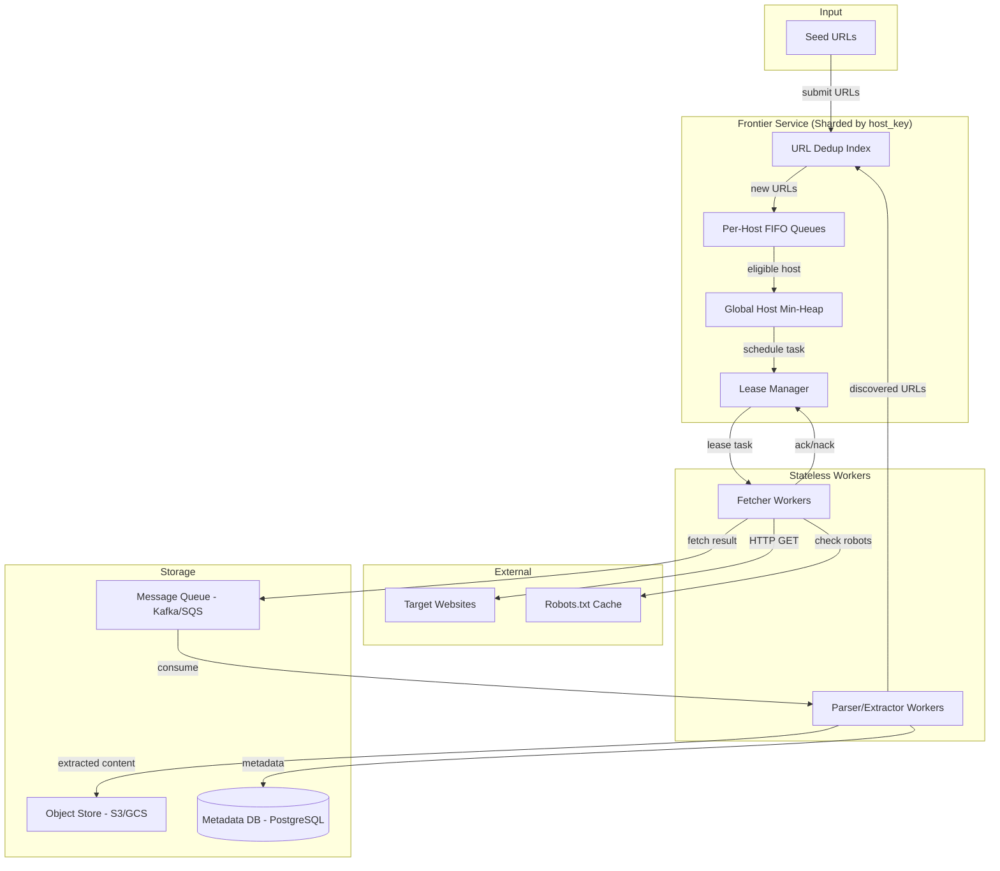
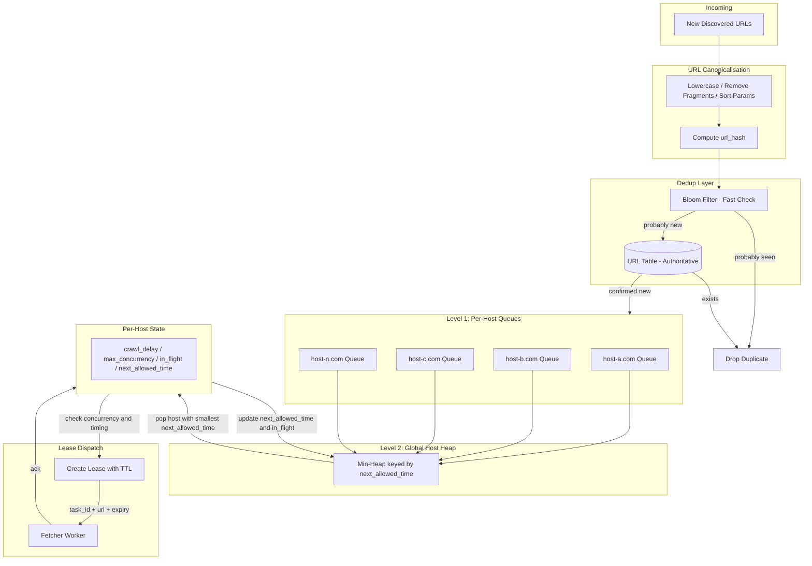
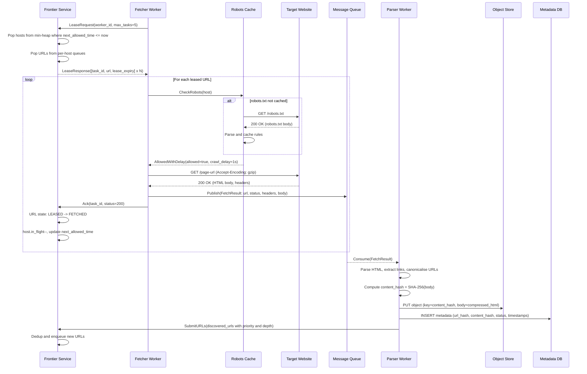

# Web Crawler — Architecture Diagrams

## 1. High-Level Architecture

```mermaid
flowchart TB
    subgraph Input
        Seeds[Seed URLs]
    end

    subgraph Frontier["Frontier Service (Sharded by host_key)"]
        URLDedup[URL Dedup Index]
        HostHeap[Global Host Min-Heap]
        HostQueues[Per-Host FIFO Queues]
        LeaseManager[Lease Manager]
    end

    subgraph Workers["Stateless Workers"]
        Fetchers[Fetcher Workers]
        Parsers[Parser/Extractor Workers]
    end

    subgraph External
        Web[Target Websites]
        RobotsCache[Robots.txt Cache]
    end

    subgraph Storage
        ObjStore[Object Store - S3/GCS]
        MetadataDB[(Metadata DB - PostgreSQL)]
        MQ[Message Queue - Kafka/SQS]
    end

    Seeds -->|submit URLs| URLDedup
    URLDedup -->|new URLs| HostQueues
    HostQueues -->|eligible host| HostHeap
    HostHeap -->|schedule task| LeaseManager
    LeaseManager -->|lease task| Fetchers
    Fetchers -->|check robots| RobotsCache
    Fetchers -->|HTTP GET| Web
    Fetchers -->|fetch result| MQ
    MQ -->|consume| Parsers
    Parsers -->|discovered URLs| URLDedup
    Parsers -->|extracted content| ObjStore
    Parsers -->|metadata| MetadataDB
    Fetchers -->|ack/nack| LeaseManager
```

## 2. Frontier Two-Level Scheduler — Deep Dive

```mermaid
flowchart TB
    subgraph Incoming
        NewURLs[New Discovered URLs]
    end

    subgraph DedupLayer["Dedup Layer"]
        BloomFilter[Bloom Filter - Fast Check]
        DBCheck[(URL Table - Authoritative)]
    end

    subgraph Canonicalizer["URL Canonicalisation"]
        Normalize[Lowercase / Remove Fragments / Sort Params]
        Hash[Compute url_hash]
    end

    subgraph Level1["Level 1: Per-Host Queues"]
        HQ1[host-a.com Queue]
        HQ2[host-b.com Queue]
        HQ3[host-c.com Queue]
        HQN[host-n.com Queue]
    end

    subgraph Level2["Level 2: Global Host Heap"]
        MinHeap[Min-Heap keyed by next_allowed_time]
    end

    subgraph HostState["Per-Host State"]
        HS[crawl_delay / max_concurrency / in_flight / next_allowed_time]
    end

    subgraph LeaseOut["Lease Dispatch"]
        Lease[Create Lease with TTL]
        Worker[Fetcher Worker]
    end

    NewURLs --> Normalize
    Normalize --> Hash
    Hash --> BloomFilter
    BloomFilter -->|probably new| DBCheck
    BloomFilter -->|probably seen| Drop[Drop Duplicate]
    DBCheck -->|confirmed new| Level1
    DBCheck -->|exists| Drop

    HQ1 --> MinHeap
    HQ2 --> MinHeap
    HQ3 --> MinHeap
    HQN --> MinHeap

    MinHeap -->|pop host with smallest next_allowed_time| HostState
    HostState -->|check concurrency and timing| Lease
    Lease -->|task_id + url + expiry| Worker

    Worker -->|ack| HostState
    HostState -->|update next_allowed_time and in_flight| MinHeap
```

## 3. Page Fetch and Process — Sequence Diagram

```mermaid
sequenceDiagram
    participant F as Frontier Service
    participant W as Fetcher Worker
    participant R as Robots Cache
    participant T as Target Website
    participant MQ as Message Queue
    participant P as Parser Worker
    participant S as Object Store
    participant DB as Metadata DB

    W->>F: LeaseRequest(worker_id, max_tasks=5)
    F->>F: Pop hosts from min-heap where next_allowed_time <= now
    F->>F: Pop URLs from per-host queues
    F-->>W: LeaseResponse([task_id, url, lease_expiry] x N)

    loop For each leased URL
        W->>R: CheckRobots(host)
        alt robots.txt not cached
            R->>T: GET /robots.txt
            T-->>R: 200 OK (robots.txt body)
            R->>R: Parse and cache rules
        end
        R-->>W: AllowedWithDelay(allowed=true, crawl_delay=1s)

        W->>T: GET /page-url (Accept-Encoding: gzip)
        T-->>W: 200 OK (HTML body, headers)

        W->>MQ: Publish(FetchResult: url, status, headers, body)
        W->>F: Ack(task_id, status=200)
        F->>F: URL state: LEASED -> FETCHED
        F->>F: host.in_flight--, update next_allowed_time
    end

    MQ-->>P: Consume(FetchResult)
    P->>P: Parse HTML, extract links, canonicalise URLs
    P->>P: Compute content_hash = SHA-256(body)
    P->>S: PUT object (key=content_hash, body=compressed_html)
    P->>DB: INSERT metadata (url_hash, content_hash, status, timestamps)
    P->>F: SubmitURLs(discovered_urls with priority and depth)
    F->>F: Dedup and enqueue new URLs
```
