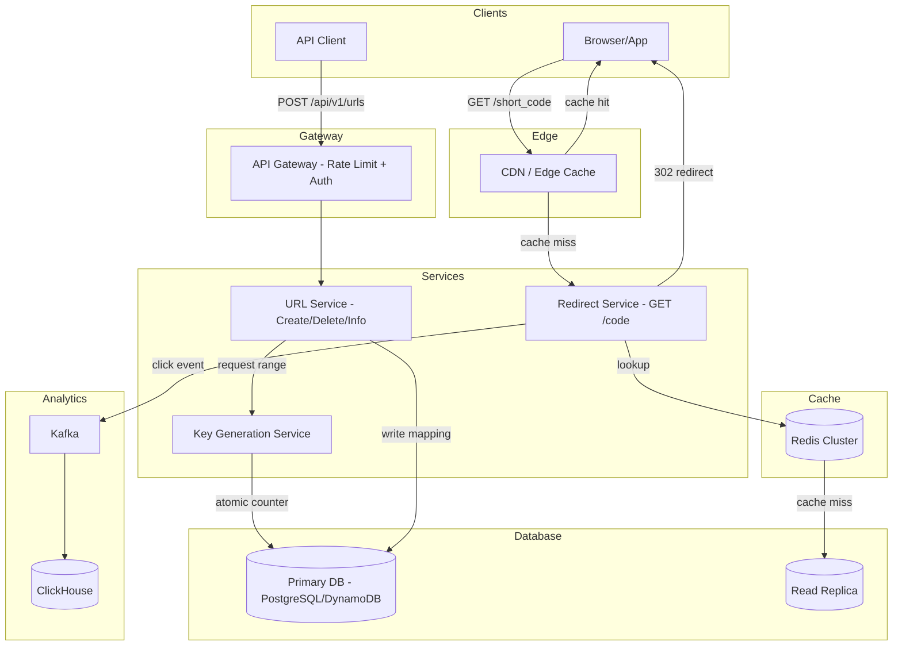
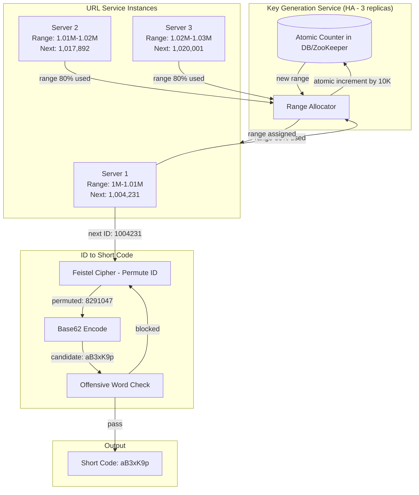
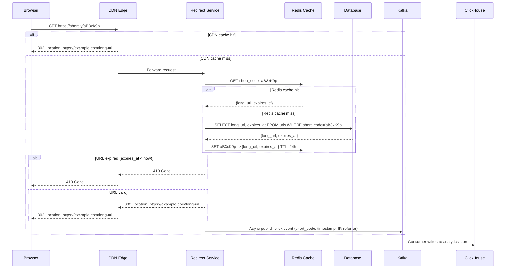

# URL Shortener — Architecture Diagrams

## 1. High-Level Architecture

```mermaid
flowchart TB
    subgraph Clients
        Browser[Browser/App]
        APIClient[API Client]
    end

    subgraph Edge
        CDN[CDN / Edge Cache]
    end

    subgraph Gateway
        APIGW[API Gateway - Rate Limit + Auth]
    end

    subgraph Services
        URLService[URL Service - Create/Delete/Info]
        RedirectService[Redirect Service - GET /code]
        KGS[Key Generation Service]
    end

    subgraph Cache
        Redis[(Redis Cluster)]
    end

    subgraph Database
        PrimaryDB[(Primary DB - PostgreSQL/DynamoDB)]
        ReadReplica[(Read Replica)]
    end

    subgraph Analytics
        Kafka[Kafka]
        ClickHouse[(ClickHouse)]
    end

    Browser -->|GET /short_code| CDN
    CDN -->|cache miss| RedirectService
    APIClient -->|POST /api/v1/urls| APIGW
    APIGW --> URLService
    URLService -->|request range| KGS
    KGS -->|atomic counter| PrimaryDB
    URLService -->|write mapping| PrimaryDB
    RedirectService -->|lookup| Redis
    Redis -->|cache miss| ReadReplica
    RedirectService -->|click event| Kafka
    Kafka --> ClickHouse
    CDN -->|cache hit| Browser
    RedirectService -->|302 redirect| Browser
```

## 2. Key Generation Service — Deep Dive

```mermaid
flowchart TB
    subgraph KGS["Key Generation Service (HA - 3 replicas)"]
        Counter[(Atomic Counter in DB/ZooKeeper)]
        RangeAlloc[Range Allocator]
    end

    subgraph AppServers["URL Service Instances"]
        AS1[Server 1<br/>Range: 1M-1.01M<br/>Next: 1,004,231]
        AS2[Server 2<br/>Range: 1.01M-1.02M<br/>Next: 1,017,892]
        AS3[Server 3<br/>Range: 1.02M-1.03M<br/>Next: 1,020,001]
    end

    subgraph Encoding["ID to Short Code"]
        Feistel[Feistel Cipher - Permute ID]
        Base62[Base62 Encode]
        Blocklist[Offensive Word Check]
    end

    subgraph Output
        ShortCode[Short Code: aB3xK9p]
    end

    AS1 -->|range 80% used| RangeAlloc
    AS2 -->|range 80% used| RangeAlloc
    AS3 -->|range 80% used| RangeAlloc
    RangeAlloc -->|atomic increment by 10K| Counter
    Counter -->|new range| RangeAlloc
    RangeAlloc -->|range assigned| AppServers

    AS1 -->|next ID: 1004231| Feistel
    Feistel -->|permuted: 8291047| Base62
    Base62 -->|candidate: aB3xK9p| Blocklist
    Blocklist -->|pass| ShortCode
    Blocklist -->|blocked| Feistel
```

## 3. URL Redirect — Sequence Diagram

```mermaid
sequenceDiagram
    participant B as Browser
    participant CDN as CDN Edge
    participant RS as Redirect Service
    participant RC as Redis Cache
    participant DB as Database
    participant K as Kafka
    participant CH as ClickHouse

    B->>CDN: GET https://short.ly/aB3xK9p

    alt CDN cache hit
        CDN-->>B: 302 Location: https://example.com/long-url
    else CDN cache miss
        CDN->>RS: Forward request
        RS->>RC: GET short_code=aB3xK9p

        alt Redis cache hit
            RC-->>RS: {long_url, expires_at}
        else Redis cache miss
            RS->>DB: SELECT long_url, expires_at FROM urls WHERE short_code='aB3xK9p'
            DB-->>RS: {long_url, expires_at}
            RS->>RC: SET aB3xK9p -> {long_url, expires_at} TTL=24h
        end

        alt URL expired (expires_at < now)
            RS-->>CDN: 410 Gone
            CDN-->>B: 410 Gone
        else URL valid
            RS-->>CDN: 302 Location: https://example.com/long-url
            CDN-->>B: 302 Location: https://example.com/long-url
        end

        RS->>K: Async publish click event (short_code, timestamp, IP, referrer)
    end

    K-->>CH: Consumer writes to analytics store
```
