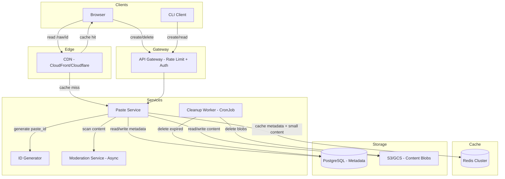
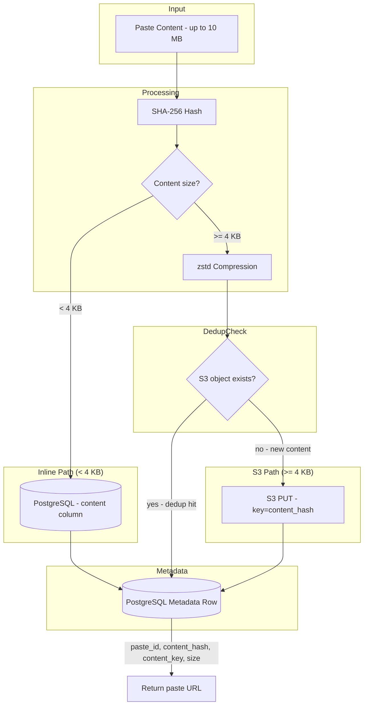
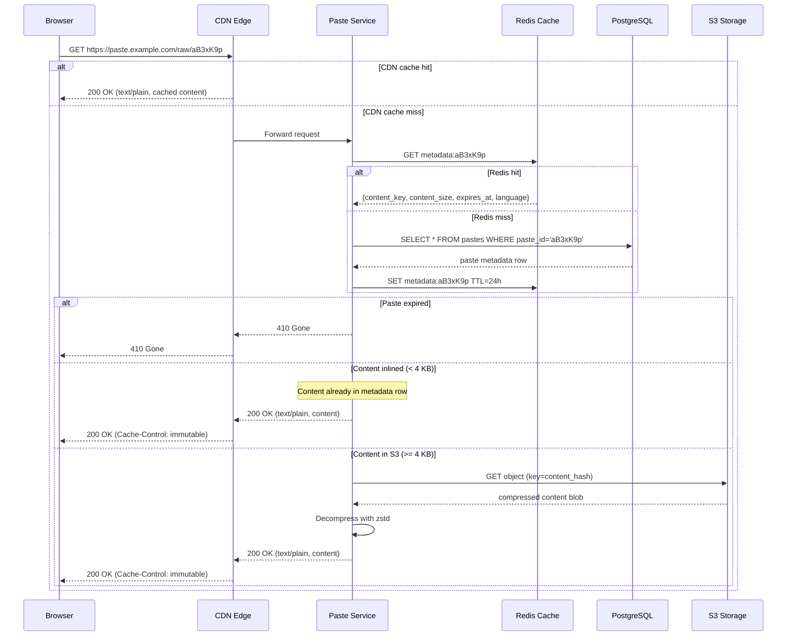

# Pastebin — Architecture Diagrams

## 1. High-Level Architecture

```mermaid
flowchart TB
    subgraph Clients
        Browser[Browser]
        CLI[CLI Client]
    end

    subgraph Edge
        CDN[CDN - CloudFront/Cloudflare]
    end

    subgraph Gateway
        APIGW[API Gateway - Rate Limit + Auth]
    end

    subgraph Services
        PasteService[Paste Service]
        IDGen[ID Generator]
        CleanupWorker[Cleanup Worker - CronJob]
        ModService[Moderation Service - Async]
    end

    subgraph Cache
        Redis[(Redis Cluster)]
    end

    subgraph Storage
        PG[(PostgreSQL - Metadata)]
        S3[S3/GCS - Content Blobs]
    end

    Browser -->|read /raw/id| CDN
    CDN -->|cache miss| PasteService
    Browser -->|create/delete| APIGW
    CLI -->|create/read| APIGW
    APIGW --> PasteService
    PasteService -->|generate paste_id| IDGen
    PasteService -->|read/write metadata| PG
    PasteService -->|read/write content| S3
    PasteService -->|cache metadata + small content| Redis
    PasteService -->|scan content| ModService
    CleanupWorker -->|delete expired| PG
    CleanupWorker -->|delete blobs| S3
    CDN -->|cache hit| Browser
```

## 2. Content Storage — Deep Dive

```mermaid
flowchart TB
    subgraph Input
        Content[Paste Content - up to 10 MB]
    end

    subgraph Processing
        SizeCheck{Content size?}
        Hash[SHA-256 Hash]
        Compress[zstd Compression]
    end

    subgraph DedupCheck
        S3Check{S3 object exists?}
    end

    subgraph SmallPath["Inline Path (< 4 KB)"]
        DBWrite[(PostgreSQL - content column)]
    end

    subgraph LargePath["S3 Path (>= 4 KB)"]
        S3Write[S3 PUT - key=content_hash]
    end

    subgraph Metadata
        MetaWrite[(PostgreSQL Metadata Row)]
    end

    Content --> Hash
    Hash --> SizeCheck
    SizeCheck -->|"< 4 KB"| DBWrite
    DBWrite --> MetaWrite

    SizeCheck -->|">= 4 KB"| Compress
    Compress --> S3Check
    S3Check -->|"yes - dedup hit"| MetaWrite
    S3Check -->|"no - new content"| S3Write
    S3Write --> MetaWrite

    MetaWrite -->|"paste_id, content_hash, content_key, size"| Done[Return paste URL]
```

## 3. Read Paste — Sequence Diagram

```mermaid
sequenceDiagram
    participant B as Browser
    participant CDN as CDN Edge
    participant PS as Paste Service
    participant RC as Redis Cache
    participant DB as PostgreSQL
    participant S3 as S3 Storage

    B->>CDN: GET https://paste.example.com/raw/aB3xK9p

    alt CDN cache hit
        CDN-->>B: 200 OK (text/plain, cached content)
    else CDN cache miss
        CDN->>PS: Forward request

        PS->>RC: GET metadata:aB3xK9p
        alt Redis hit
            RC-->>PS: {content_key, content_size, expires_at, language}
        else Redis miss
            PS->>DB: SELECT * FROM pastes WHERE paste_id='aB3xK9p'
            DB-->>PS: paste metadata row
            PS->>RC: SET metadata:aB3xK9p TTL=24h
        end

        alt Paste expired
            PS-->>CDN: 410 Gone
            CDN-->>B: 410 Gone
        else Content inlined (< 4 KB)
            Note over PS: Content already in metadata row
            PS-->>CDN: 200 OK (text/plain, content)
            CDN-->>B: 200 OK (Cache-Control: immutable)
        else Content in S3 (>= 4 KB)
            PS->>S3: GET object (key=content_hash)
            S3-->>PS: compressed content blob
            PS->>PS: Decompress with zstd
            PS-->>CDN: 200 OK (text/plain, content)
            CDN-->>B: 200 OK (Cache-Control: immutable)
        end
    end
```
