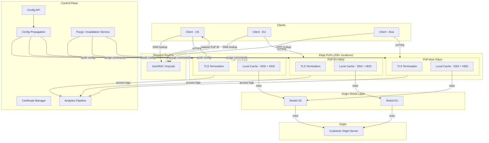
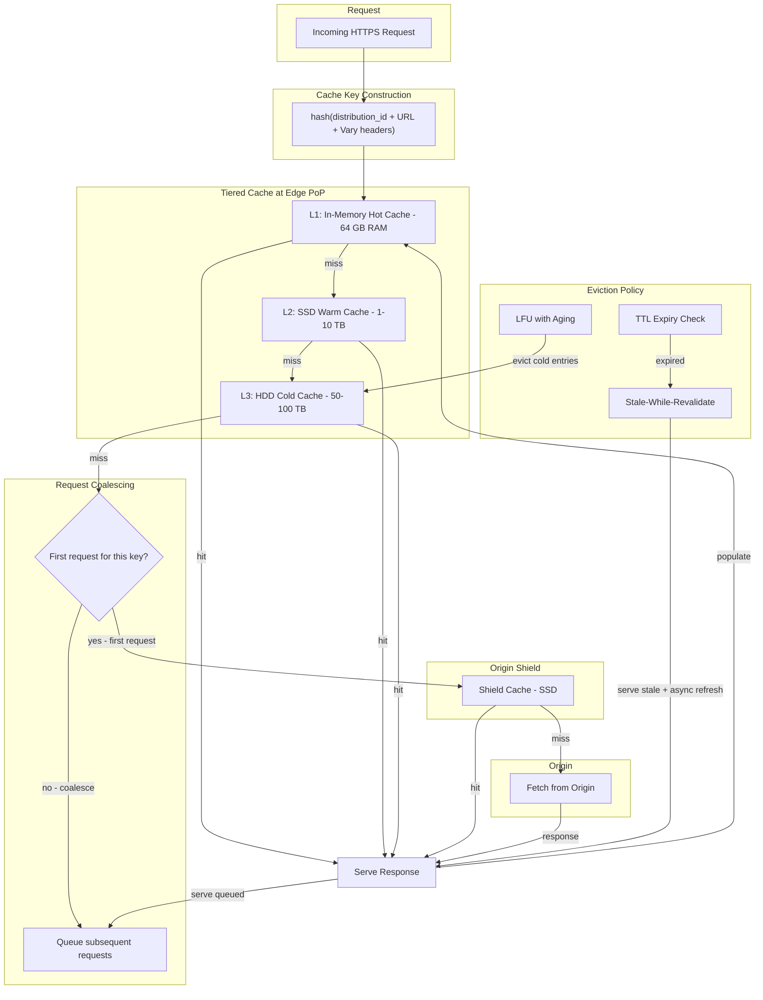
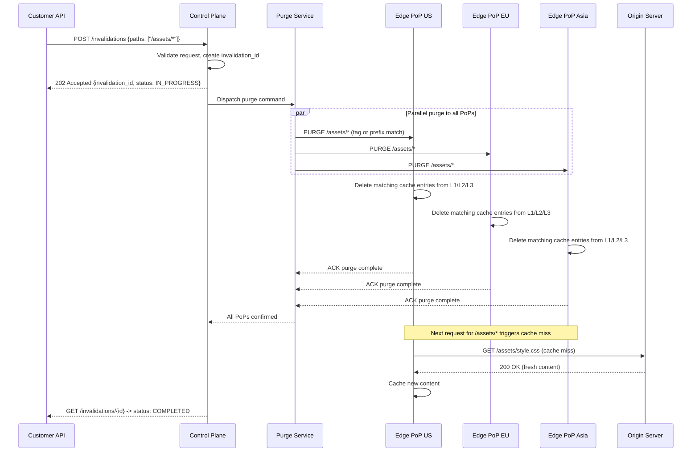

# CDN — Architecture Diagrams

## 1. High-Level Architecture

```mermaid
flowchart TB
    subgraph Clients
        C1[Client - US]
        C2[Client - EU]
        C3[Client - Asia]
    end

    subgraph DNS["Request Routing"]
        GeoDNS[GeoDNS / Anycast]
    end

    subgraph EdgePoPs["Edge PoPs (200+ locations)"]
        subgraph PoP1["PoP US-East"]
            TLS1[TLS Termination]
            Cache1[Local Cache - SSD + HDD]
        end
        subgraph PoP2["PoP EU-West"]
            TLS2[TLS Termination]
            Cache2[Local Cache - SSD + HDD]
        end
        subgraph PoP3["PoP Asia-Tokyo"]
            TLS3[TLS Termination]
            Cache3[Local Cache - SSD + HDD]
        end
    end

    subgraph Shield["Origin Shield Layer"]
        ShieldUS[Shield US]
        ShieldEU[Shield EU]
    end

    subgraph Origin
        OriginServer[Customer Origin Server]
    end

    subgraph ControlPlane["Control Plane"]
        ConfigAPI[Config API]
        ConfigPush[Config Propagation]
        PurgeService[Purge / Invalidation Service]
        CertManager[Certificate Manager]
        Analytics[Analytics Pipeline]
    end

    C1 -->|DNS lookup| GeoDNS
    C2 -->|DNS lookup| GeoDNS
    C3 -->|DNS lookup| GeoDNS
    GeoDNS -->|nearest PoP IP| C1
    C1 -->|HTTPS| PoP1
    C2 -->|HTTPS| PoP2
    C3 -->|HTTPS| PoP3

    Cache1 -->|miss| ShieldUS
    Cache2 -->|miss| ShieldEU
    Cache3 -->|miss| ShieldUS

    ShieldUS -->|miss| OriginServer
    ShieldEU -->|miss| OriginServer

    ConfigAPI --> ConfigPush
    ConfigPush -->|push config| PoP1
    ConfigPush -->|push config| PoP2
    ConfigPush -->|push config| PoP3
    PurgeService -->|purge commands| PoP1
    PurgeService -->|purge commands| PoP2
    PurgeService -->|purge commands| PoP3

    PoP1 -->|access logs| Analytics
    PoP2 -->|access logs| Analytics
    PoP3 -->|access logs| Analytics
```

## 2. Cache Hierarchy and Eviction — Deep Dive

```mermaid
flowchart TB
    subgraph Request
        Req[Incoming HTTPS Request]
    end

    subgraph CacheKey["Cache Key Construction"]
        KeyBuild["hash(distribution_id + URL + Vary headers)"]
    end

    subgraph TieredCache["Tiered Cache at Edge PoP"]
        L1[L1: In-Memory Hot Cache - 64 GB RAM]
        L2[L2: SSD Warm Cache - 1-10 TB]
        L3[L3: HDD Cold Cache - 50-100 TB]
    end

    subgraph Coalesce["Request Coalescing"]
        Lock{First request for this key?}
        Queue[Queue subsequent requests]
    end

    subgraph ShieldTier["Origin Shield"]
        ShieldCache[Shield Cache - SSD]
    end

    subgraph OriginTier["Origin"]
        OriginFetch[Fetch from Origin]
    end

    subgraph Eviction["Eviction Policy"]
        LFU[LFU with Aging]
        TTLCheck[TTL Expiry Check]
        SWR[Stale-While-Revalidate]
    end

    Req --> KeyBuild
    KeyBuild --> L1
    L1 -->|hit| Response[Serve Response]
    L1 -->|miss| L2
    L2 -->|hit| Response
    L2 -->|miss| L3
    L3 -->|hit| Response
    L3 -->|miss| Lock

    Lock -->|yes - first request| ShieldCache
    Lock -->|no - coalesce| Queue

    ShieldCache -->|hit| Response
    ShieldCache -->|miss| OriginFetch
    OriginFetch -->|response| Response

    Response -->|populate| L1
    Response -->|serve queued| Queue

    TTLCheck -->|expired| SWR
    SWR -->|serve stale + async refresh| Response
    LFU -->|evict cold entries| L3
```

## 3. Cache Invalidation — Sequence Diagram

```mermaid
sequenceDiagram
    participant Customer as Customer API
    participant CP as Control Plane
    participant PS as Purge Service
    participant PoP1 as Edge PoP US
    participant PoP2 as Edge PoP EU
    participant PoP3 as Edge PoP Asia
    participant Origin as Origin Server

    Customer->>CP: POST /invalidations {paths: ["/assets/*"]}
    CP->>CP: Validate request, create invalidation_id
    CP-->>Customer: 202 Accepted {invalidation_id, status: IN_PROGRESS}

    CP->>PS: Dispatch purge command

    par Parallel purge to all PoPs
        PS->>PoP1: PURGE /assets/* (tag or prefix match)
        PS->>PoP2: PURGE /assets/*
        PS->>PoP3: PURGE /assets/*
    end

    PoP1->>PoP1: Delete matching cache entries from L1/L2/L3
    PoP2->>PoP2: Delete matching cache entries from L1/L2/L3
    PoP3->>PoP3: Delete matching cache entries from L1/L2/L3

    PoP1-->>PS: ACK purge complete
    PoP2-->>PS: ACK purge complete
    PoP3-->>PS: ACK purge complete

    PS-->>CP: All PoPs confirmed

    Note over PoP1,PoP3: Next request for /assets/* triggers cache miss

    PoP1->>Origin: GET /assets/style.css (cache miss)
    Origin-->>PoP1: 200 OK (fresh content)
    PoP1->>PoP1: Cache new content

    CP-->>Customer: GET /invalidations/{id} -> status: COMPLETED
```
