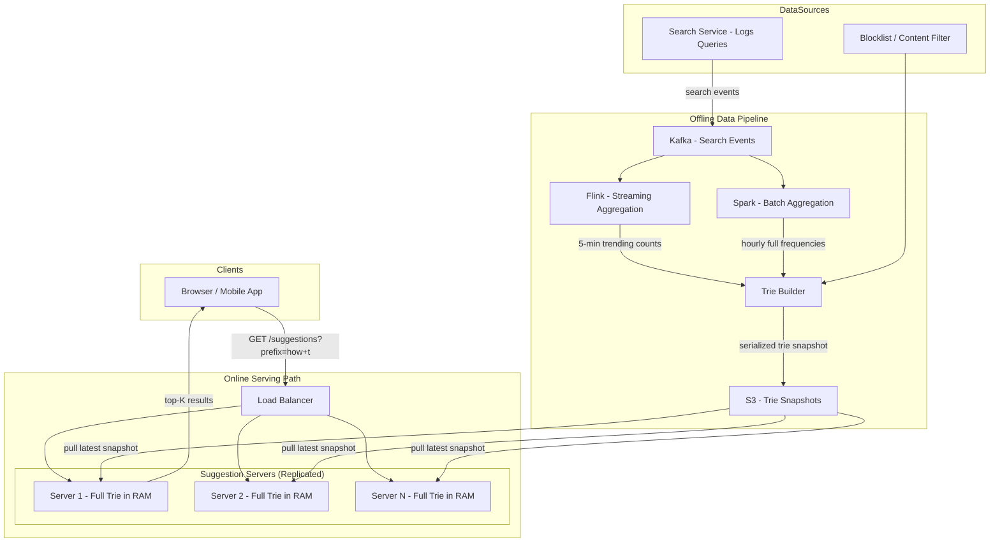
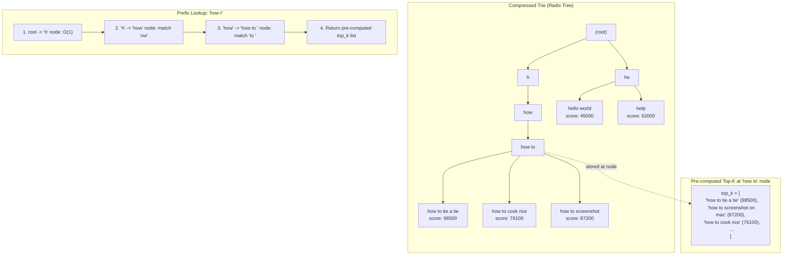
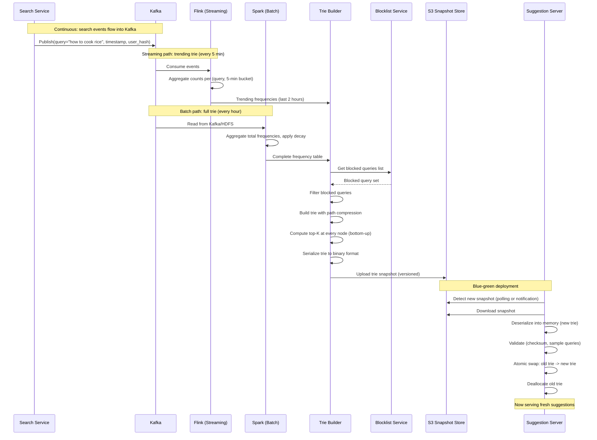

# Search Autocomplete — Architecture Diagrams

## 1. High-Level Architecture

```mermaid
flowchart TB
    subgraph Clients
        Browser[Browser / Mobile App]
    end

    subgraph OnlinePath["Online Serving Path"]
        LB[Load Balancer]
        subgraph SuggServers["Suggestion Servers (Replicated)"]
            SS1[Server 1 - Full Trie in RAM]
            SS2[Server 2 - Full Trie in RAM]
            SS3[Server N - Full Trie in RAM]
        end
    end

    subgraph OfflinePath["Offline Data Pipeline"]
        Kafka[Kafka - Search Events]
        Flink[Flink - Streaming Aggregation]
        Spark[Spark - Batch Aggregation]
        TrieBuilder[Trie Builder]
        S3[S3 - Trie Snapshots]
    end

    subgraph DataSources
        SearchService[Search Service - Logs Queries]
        Blocklist[Blocklist / Content Filter]
    end

    Browser -->|"GET /suggestions?prefix=how+t"| LB
    LB --> SS1
    LB --> SS2
    LB --> SS3
    SS1 -->|top-K results| Browser

    SearchService -->|search events| Kafka
    Kafka --> Flink
    Flink -->|5-min trending counts| TrieBuilder
    Kafka --> Spark
    Spark -->|hourly full frequencies| TrieBuilder
    Blocklist --> TrieBuilder
    TrieBuilder -->|serialized trie snapshot| S3
    S3 -->|pull latest snapshot| SS1
    S3 -->|pull latest snapshot| SS2
    S3 -->|pull latest snapshot| SS3
```

## 2. Trie Structure and Lookup — Deep Dive

```mermaid
flowchart TB
    subgraph TrieStructure["Compressed Trie (Radix Tree)"]
        Root["(root)"]
        H["h"]
        HO["how"]
        HOW_TO["how to "]
        HOW_TO_TIE["how to tie a tie<br/>score: 98500"]
        HOW_TO_COOK["how to cook rice<br/>score: 76100"]
        HOW_TO_SS["how to screenshot<br/>score: 87200"]
        HE["he"]
        HELLO["hello world<br/>score: 45000"]
        HELP["help<br/>score: 62000"]
    end

    subgraph TopK["Pre-computed Top-K at 'how to' node"]
        TK["top_k = [<br/>  'how to tie a tie' (98500),<br/>  'how to screenshot on mac' (87200),<br/>  'how to cook rice' (76100),<br/>  ...<br/>]"]
    end

    subgraph Lookup["Prefix Lookup: 'how t'"]
        Step1["1. root -> 'h' node: O(1)"]
        Step2["2. 'h' -> 'how' node: match 'ow'"]
        Step3["3. 'how' -> 'how to ' node: match 'to '"]
        Step4["4. Return pre-computed top_k list"]
    end

    Root --> H
    Root --> HE
    H --> HO
    HO --> HOW_TO
    HOW_TO --> HOW_TO_TIE
    HOW_TO --> HOW_TO_COOK
    HOW_TO --> HOW_TO_SS
    HE --> HELLO
    HE --> HELP

    HOW_TO -.->|stored at node| TK
    Step1 --> Step2
    Step2 --> Step3
    Step3 --> Step4
```

## 3. Trie Build and Deploy — Sequence Diagram

```mermaid
sequenceDiagram
    participant SS as Search Service
    participant K as Kafka
    participant FL as Flink (Streaming)
    participant SP as Spark (Batch)
    participant TB as Trie Builder
    participant BL as Blocklist Service
    participant S3 as S3 Snapshot Store
    participant SRV as Suggestion Server

    Note over SS,K: Continuous: search events flow into Kafka
    SS->>K: Publish(query="how to cook rice", timestamp, user_hash)

    Note over K,FL: Streaming path: trending trie (every 5 min)
    K->>FL: Consume events
    FL->>FL: Aggregate counts per (query, 5-min bucket)
    FL->>TB: Trending frequencies (last 2 hours)

    Note over K,SP: Batch path: full trie (every hour)
    K->>SP: Read from Kafka/HDFS
    SP->>SP: Aggregate total frequencies, apply decay
    SP->>TB: Complete frequency table

    TB->>BL: Get blocked queries list
    BL-->>TB: Blocked query set
    TB->>TB: Filter blocked queries
    TB->>TB: Build trie with path compression
    TB->>TB: Compute top-K at every node (bottom-up)
    TB->>TB: Serialize trie to binary format
    TB->>S3: Upload trie snapshot (versioned)

    Note over S3,SRV: Blue-green deployment
    SRV->>S3: Detect new snapshot (polling or notification)
    SRV->>S3: Download snapshot
    SRV->>SRV: Deserialize into memory (new trie)
    SRV->>SRV: Validate (checksum, sample queries)
    SRV->>SRV: Atomic swap: old trie -> new trie
    SRV->>SRV: Deallocate old trie
    Note over SRV: Now serving fresh suggestions
```
