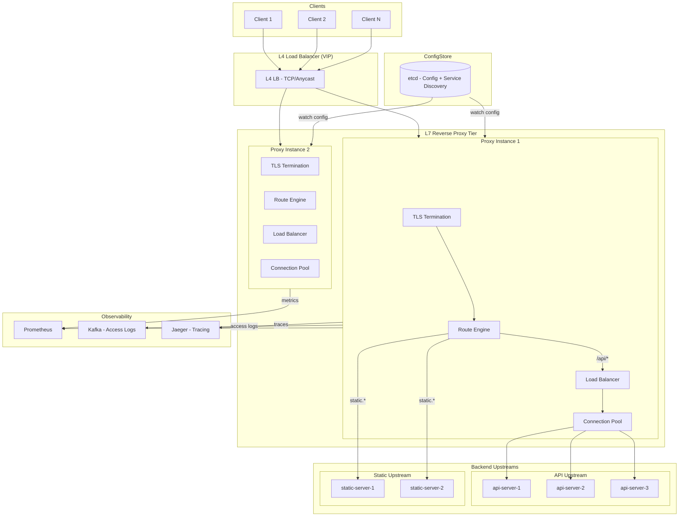
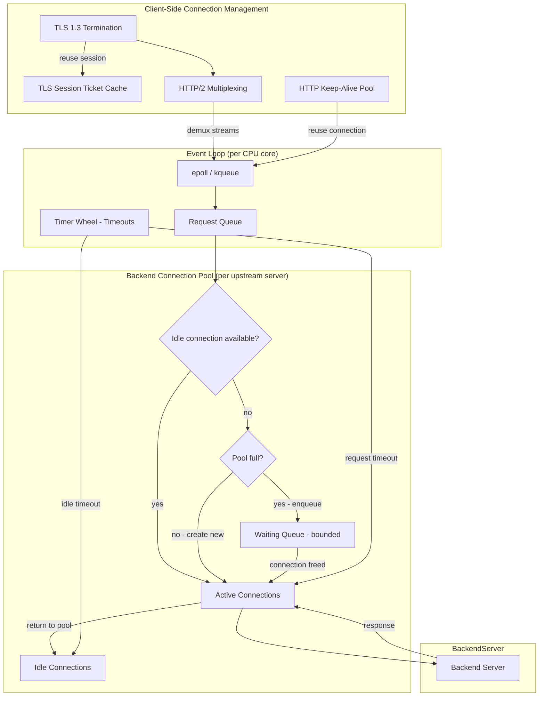
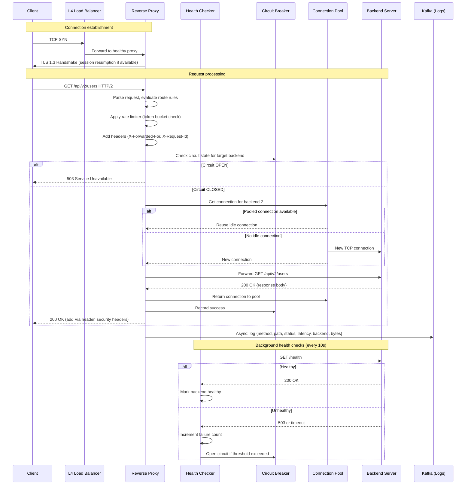

# Web Proxy / Reverse Proxy — Architecture Diagrams

## 1. High-Level Architecture

```mermaid
flowchart TB
    subgraph Clients
        C1[Client 1]
        C2[Client 2]
        CN[Client N]
    end

    subgraph L4["L4 Load Balancer (VIP)"]
        L4LB[L4 LB - TCP/Anycast]
    end

    subgraph ProxyTier["L7 Reverse Proxy Tier"]
        subgraph P1["Proxy Instance 1"]
            TLS1[TLS Termination]
            Router1[Route Engine]
            LB1[Load Balancer]
            ConnPool1[Connection Pool]
        end
        subgraph P2["Proxy Instance 2"]
            TLS2[TLS Termination]
            Router2[Route Engine]
            LB2[Load Balancer]
            ConnPool2[Connection Pool]
        end
    end

    subgraph ConfigStore
        etcd[(etcd - Config + Service Discovery)]
    end

    subgraph Backends["Backend Upstreams"]
        subgraph API["API Upstream"]
            API1[api-server-1]
            API2[api-server-2]
            API3[api-server-3]
        end
        subgraph Static["Static Upstream"]
            S1[static-server-1]
            S2[static-server-2]
        end
    end

    subgraph Observability
        Prometheus[Prometheus]
        Kafka[Kafka - Access Logs]
        Jaeger[Jaeger - Tracing]
    end

    C1 --> L4LB
    C2 --> L4LB
    CN --> L4LB
    L4LB --> P1
    L4LB --> P2

    TLS1 --> Router1
    Router1 -->|"/api/*"| LB1
    LB1 --> ConnPool1
    ConnPool1 --> API1
    ConnPool1 --> API2
    ConnPool1 --> API3
    Router1 -->|"static.*"| S1
    Router1 -->|"static.*"| S2

    etcd -->|watch config| P1
    etcd -->|watch config| P2

    P1 -->|metrics| Prometheus
    P1 -->|access logs| Kafka
    P1 -->|traces| Jaeger
    P2 -->|metrics| Prometheus
```

## 2. Connection Management — Deep Dive

```mermaid
flowchart TB
    subgraph ClientSide["Client-Side Connection Management"]
        TLSTerm[TLS 1.3 Termination]
        SessionCache[TLS Session Ticket Cache]
        HTTP2[HTTP/2 Multiplexing]
        KeepAlive[HTTP Keep-Alive Pool]
    end

    subgraph EventLoop["Event Loop (per CPU core)"]
        Epoll[epoll / kqueue]
        TimerWheel[Timer Wheel - Timeouts]
        RequestQueue[Request Queue]
    end

    subgraph BackendPool["Backend Connection Pool (per upstream server)"]
        Idle[Idle Connections]
        Active[Active Connections]
        Queue[Waiting Queue - bounded]

        MaxConn{Pool full?}
        IdleAvail{Idle connection available?}
    end

    subgraph BackendServer
        Backend[Backend Server]
    end

    TLSTerm -->|reuse session| SessionCache
    TLSTerm --> HTTP2
    HTTP2 -->|demux streams| Epoll
    KeepAlive -->|reuse connection| Epoll

    Epoll --> RequestQueue
    RequestQueue --> IdleAvail
    IdleAvail -->|yes| Active
    IdleAvail -->|no| MaxConn
    MaxConn -->|no - create new| Active
    MaxConn -->|yes - enqueue| Queue
    Active --> Backend
    Backend -->|response| Active
    Active -->|return to pool| Idle
    Queue -->|connection freed| Active

    TimerWheel -->|idle timeout| Idle
    TimerWheel -->|request timeout| Active
```

## 3. Request Lifecycle — Sequence Diagram

```mermaid
sequenceDiagram
    participant C as Client
    participant LB as L4 Load Balancer
    participant P as Reverse Proxy
    participant HC as Health Checker
    participant CB as Circuit Breaker
    participant Pool as Connection Pool
    participant B as Backend Server
    participant K as Kafka (Logs)

    Note over C,P: Connection establishment
    C->>LB: TCP SYN
    LB->>P: Forward to healthy proxy
    P->>C: TLS 1.3 Handshake (session resumption if available)

    Note over C,B: Request processing
    C->>P: GET /api/v2/users HTTP/2
    P->>P: Parse request, evaluate route rules
    P->>P: Apply rate limiter (token bucket check)
    P->>P: Add headers (X-Forwarded-For, X-Request-Id)

    P->>CB: Check circuit state for target backend
    alt Circuit OPEN
        P-->>C: 503 Service Unavailable
    else Circuit CLOSED
        P->>Pool: Get connection for backend-2
        alt Pooled connection available
            Pool-->>P: Reuse idle connection
        else No idle connection
            Pool->>B: New TCP connection
            Pool-->>P: New connection
        end

        P->>B: Forward GET /api/v2/users
        B-->>P: 200 OK {response body}
        P->>Pool: Return connection to pool
        P->>CB: Record success

        P-->>C: 200 OK (add Via header, security headers)
    end

    P->>K: Async: log {method, path, status, latency, backend, bytes}

    Note over HC,B: Background health checks (every 10s)
    HC->>B: GET /health
    alt Healthy
        B-->>HC: 200 OK
        HC->>HC: Mark backend healthy
    else Unhealthy
        B-->>HC: 503 or timeout
        HC->>HC: Increment failure count
        HC->>CB: Open circuit if threshold exceeded
    end
```
