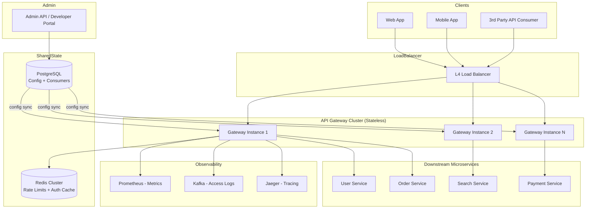
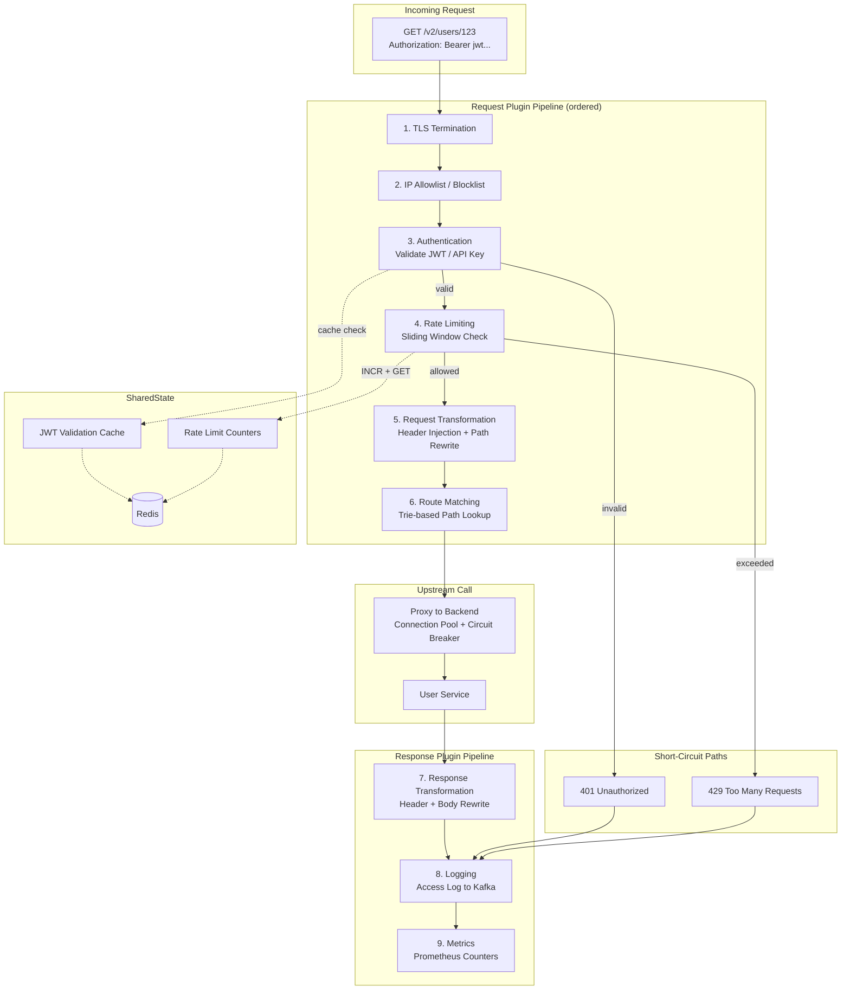
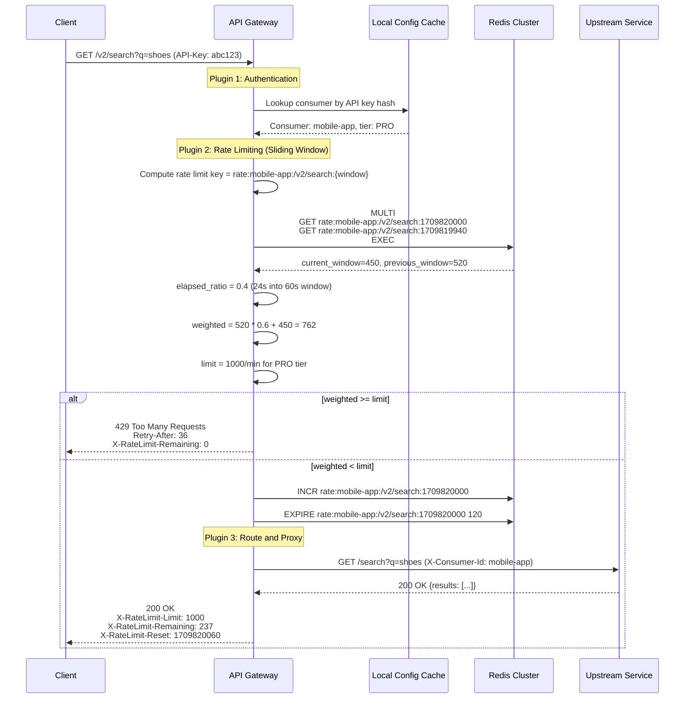

# API Gateway — Architecture Diagrams

## 1. High-Level Architecture

```mermaid
flowchart TB
    subgraph Clients
        Web[Web App]
        Mobile[Mobile App]
        ThirdParty[3rd Party API Consumer]
    end

    subgraph LoadBalancer
        L4LB[L4 Load Balancer]
    end

    subgraph GatewayCluster["API Gateway Cluster (Stateless)"]
        GW1[Gateway Instance 1]
        GW2[Gateway Instance 2]
        GWN[Gateway Instance N]
    end

    subgraph SharedState
        Redis[(Redis Cluster<br/>Rate Limits + Auth Cache)]
        PG[(PostgreSQL<br/>Config + Consumers)]
    end

    subgraph Microservices["Downstream Microservices"]
        UserSvc[User Service]
        OrderSvc[Order Service]
        SearchSvc[Search Service]
        PaymentSvc[Payment Service]
    end

    subgraph Observability
        Prometheus[Prometheus - Metrics]
        Kafka[Kafka - Access Logs]
        Jaeger[Jaeger - Tracing]
    end

    subgraph Admin
        AdminAPI[Admin API / Developer Portal]
    end

    Web --> L4LB
    Mobile --> L4LB
    ThirdParty --> L4LB
    L4LB --> GW1
    L4LB --> GW2
    L4LB --> GWN

    GW1 --> Redis
    GW1 --> UserSvc
    GW1 --> OrderSvc
    GW2 --> SearchSvc
    GWN --> PaymentSvc

    GW1 --> Prometheus
    GW1 --> Kafka
    GW1 --> Jaeger

    AdminAPI --> PG
    PG -->|config sync| GW1
    PG -->|config sync| GW2
    PG -->|config sync| GWN
```

## 2. Plugin Pipeline — Deep Dive

```mermaid
flowchart TB
    subgraph Request["Incoming Request"]
        Req["GET /v2/users/123<br/>Authorization: Bearer jwt..."]
    end

    subgraph RequestPipeline["Request Plugin Pipeline (ordered)"]
        P1[1. TLS Termination]
        P2[2. IP Allowlist / Blocklist]
        P3[3. Authentication<br/>Validate JWT / API Key]
        P4[4. Rate Limiting<br/>Sliding Window Check]
        P5[5. Request Transformation<br/>Header Injection + Path Rewrite]
        P6[6. Route Matching<br/>Trie-based Path Lookup]
    end

    subgraph Upstream["Upstream Call"]
        Proxy[Proxy to Backend<br/>Connection Pool + Circuit Breaker]
        Backend[User Service]
    end

    subgraph ResponsePipeline["Response Plugin Pipeline"]
        R1[7. Response Transformation<br/>Header + Body Rewrite]
        R2[8. Logging<br/>Access Log to Kafka]
        R3[9. Metrics<br/>Prometheus Counters]
    end

    subgraph ShortCircuit["Short-Circuit Paths"]
        Auth401[401 Unauthorized]
        Rate429[429 Too Many Requests]
    end

    subgraph SharedState
        Redis[(Redis)]
        JWTCache[JWT Validation Cache]
        RateCounters[Rate Limit Counters]
    end

    Req --> P1 --> P2 --> P3
    P3 -->|valid| P4
    P3 -->|invalid| Auth401
    P3 -.->|cache check| JWTCache
    JWTCache -.-> Redis

    P4 -->|allowed| P5
    P4 -->|exceeded| Rate429
    P4 -.->|INCR + GET| RateCounters
    RateCounters -.-> Redis

    P5 --> P6
    P6 --> Proxy
    Proxy --> Backend
    Backend --> R1 --> R2 --> R3

    Auth401 --> R2
    Rate429 --> R2
```

## 3. Rate Limiting Flow — Sequence Diagram

```mermaid
sequenceDiagram
    participant C as Client
    participant GW as API Gateway
    participant Cache as Local Config Cache
    participant R as Redis Cluster
    participant US as Upstream Service

    C->>GW: GET /v2/search?q=shoes (API-Key: abc123)

    Note over GW: Plugin 1: Authentication
    GW->>Cache: Lookup consumer by API key hash
    Cache-->>GW: Consumer: mobile-app, tier: PRO

    Note over GW: Plugin 2: Rate Limiting (Sliding Window)
    GW->>GW: Compute rate limit key = rate:mobile-app:/v2/search:{window}
    GW->>R: MULTI<br/>GET rate:mobile-app:/v2/search:1709820000<br/>GET rate:mobile-app:/v2/search:1709819940<br/>EXEC
    R-->>GW: current_window=450, previous_window=520

    GW->>GW: elapsed_ratio = 0.4 (24s into 60s window)
    GW->>GW: weighted = 520 * 0.6 + 450 = 762
    GW->>GW: limit = 1000/min for PRO tier

    alt weighted >= limit
        GW-->>C: 429 Too Many Requests<br/>Retry-After: 36<br/>X-RateLimit-Remaining: 0
    else weighted < limit
        GW->>R: INCR rate:mobile-app:/v2/search:1709820000
        GW->>R: EXPIRE rate:mobile-app:/v2/search:1709820000 120

        Note over GW: Plugin 3: Route and Proxy
        GW->>US: GET /search?q=shoes (X-Consumer-Id: mobile-app)
        US-->>GW: 200 OK {results: [...]}

        GW-->>C: 200 OK<br/>X-RateLimit-Limit: 1000<br/>X-RateLimit-Remaining: 237<br/>X-RateLimit-Reset: 1709820060
    end
```
