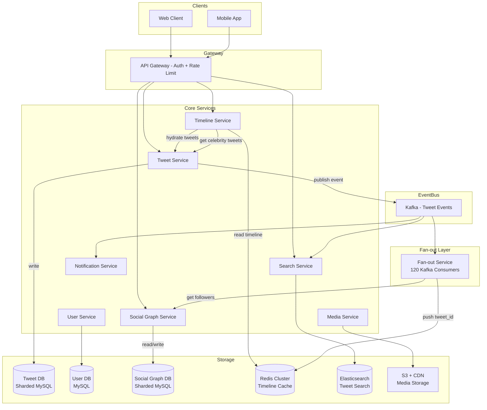
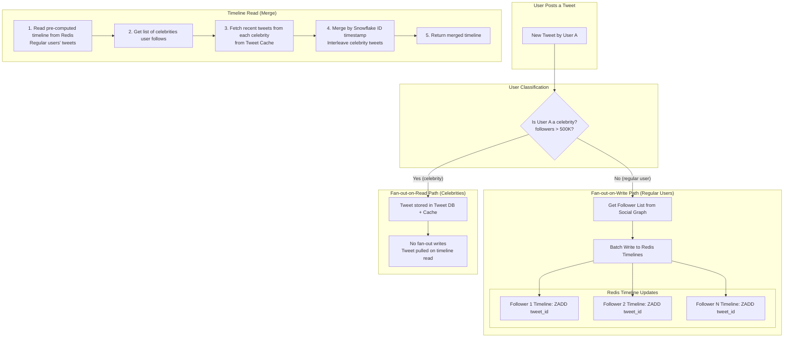
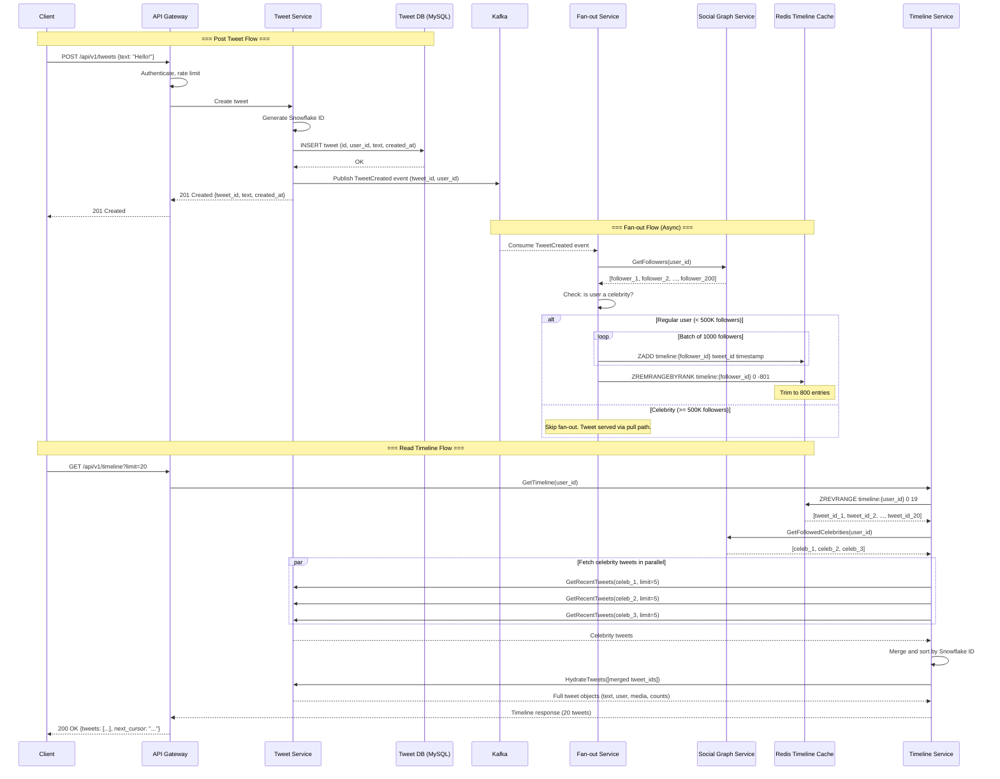

# Twitter / X — Architecture Diagrams

## 1. High-Level Architecture

```mermaid
flowchart TB
    subgraph Clients
        Web[Web Client]
        Mobile[Mobile App]
    end

    subgraph Gateway
        APIGW[API Gateway - Auth + Rate Limit]
    end

    subgraph CoreServices["Core Services"]
        TweetSvc[Tweet Service]
        TimelineSvc[Timeline Service]
        SocialGraph[Social Graph Service]
        UserSvc[User Service]
        SearchSvc[Search Service]
        NotifSvc[Notification Service]
        MediaSvc[Media Service]
    end

    subgraph FanOut["Fan-out Layer"]
        FanOutSvc[Fan-out Service<br/>120 Kafka Consumers]
    end

    subgraph EventBus
        Kafka[Kafka - Tweet Events]
    end

    subgraph Storage
        TweetDB[(Tweet DB<br/>Sharded MySQL)]
        UserDB[(User DB<br/>MySQL)]
        GraphDB[(Social Graph DB<br/>Sharded MySQL)]
        Redis[(Redis Cluster<br/>Timeline Cache)]
        ES[(Elasticsearch<br/>Tweet Search)]
        S3[S3 + CDN<br/>Media Storage]
    end

    Web --> APIGW
    Mobile --> APIGW
    APIGW --> TweetSvc
    APIGW --> TimelineSvc
    APIGW --> SocialGraph
    APIGW --> SearchSvc

    TweetSvc -->|write| TweetDB
    TweetSvc -->|publish event| Kafka
    TimelineSvc -->|read timeline| Redis
    TimelineSvc -->|hydrate tweets| TweetSvc
    TimelineSvc -->|get celebrity tweets| TweetSvc
    SocialGraph -->|read/write| GraphDB
    UserSvc --> UserDB
    MediaSvc --> S3
    SearchSvc --> ES

    Kafka --> FanOutSvc
    Kafka --> SearchSvc
    Kafka --> NotifSvc

    FanOutSvc -->|get followers| SocialGraph
    FanOutSvc -->|push tweet_id| Redis
```

## 2. Hybrid Fan-out — Deep Dive

```mermaid
flowchart TB
    subgraph TweetPost["User Posts a Tweet"]
        Tweet[New Tweet by User A]
    end

    subgraph Detection["User Classification"]
        Check{Is User A a celebrity?<br/>followers > 500K?}
    end

    subgraph PushPath["Fan-out-on-Write Path (Regular Users)"]
        GetFollowers[Get Follower List from Social Graph]
        BatchWrite[Batch Write to Redis Timelines]
        subgraph RedisWrites["Redis Timeline Updates"]
            F1[Follower 1 Timeline: ZADD tweet_id]
            F2[Follower 2 Timeline: ZADD tweet_id]
            FN[Follower N Timeline: ZADD tweet_id]
        end
    end

    subgraph PullPath["Fan-out-on-Read Path (Celebrities)"]
        TweetCache[Tweet stored in Tweet DB + Cache]
        NoFanout[No fan-out writes<br/>Tweet pulled on timeline read]
    end

    subgraph TimelineRead["Timeline Read (Merge)"]
        ReadRedis[1. Read pre-computed timeline from Redis<br/>Regular users' tweets]
        GetCelebs[2. Get list of celebrities user follows]
        FetchCeleb[3. Fetch recent tweets from each celebrity<br/>from Tweet Cache]
        Merge[4. Merge by Snowflake ID timestamp<br/>Interleave celebrity tweets]
        Return[5. Return merged timeline]
    end

    Tweet --> Check
    Check -->|"No (regular user)"| GetFollowers
    GetFollowers --> BatchWrite
    BatchWrite --> F1
    BatchWrite --> F2
    BatchWrite --> FN

    Check -->|"Yes (celebrity)"| TweetCache
    TweetCache --> NoFanout

    ReadRedis --> GetCelebs
    GetCelebs --> FetchCeleb
    FetchCeleb --> Merge
    Merge --> Return
```

## 3. Post Tweet and Timeline Read — Sequence Diagram

```mermaid
sequenceDiagram
    participant C as Client
    participant GW as API Gateway
    participant TS as Tweet Service
    participant DB as Tweet DB (MySQL)
    participant K as Kafka
    participant FO as Fan-out Service
    participant SG as Social Graph Service
    participant R as Redis Timeline Cache
    participant TL as Timeline Service

    Note over C,DB: === Post Tweet Flow ===
    C->>GW: POST /api/v1/tweets {text: "Hello!"}
    GW->>GW: Authenticate, rate limit
    GW->>TS: Create tweet
    TS->>TS: Generate Snowflake ID
    TS->>DB: INSERT tweet (id, user_id, text, created_at)
    DB-->>TS: OK
    TS->>K: Publish TweetCreated event (tweet_id, user_id)
    TS-->>GW: 201 Created {tweet_id, text, created_at}
    GW-->>C: 201 Created

    Note over K,R: === Fan-out Flow (Async) ===
    K-->>FO: Consume TweetCreated event
    FO->>SG: GetFollowers(user_id)
    SG-->>FO: [follower_1, follower_2, ..., follower_200]
    FO->>FO: Check: is user a celebrity?

    alt Regular user (< 500K followers)
        loop Batch of 1000 followers
            FO->>R: ZADD timeline:{follower_id} tweet_id timestamp
        end
        FO->>R: ZREMRANGEBYRANK timeline:{follower_id} 0 -801
        Note over R: Trim to 800 entries
    else Celebrity (>= 500K followers)
        Note over FO: Skip fan-out. Tweet served via pull path.
    end

    Note over C,R: === Read Timeline Flow ===
    C->>GW: GET /api/v1/timeline?limit=20
    GW->>TL: GetTimeline(user_id)
    TL->>R: ZREVRANGE timeline:{user_id} 0 19
    R-->>TL: [tweet_id_1, tweet_id_2, ..., tweet_id_20]

    TL->>SG: GetFollowedCelebrities(user_id)
    SG-->>TL: [celeb_1, celeb_2, celeb_3]

    par Fetch celebrity tweets in parallel
        TL->>TS: GetRecentTweets(celeb_1, limit=5)
        TL->>TS: GetRecentTweets(celeb_2, limit=5)
        TL->>TS: GetRecentTweets(celeb_3, limit=5)
    end
    TS-->>TL: Celebrity tweets

    TL->>TL: Merge and sort by Snowflake ID
    TL->>TS: HydrateTweets([merged tweet_ids])
    TS-->>TL: Full tweet objects (text, user, media, counts)

    TL-->>GW: Timeline response (20 tweets)
    GW-->>C: 200 OK {tweets: [...], next_cursor: "..."}
```
