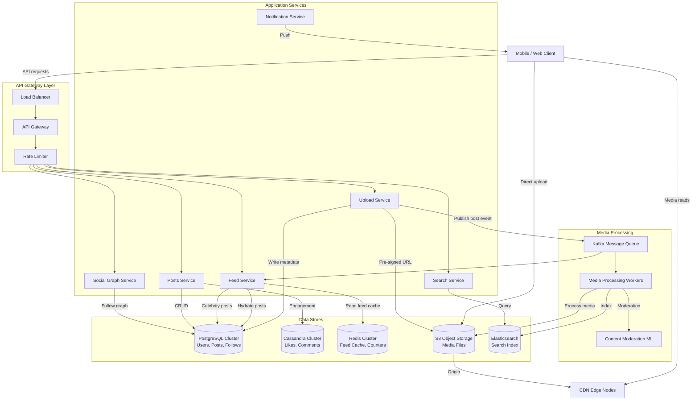
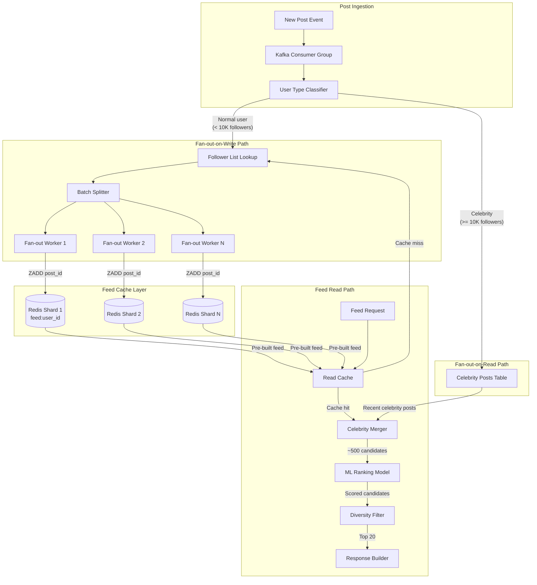
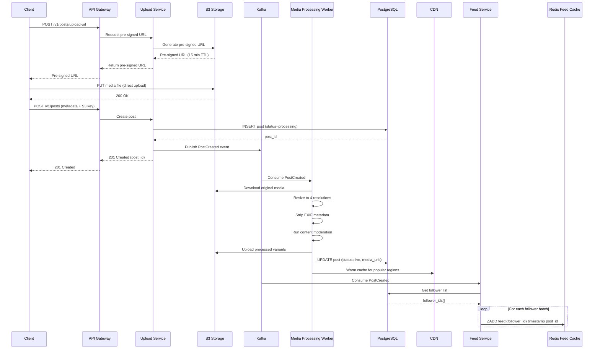

# Instagram — Architecture Diagrams

## 1. High-Level Architecture

```mermaid
flowchart TB
    Client[Mobile / Web Client]

    subgraph Gateway["API Gateway Layer"]
        LB[Load Balancer]
        AG[API Gateway]
        RL[Rate Limiter]
    end

    subgraph Services["Application Services"]
        US[Upload Service]
        FS[Feed Service]
        PS[Posts Service]
        SGS[Social Graph Service]
        NS[Notification Service]
        SS[Search Service]
    end

    subgraph Processing["Media Processing"]
        MQ[Kafka Message Queue]
        MPW[Media Processing Workers]
        MOD[Content Moderation ML]
    end

    subgraph Storage["Data Stores"]
        PG[(PostgreSQL Cluster<br/>Users, Posts, Follows)]
        CASS[(Cassandra Cluster<br/>Likes, Comments)]
        REDIS[(Redis Cluster<br/>Feed Cache, Counters)]
        S3[(S3 Object Storage<br/>Media Files)]
        ES[(Elasticsearch<br/>Search Index)]
    end

    CDN[CDN Edge Nodes]

    Client -->|API requests| LB
    Client -->|Media reads| CDN
    Client -->|Direct upload| S3
    LB --> AG
    AG --> RL
    RL --> US & FS & PS & SGS & SS

    US -->|Write metadata| PG
    US -->|Publish post event| MQ
    US -->|Pre-signed URL| S3

    FS -->|Read feed cache| REDIS
    FS -->|Hydrate posts| PG
    FS -->|Celebrity posts| PG

    PS -->|CRUD| PG
    PS -->|Engagement| CASS

    SGS -->|Follow graph| PG

    SS -->|Query| ES

    MQ --> MPW
    MQ --> FS
    MPW -->|Process media| S3
    MPW -->|Moderation| MOD
    MPW -->|Index| ES

    NS -->|Push| Client

    S3 -->|Origin| CDN
```

## 2. Feed Generation Engine — Deep Dive

```mermaid
flowchart TB
    subgraph Ingestion["Post Ingestion"]
        NP[New Post Event]
        KC[Kafka Consumer Group]
        UT[User Type Classifier]
    end

    subgraph PushPath["Fan-out-on-Write Path"]
        FL[Follower List Lookup]
        BATCH[Batch Splitter]
        FW1[Fan-out Worker 1]
        FW2[Fan-out Worker 2]
        FWN[Fan-out Worker N]
    end

    subgraph PullPath["Fan-out-on-Read Path"]
        CT[Celebrity Posts Table]
    end

    subgraph FeedRead["Feed Read Path"]
        FR[Feed Request]
        RC[Read Cache]
        CM[Celebrity Merger]
        RANK[ML Ranking Model]
        DIV[Diversity Filter]
        RESP[Response Builder]
    end

    subgraph Cache["Feed Cache Layer"]
        R1[(Redis Shard 1<br/>feed:user_id)]
        R2[(Redis Shard 2)]
        RN[(Redis Shard N)]
    end

    NP --> KC
    KC --> UT

    UT -->|"Normal user<br/>(< 10K followers)"| FL
    UT -->|"Celebrity<br/>(>= 10K followers)"| CT

    FL --> BATCH
    BATCH --> FW1 & FW2 & FWN

    FW1 -->|ZADD post_id| R1
    FW2 -->|ZADD post_id| R2
    FWN -->|ZADD post_id| RN

    FR --> RC
    RC -->|Cache hit| CM
    RC -->|Cache miss| FL

    R1 & R2 & RN -->|Pre-built feed| RC
    CT -->|Recent celebrity posts| CM

    CM -->|~500 candidates| RANK
    RANK -->|Scored candidates| DIV
    DIV -->|Top 20| RESP
```

## 3. Photo Upload and Processing — Sequence Diagram

```mermaid
sequenceDiagram
    participant C as Client
    participant AG as API Gateway
    participant US as Upload Service
    participant S3 as S3 Storage
    participant K as Kafka
    participant MPW as Media Processing Worker
    participant PG as PostgreSQL
    participant CDN as CDN
    participant FS as Feed Service
    participant R as Redis Feed Cache

    C->>AG: POST /v1/posts/upload-url
    AG->>US: Request pre-signed URL
    US->>S3: Generate pre-signed URL
    S3-->>US: Pre-signed URL (15 min TTL)
    US-->>AG: Return pre-signed URL
    AG-->>C: Pre-signed URL

    C->>S3: PUT media file (direct upload)
    S3-->>C: 200 OK

    C->>AG: POST /v1/posts (metadata + S3 key)
    AG->>US: Create post
    US->>PG: INSERT post (status=processing)
    PG-->>US: post_id
    US->>K: Publish PostCreated event
    US-->>AG: 201 Created (post_id)
    AG-->>C: 201 Created

    K->>MPW: Consume PostCreated
    MPW->>S3: Download original media
    MPW->>MPW: Resize to 4 resolutions
    MPW->>MPW: Strip EXIF metadata
    MPW->>MPW: Run content moderation
    MPW->>S3: Upload processed variants
    MPW->>PG: UPDATE post (status=live, media_urls)
    MPW->>CDN: Warm cache for popular regions

    K->>FS: Consume PostCreated
    FS->>PG: Get follower list
    PG-->>FS: follower_ids[]
    loop For each follower batch
        FS->>R: ZADD feed:{follower_id} timestamp post_id
    end
```
