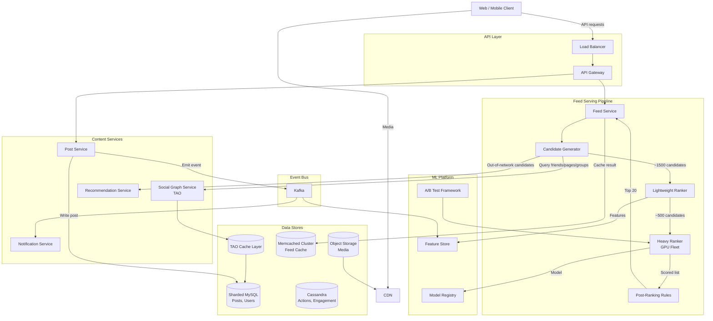
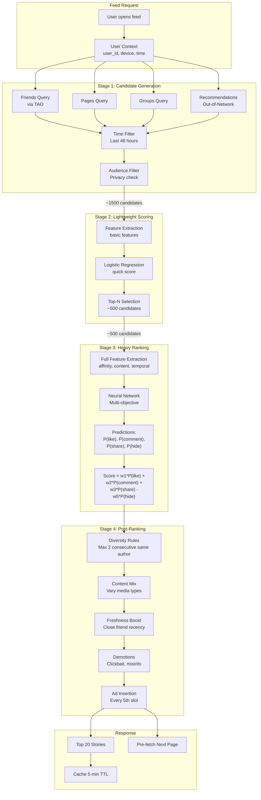
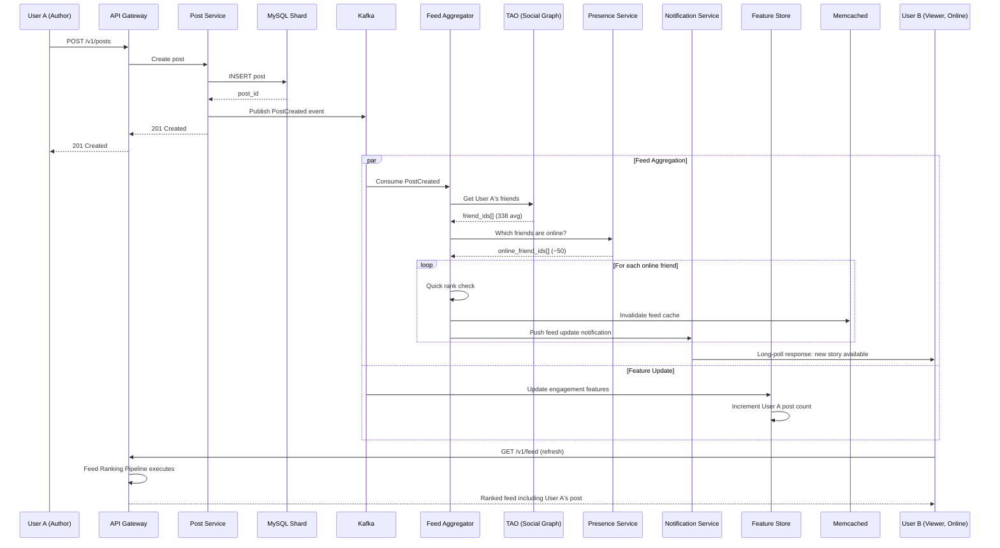

# Facebook News Feed — Architecture Diagrams

## 1. High-Level Architecture

```mermaid
flowchart TB
    Client[Web / Mobile Client]

    subgraph Gateway["API Layer"]
        LB[Load Balancer]
        AG[API Gateway]
    end

    subgraph FeedPipeline["Feed Serving Pipeline"]
        FS[Feed Service]
        CG[Candidate Generator]
        LR[Lightweight Ranker]
        HR[Heavy Ranker<br/>GPU Fleet]
        PR[Post-Ranking Rules]
    end

    subgraph ContentServices["Content Services"]
        PS[Post Service]
        SS[Social Graph Service<br/>TAO]
        RS[Recommendation Service]
        NS[Notification Service]
    end

    subgraph MLPlatform["ML Platform"]
        FEAT[Feature Store]
        MODEL[Model Registry]
        AB[A/B Test Framework]
    end

    subgraph DataStores["Data Stores"]
        TAO[(TAO Cache Layer)]
        MySQL[(Sharded MySQL<br/>Posts, Users)]
        MC[(Memcached Cluster<br/>Feed Cache)]
        CASS[(Cassandra<br/>Actions, Engagement)]
        S3[(Object Storage<br/>Media)]
    end

    subgraph Messaging["Event Bus"]
        K[Kafka]
    end

    CDN[CDN]

    Client -->|API requests| LB
    Client -->|Media| CDN
    LB --> AG
    AG --> FS & PS

    FS --> CG
    CG -->|Query friends/pages/groups| SS
    CG -->|Out-of-network candidates| RS
    SS --> TAO
    TAO --> MySQL

    CG -->|~1500 candidates| LR
    LR -->|Features| FEAT
    LR -->|~500 candidates| HR
    HR -->|Model| MODEL
    HR -->|Scored list| PR
    PR -->|Top 20| FS
    FS -->|Cache result| MC

    PS -->|Write post| MySQL
    PS -->|Emit event| K
    K --> NS
    K --> FEAT

    S3 --> CDN
    AB --> HR
```

## 2. Feed Ranking Pipeline — Deep Dive

```mermaid
flowchart TB
    subgraph Input["Feed Request"]
        REQ[User opens feed]
        UC[User Context<br/>user_id, device, time]
    end

    subgraph Stage1["Stage 1: Candidate Generation"]
        FQ[Friends Query<br/>via TAO]
        PQ[Pages Query]
        GQ[Groups Query]
        RQ[Recommendations<br/>Out-of-Network]
        TF[Time Filter<br/>Last 48 hours]
        AF[Audience Filter<br/>Privacy check]
    end

    subgraph Stage2["Stage 2: Lightweight Scoring"]
        LF[Feature Extraction<br/>basic features]
        LM[Logistic Regression<br/>quick score]
        TOPN[Top-N Selection<br/>~500 candidates]
    end

    subgraph Stage3["Stage 3: Heavy Ranking"]
        FF[Full Feature Extraction<br/>affinity, content, temporal]
        NN[Neural Network<br/>Multi-objective]
        PRED["Predictions:<br/>P(like), P(comment),<br/>P(share), P(hide)"]
        SCORE["Score = w1*P(like) +<br/>w2*P(comment) +<br/>w3*P(share) -<br/>w5*P(hide)"]
    end

    subgraph Stage4["Stage 4: Post-Ranking"]
        DIV[Diversity Rules<br/>Max 2 consecutive same author]
        MIX[Content Mix<br/>Vary media types]
        FRESH[Freshness Boost<br/>Close friend recency]
        DEMO[Demotions<br/>Clickbait, misinfo]
        ADS[Ad Insertion<br/>Every 5th slot]
    end

    subgraph Output["Response"]
        TOP20[Top 20 Stories]
        PREFETCH[Pre-fetch Next Page]
        CACHE[Cache 5 min TTL]
    end

    REQ --> UC
    UC --> FQ & PQ & GQ & RQ
    FQ & PQ & GQ & RQ --> TF
    TF --> AF
    AF -->|~1500 candidates| LF

    LF --> LM
    LM --> TOPN
    TOPN -->|~500 candidates| FF

    FF --> NN
    NN --> PRED
    PRED --> SCORE

    SCORE --> DIV
    DIV --> MIX
    MIX --> FRESH
    FRESH --> DEMO
    DEMO --> ADS

    ADS --> TOP20
    ADS --> PREFETCH
    TOP20 --> CACHE
```

## 3. Post Publish and Real-Time Feed Update — Sequence Diagram

```mermaid
sequenceDiagram
    participant U as User A (Author)
    participant AG as API Gateway
    participant PS as Post Service
    participant DB as MySQL Shard
    participant K as Kafka
    participant FA as Feed Aggregator
    participant TAO as TAO (Social Graph)
    participant PRES as Presence Service
    participant NS as Notification Service
    participant FS as Feature Store
    participant MC as Memcached
    participant V as User B (Viewer, Online)

    U->>AG: POST /v1/posts
    AG->>PS: Create post
    PS->>DB: INSERT post
    DB-->>PS: post_id
    PS->>K: Publish PostCreated event
    PS-->>AG: 201 Created
    AG-->>U: 201 Created

    par Feed Aggregation
        K->>FA: Consume PostCreated
        FA->>TAO: Get User A's friends
        TAO-->>FA: friend_ids[] (338 avg)
        FA->>PRES: Which friends are online?
        PRES-->>FA: online_friend_ids[] (~50)
        loop For each online friend
            FA->>FA: Quick rank check
            FA->>MC: Invalidate feed cache
            FA->>NS: Push feed update notification
        end
        NS->>V: Long-poll response: new story available
    and Feature Update
        K->>FS: Update engagement features
        FS->>FS: Increment User A post count
    end

    V->>AG: GET /v1/feed (refresh)
    AG->>AG: Feed Ranking Pipeline executes
    AG-->>V: Ranked feed including User A's post
```
