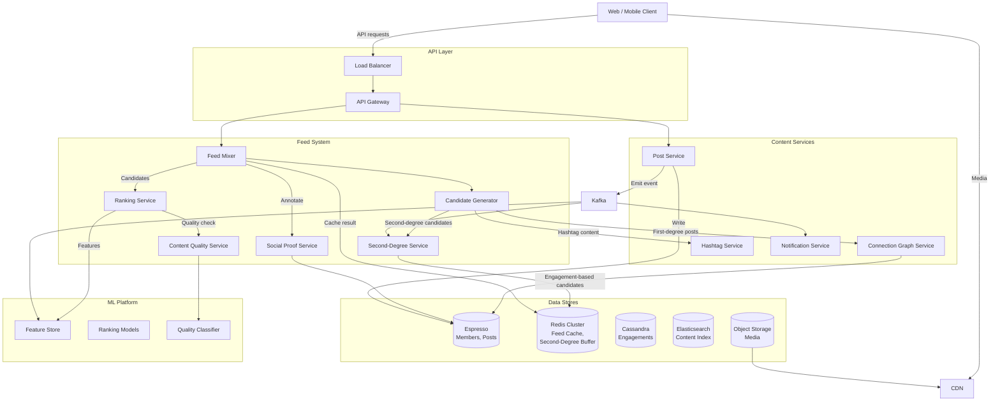
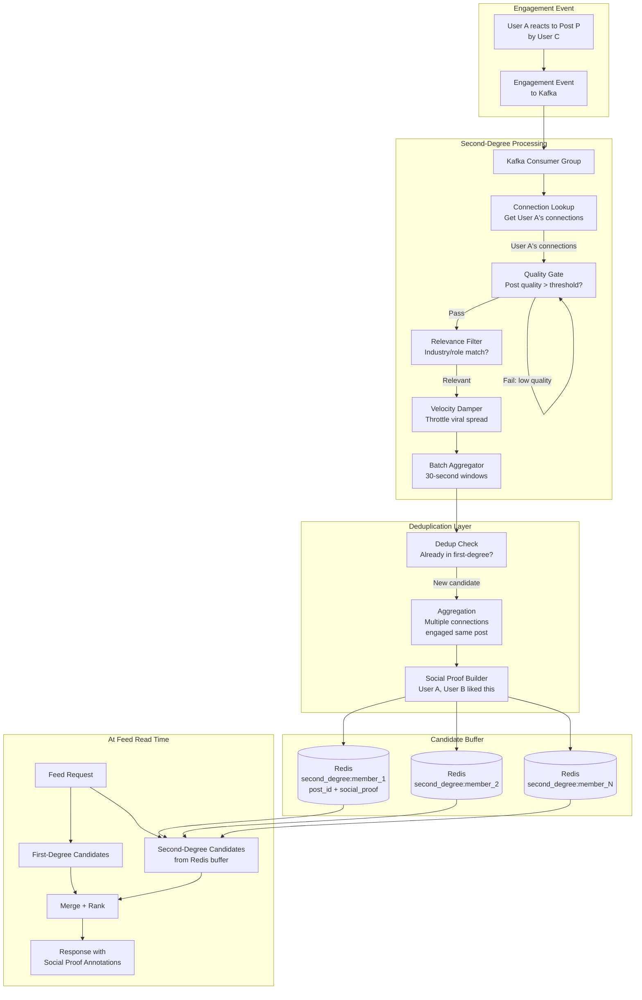
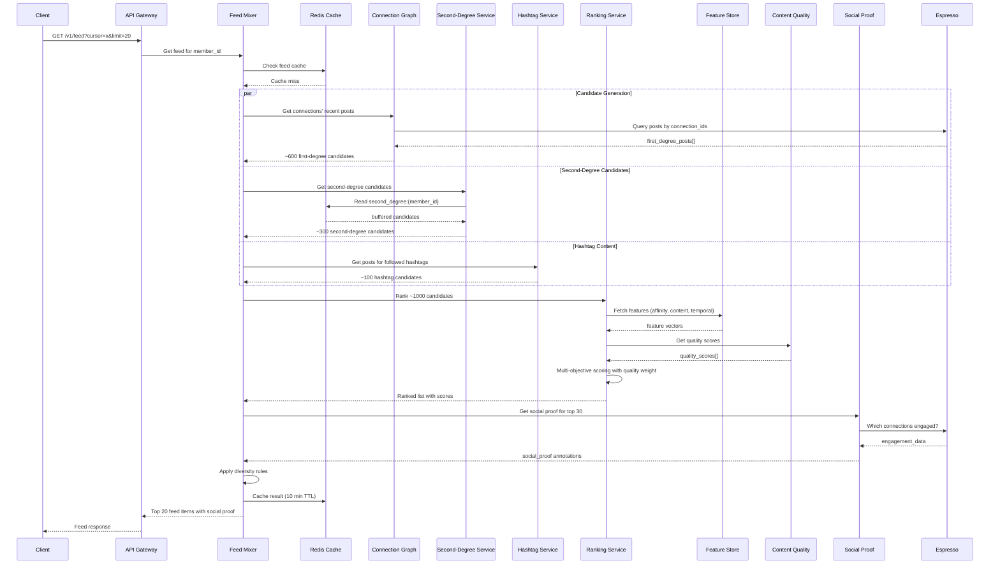

# LinkedIn Feed — Architecture Diagrams

## 1. High-Level Architecture

```mermaid
flowchart TB
    Client[Web / Mobile Client]

    subgraph Gateway["API Layer"]
        LB[Load Balancer]
        AG[API Gateway]
    end

    subgraph FeedSystem["Feed System"]
        FM[Feed Mixer]
        CG[Candidate Generator]
        SD[Second-Degree Service]
        RS[Ranking Service]
        SP[Social Proof Service]
        CQ[Content Quality Service]
    end

    subgraph ContentServices["Content Services"]
        PS[Post Service]
        CGS[Connection Graph Service]
        HS[Hashtag Service]
        NS[Notification Service]
    end

    subgraph DataStores["Data Stores"]
        ESP[(Espresso<br/>Members, Posts)]
        REDIS[(Redis Cluster<br/>Feed Cache,<br/>Second-Degree Buffer)]
        CASS[(Cassandra<br/>Engagements)]
        ES[(Elasticsearch<br/>Content Index)]
        S3[(Object Storage<br/>Media)]
    end

    subgraph MLPlatform["ML Platform"]
        FEAT[Feature Store]
        MODEL[Ranking Models]
        QUAL[Quality Classifier]
    end

    K[Kafka]
    CDN[CDN]

    Client -->|API requests| LB
    Client -->|Media| CDN
    LB --> AG
    AG --> FM & PS

    FM --> CG
    CG -->|First-degree posts| CGS
    CG -->|Second-degree candidates| SD
    CG -->|Hashtag content| HS
    CGS --> ESP

    SD -->|Engagement-based candidates| REDIS
    FM -->|Candidates| RS
    RS -->|Features| FEAT
    RS -->|Quality check| CQ
    CQ --> QUAL
    FM -->|Annotate| SP
    SP --> ESP

    FM -->|Cache result| REDIS

    PS -->|Write| ESP
    PS -->|Emit event| K
    K --> SD
    K --> FEAT
    K --> NS

    S3 --> CDN
```

## 2. Second-Degree Content Pipeline — Deep Dive

```mermaid
flowchart TB
    subgraph Trigger["Engagement Event"]
        UA[User A reacts to Post P<br/>by User C]
        EV[Engagement Event<br/>to Kafka]
    end

    subgraph Processing["Second-Degree Processing"]
        KC[Kafka Consumer Group]
        CL[Connection Lookup<br/>Get User A's connections]
        QG[Quality Gate<br/>Post quality > threshold?]
        RF[Relevance Filter<br/>Industry/role match?]
        VD[Velocity Damper<br/>Throttle viral spread]
        BA[Batch Aggregator<br/>30-second windows]
    end

    subgraph Storage["Candidate Buffer"]
        R1[(Redis<br/>second_degree:member_1<br/>post_id + social_proof)]
        R2[(Redis<br/>second_degree:member_2)]
        RN[(Redis<br/>second_degree:member_N)]
    end

    subgraph Dedup["Deduplication Layer"]
        DD[Dedup Check<br/>Already in first-degree?]
        AGG[Aggregation<br/>Multiple connections<br/>engaged same post]
        SPB[Social Proof Builder<br/>User A, User B liked this]
    end

    subgraph FeedRead["At Feed Read Time"]
        FR[Feed Request]
        FD[First-Degree Candidates]
        SD[Second-Degree Candidates<br/>from Redis buffer]
        MERGE[Merge + Rank]
        RESP[Response with<br/>Social Proof Annotations]
    end

    UA --> EV
    EV --> KC
    KC --> CL
    CL -->|User A's connections| QG
    QG -->|Pass| RF
    QG -->|Fail: low quality| QG
    RF -->|Relevant| VD
    VD --> BA

    BA --> DD
    DD -->|New candidate| AGG
    AGG --> SPB
    SPB --> R1 & R2 & RN

    FR --> FD & SD
    R1 & R2 & RN --> SD
    FD --> MERGE
    SD --> MERGE
    MERGE --> RESP
```

## 3. Feed Load with Ranking — Sequence Diagram

```mermaid
sequenceDiagram
    participant C as Client
    participant AG as API Gateway
    participant FM as Feed Mixer
    participant CACHE as Redis Cache
    participant CGS as Connection Graph
    participant SD as Second-Degree Service
    participant HS as Hashtag Service
    participant RS as Ranking Service
    participant FS as Feature Store
    participant CQ as Content Quality
    participant SP as Social Proof
    participant DB as Espresso

    C->>AG: GET /v1/feed?cursor=x&limit=20
    AG->>FM: Get feed for member_id

    FM->>CACHE: Check feed cache
    CACHE-->>FM: Cache miss

    par Candidate Generation
        FM->>CGS: Get connections' recent posts
        CGS->>DB: Query posts by connection_ids
        DB-->>CGS: first_degree_posts[]
        CGS-->>FM: ~600 first-degree candidates
    and Second-Degree Candidates
        FM->>SD: Get second-degree candidates
        SD->>CACHE: Read second_degree:{member_id}
        CACHE-->>SD: buffered candidates
        SD-->>FM: ~300 second-degree candidates
    and Hashtag Content
        FM->>HS: Get posts for followed hashtags
        HS-->>FM: ~100 hashtag candidates
    end

    FM->>RS: Rank ~1000 candidates
    RS->>FS: Fetch features (affinity, content, temporal)
    FS-->>RS: feature vectors
    RS->>CQ: Get quality scores
    CQ-->>RS: quality_scores[]
    RS->>RS: Multi-objective scoring with quality weight
    RS-->>FM: Ranked list with scores

    FM->>SP: Get social proof for top 30
    SP->>DB: Which connections engaged?
    DB-->>SP: engagement_data
    SP-->>FM: social_proof annotations

    FM->>FM: Apply diversity rules
    FM->>CACHE: Cache result (10 min TTL)
    FM-->>AG: Top 20 feed items with social proof
    AG-->>C: Feed response
```
