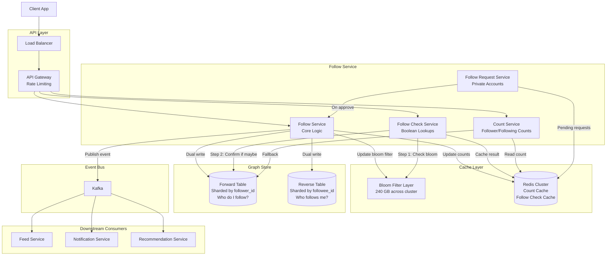
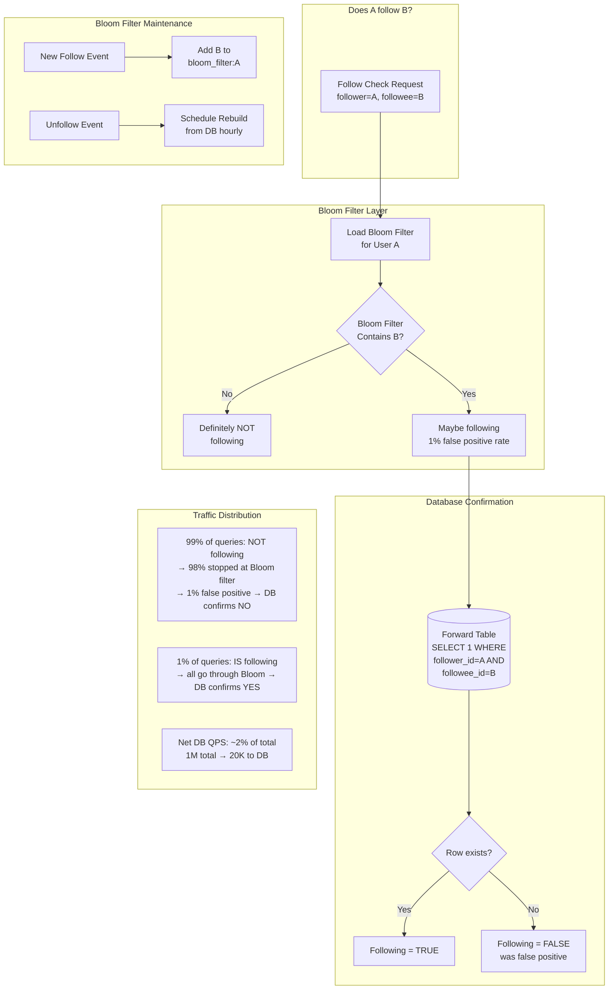
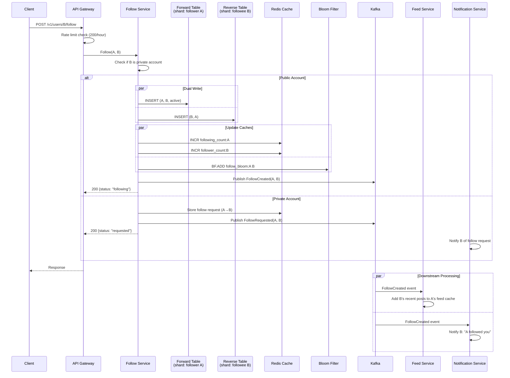

# Follow System — Architecture Diagrams

## 1. High-Level Architecture

```mermaid
flowchart TB
    Client[Client App]

    subgraph Gateway["API Layer"]
        LB[Load Balancer]
        AG[API Gateway<br/>Rate Limiting]
    end

    subgraph FollowService["Follow Service"]
        FS[Follow Service<br/>Core Logic]
        FCS[Follow Check Service<br/>Boolean Lookups]
        CS[Count Service<br/>Follower/Following Counts]
        FRS[Follow Request Service<br/>Private Accounts]
    end

    subgraph CacheLayer["Cache Layer"]
        BF[Bloom Filter Layer<br/>240 GB across cluster]
        RC[(Redis Cluster<br/>Count Cache<br/>Follow Check Cache)]
    end

    subgraph DataStores["Graph Store"]
        FWD[(Forward Table<br/>Sharded by follower_id<br/>Who do I follow?)]
        REV[(Reverse Table<br/>Sharded by followee_id<br/>Who follows me?)]
    end

    subgraph EventBus["Event Bus"]
        K[Kafka]
    end

    subgraph Downstream["Downstream Consumers"]
        FEED[Feed Service]
        NOTIF[Notification Service]
        RECO[Recommendation Service]
    end

    Client --> LB
    LB --> AG
    AG --> FS & FCS & CS

    FS -->|Dual write| FWD & REV
    FS -->|Update counts| RC
    FS -->|Update bloom filter| BF
    FS -->|Publish event| K

    FCS -->|Step 1: Check bloom| BF
    FCS -->|Step 2: Confirm if maybe| FWD
    FCS -->|Cache result| RC

    CS -->|Read count| RC
    CS -->|Fallback| FWD

    FRS -->|Pending requests| RC
    FRS -->|On approve| FS

    K --> FEED & NOTIF & RECO
```

## 2. Bloom Filter Follow Check — Deep Dive

```mermaid
flowchart TB
    subgraph Query["Does A follow B?"]
        REQ[Follow Check Request<br/>follower=A, followee=B]
    end

    subgraph BloomLayer["Bloom Filter Layer"]
        BL[Load Bloom Filter<br/>for User A]
        CHECK{Bloom Filter<br/>Contains B?}
        DEF_NO[Definitely NOT<br/>following]
        MAYBE[Maybe following<br/>1% false positive rate]
    end

    subgraph DBLayer["Database Confirmation"]
        DB[(Forward Table<br/>SELECT 1 WHERE<br/>follower_id=A AND<br/>followee_id=B)]
        CONFIRM{Row exists?}
        YES[Following = TRUE]
        NO[Following = FALSE<br/>was false positive]
    end

    subgraph Stats["Traffic Distribution"]
        S1["99% of queries: NOT following<br/>→ 98% stopped at Bloom filter<br/>→ 1% false positive → DB confirms NO"]
        S2["1% of queries: IS following<br/>→ all go through Bloom → DB confirms YES"]
        S3["Net DB QPS: ~2% of total<br/>1M total → 20K to DB"]
    end

    subgraph Maintenance["Bloom Filter Maintenance"]
        FOLLOW[New Follow Event]
        ADD[Add B to<br/>bloom_filter:A]
        UNFOLLOW[Unfollow Event]
        REBUILD[Schedule Rebuild<br/>from DB hourly]
    end

    REQ --> BL
    BL --> CHECK
    CHECK -->|No| DEF_NO
    CHECK -->|Yes| MAYBE

    MAYBE --> DB
    DB --> CONFIRM
    CONFIRM -->|Yes| YES
    CONFIRM -->|No| NO

    FOLLOW --> ADD
    UNFOLLOW --> REBUILD

    DEF_NO ~~~ Stats
```

## 3. Follow and Fan-out — Sequence Diagram

```mermaid
sequenceDiagram
    participant C as Client
    participant AG as API Gateway
    participant FS as Follow Service
    participant FWD as Forward Table<br/>(shard: follower A)
    participant REV as Reverse Table<br/>(shard: followee B)
    participant RC as Redis Cache
    participant BF as Bloom Filter
    participant K as Kafka
    participant FEED as Feed Service
    participant NOTIF as Notification Service

    C->>AG: POST /v1/users/B/follow
    AG->>AG: Rate limit check (200/hour)
    AG->>FS: Follow(A, B)

    FS->>FS: Check if B is private account

    alt Public Account
        par Dual Write
            FS->>FWD: INSERT (A, B, active)
        and
            FS->>REV: INSERT (B, A)
        end

        par Update Caches
            FS->>RC: INCR following_count:A
            FS->>RC: INCR follower_count:B
        and
            FS->>BF: BF.ADD follow_bloom:A B
        end

        FS->>K: Publish FollowCreated(A, B)
        FS-->>AG: 200 {status: "following"}
    else Private Account
        FS->>RC: Store follow request (A→B)
        FS->>K: Publish FollowRequested(A, B)
        FS-->>AG: 200 {status: "requested"}
        NOTIF->>NOTIF: Notify B of follow request
    end

    AG-->>C: Response

    par Downstream Processing
        K->>FEED: FollowCreated event
        FEED->>FEED: Add B's recent posts to A's feed cache
    and
        K->>NOTIF: FollowCreated event
        NOTIF->>NOTIF: Notify B: "A followed you"
    end
```
