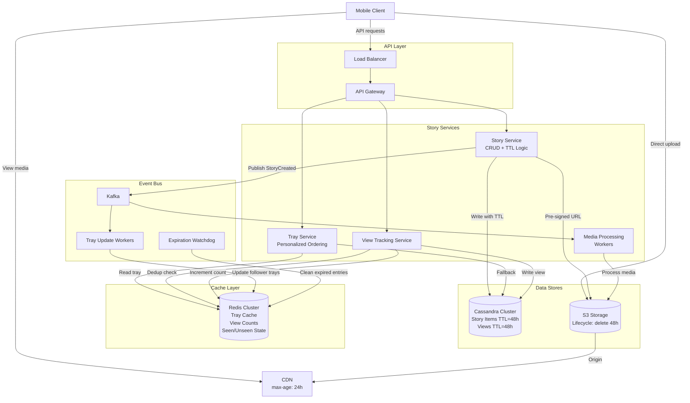
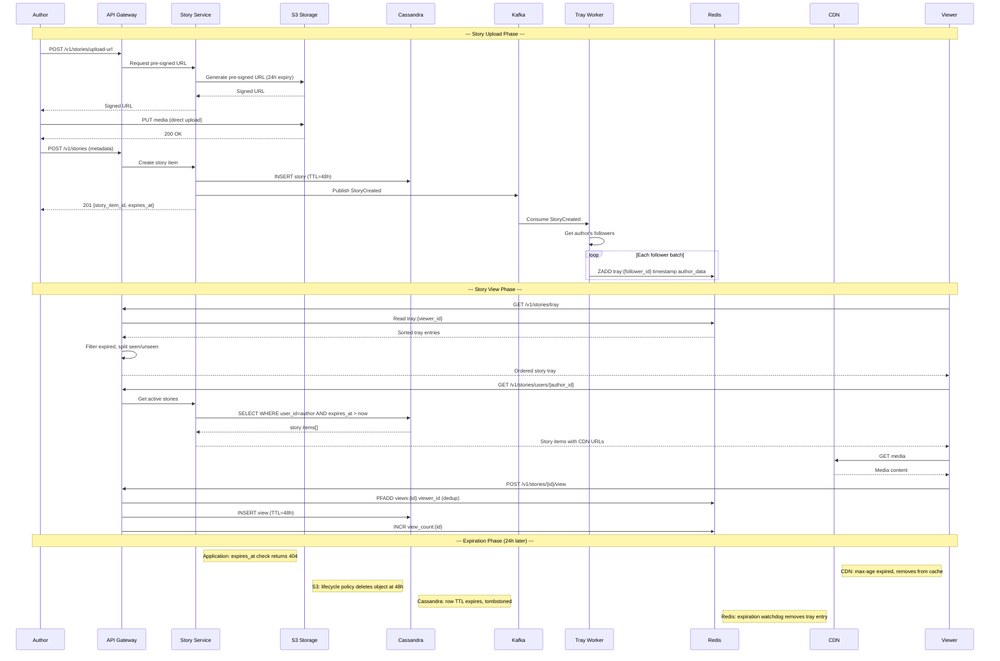

# 24-Hour Story Feature — Architecture Diagrams

## 1. High-Level Architecture



## 2. Story Tray Generation — Deep Dive

```mermaid
flowchart TB
    subgraph StoryCreation["Story Created"]
        NEW[User A posts story]
        EV[StoryCreated Event<br/>to Kafka]
    end

    subgraph TrayFanOut["Fan-out-on-Write"]
        KC[Kafka Consumer]
        FL[Get A's Followers]
        CT{Celebrity<br/>check}
        NORM[Normal Path:<br/>Update each<br/>follower's tray]
        CELEB[Celebrity Path:<br/>Skip fan-out,<br/>pull at read time]
    end

    subgraph TrayCache["Redis Tray Cache"]
        T1["ZADD tray:follower_1<br/>score=timestamp<br/>member=user_A_data"]
        T2["ZADD tray:follower_2"]
        TN["ZADD tray:follower_N"]
    end

    subgraph TrayRead["Tray Read Path"]
        REQ[User opens app]
        RC[Read tray:{user_id}<br/>from Redis]
        EXPIRE[Filter expired<br/>entries: expires_at < now]
        CPULL[Pull celebrity<br/>stories]
        MERGE[Merge + Deduplicate]
        UNSEEN[Split: unseen first<br/>then seen]
        AFFINITY[Sort by affinity<br/>within each group]
        RESP[Return ordered tray]
    end

    subgraph SeenTracking["Seen/Unseen"]
        VIEW[User views story]
        MARK[Set bit in<br/>seen:{user_id}:{date}]
        CHECK[On tray build:<br/>check all items seen?]
    end

    NEW --> EV
    EV --> KC
    KC --> FL
    FL --> CT
    CT -->|"< 100K followers"| NORM
    CT -->|">= 100K followers"| CELEB
    NORM --> T1 & T2 & TN

    REQ --> RC
    RC --> EXPIRE
    EXPIRE --> CPULL
    CPULL --> MERGE
    MERGE --> UNSEEN
    UNSEEN --> AFFINITY
    AFFINITY --> RESP

    VIEW --> MARK
    MARK --> CHECK
    CHECK --> UNSEEN
```

## 3. Story Upload, View, and Expiration — Sequence Diagram


