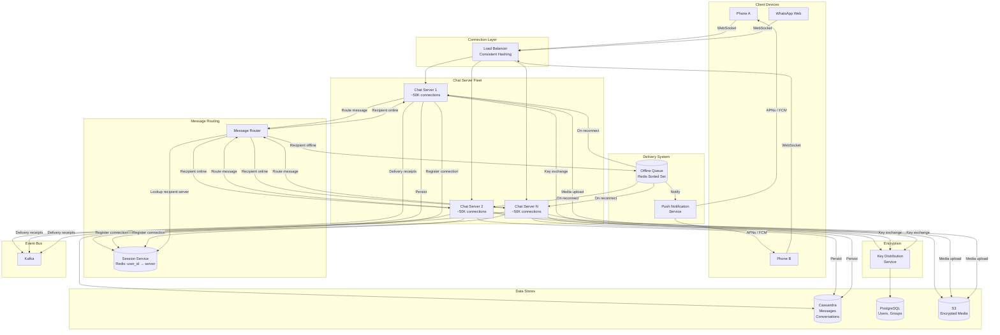
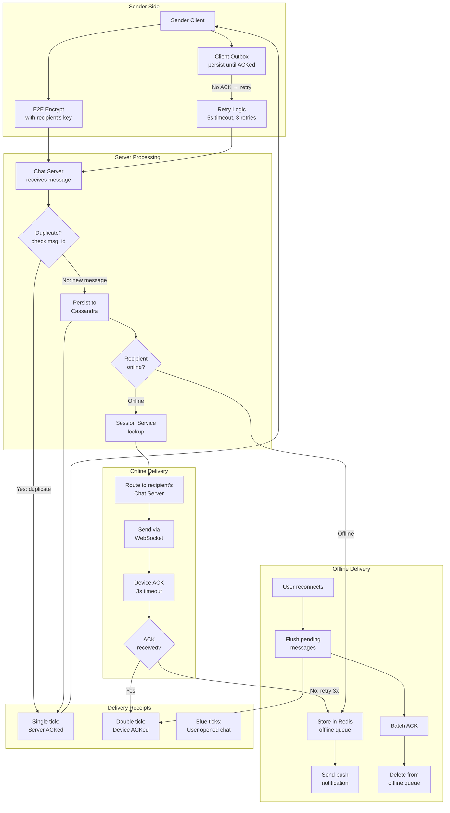
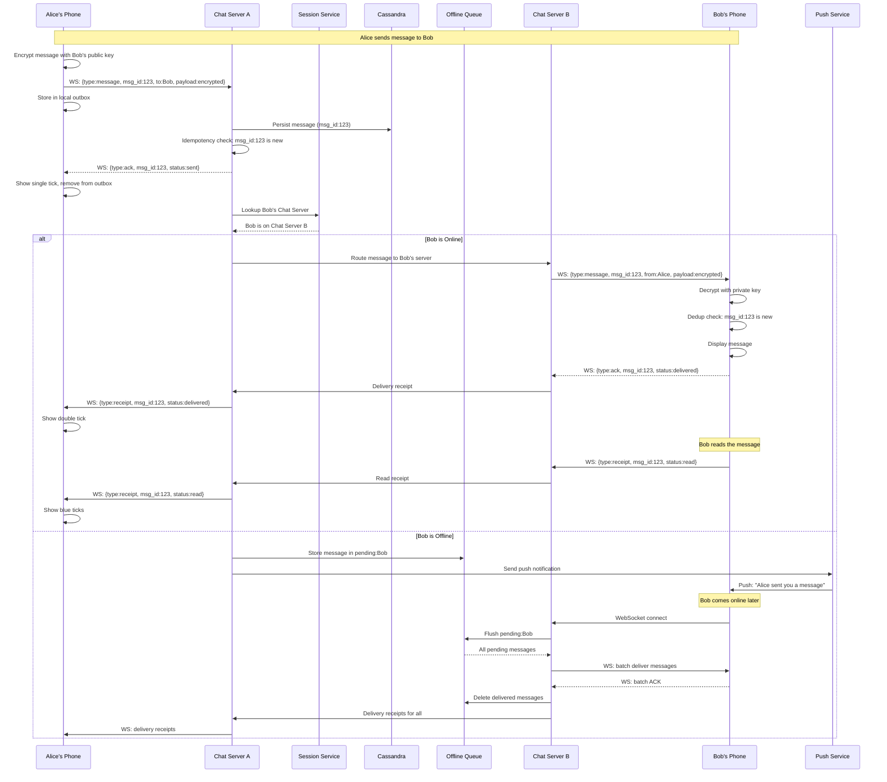

# WhatsApp — Architecture Diagrams

## 1. High-Level Architecture

```mermaid
flowchart TB
    subgraph Clients["Client Devices"]
        PA[Phone A]
        PB[Phone B]
        WEB[WhatsApp Web]
    end

    subgraph Gateway["Connection Layer"]
        LB[Load Balancer<br/>Consistent Hashing]
    end

    subgraph ChatLayer["Chat Server Fleet"]
        CS1[Chat Server 1<br/>~50K connections]
        CS2[Chat Server 2<br/>~50K connections]
        CSN[Chat Server N<br/>~50K connections]
    end

    subgraph Routing["Message Routing"]
        SS[(Session Service<br/>Redis: user_id → server)]
        MR[Message Router]
    end

    subgraph Delivery["Delivery System"]
        OQ[(Offline Queue<br/>Redis Sorted Set)]
        PNS[Push Notification<br/>Service]
    end

    subgraph Security["Encryption"]
        KDS[Key Distribution<br/>Service]
    end

    subgraph Storage["Data Stores"]
        CASS[(Cassandra<br/>Messages<br/>Conversations)]
        PG[(PostgreSQL<br/>Users, Groups)]
        S3[(S3<br/>Encrypted Media)]
    end

    subgraph Events["Event Bus"]
        K[Kafka]
    end

    PA -->|WebSocket| LB
    PB -->|WebSocket| LB
    WEB -->|WebSocket| LB

    LB --> CS1 & CS2 & CSN

    CS1 & CS2 & CSN -->|Register connection| SS
    CS1 & CS2 & CSN -->|Route message| MR
    MR -->|Lookup recipient server| SS
    MR -->|Recipient online| CS1 & CS2 & CSN
    MR -->|Recipient offline| OQ

    OQ -->|On reconnect| CS1 & CS2 & CSN
    OQ -->|Notify| PNS
    PNS -->|APNs / FCM| PA & PB

    CS1 & CS2 & CSN -->|Persist| CASS
    CS1 & CS2 & CSN -->|Key exchange| KDS
    KDS --> PG

    CS1 & CS2 & CSN -->|Delivery receipts| K
    CS1 & CS2 & CSN -->|Media upload| S3
```

## 2. Message Delivery Guarantee System — Deep Dive

```mermaid
flowchart TB
    subgraph Sender["Sender Side"]
        SC[Sender Client]
        ENCRYPT[E2E Encrypt<br/>with recipient's key]
        RETRY[Retry Logic<br/>5s timeout, 3 retries]
        OUTBOX[Client Outbox<br/>persist until ACKed]
    end

    subgraph Server["Server Processing"]
        CS[Chat Server<br/>receives message]
        IDEM{Duplicate?<br/>check msg_id}
        PERSIST[Persist to<br/>Cassandra]
        ROUTE{Recipient<br/>online?}
        LOOKUP[Session Service<br/>lookup]
    end

    subgraph OnlinePath["Online Delivery"]
        DELIVER[Route to recipient's<br/>Chat Server]
        WSEND[Send via<br/>WebSocket]
        DACK[Device ACK<br/>3s timeout]
        DRETRY{ACK<br/>received?}
    end

    subgraph OfflinePath["Offline Delivery"]
        QUEUE[Store in Redis<br/>offline queue]
        PUSH[Send push<br/>notification]
        RECONNECT[User reconnects]
        FLUSH[Flush pending<br/>messages]
        BATCH_ACK[Batch ACK]
        CLEANUP[Delete from<br/>offline queue]
    end

    subgraph Receipts["Delivery Receipts"]
        SENT[Single tick:<br/>Server ACKed]
        DELIVERED[Double tick:<br/>Device ACKed]
        READ[Blue ticks:<br/>User opened chat]
    end

    SC --> ENCRYPT
    ENCRYPT --> CS
    CS --> IDEM
    IDEM -->|Yes: duplicate| SENT
    IDEM -->|No: new message| PERSIST
    PERSIST --> ROUTE
    PERSIST --> SENT
    SENT --> SC

    ROUTE -->|Online| LOOKUP
    LOOKUP --> DELIVER
    DELIVER --> WSEND
    WSEND --> DACK
    DACK --> DRETRY
    DRETRY -->|Yes| DELIVERED
    DRETRY -->|No: retry 3x| QUEUE

    ROUTE -->|Offline| QUEUE
    QUEUE --> PUSH

    RECONNECT --> FLUSH
    FLUSH --> BATCH_ACK
    BATCH_ACK --> CLEANUP
    FLUSH --> DELIVERED

    SC --> OUTBOX
    OUTBOX -->|"No ACK → retry"| RETRY
    RETRY --> CS
```

## 3. One-on-One Message — Sequence Diagram

```mermaid
sequenceDiagram
    participant A as Alice's Phone
    participant CSA as Chat Server A
    participant SS as Session Service
    participant CASS as Cassandra
    participant OQ as Offline Queue
    participant CSB as Chat Server B
    participant B as Bob's Phone
    participant PNS as Push Service

    Note over A,B: Alice sends message to Bob

    A->>A: Encrypt message with Bob's public key
    A->>CSA: WS: {type:message, msg_id:123, to:Bob, payload:encrypted}
    A->>A: Store in local outbox

    CSA->>CASS: Persist message (msg_id:123)
    CSA->>CSA: Idempotency check: msg_id:123 is new
    CSA-->>A: WS: {type:ack, msg_id:123, status:sent}
    A->>A: Show single tick, remove from outbox

    CSA->>SS: Lookup Bob's Chat Server
    SS-->>CSA: Bob is on Chat Server B

    alt Bob is Online
        CSA->>CSB: Route message to Bob's server
        CSB->>B: WS: {type:message, msg_id:123, from:Alice, payload:encrypted}
        B->>B: Decrypt with private key
        B->>B: Dedup check: msg_id:123 is new
        B->>B: Display message
        B-->>CSB: WS: {type:ack, msg_id:123, status:delivered}
        CSB->>CSA: Delivery receipt
        CSA->>A: WS: {type:receipt, msg_id:123, status:delivered}
        A->>A: Show double tick

        Note over B: Bob reads the message
        B->>CSB: WS: {type:receipt, msg_id:123, status:read}
        CSB->>CSA: Read receipt
        CSA->>A: WS: {type:receipt, msg_id:123, status:read}
        A->>A: Show blue ticks
    else Bob is Offline
        CSA->>OQ: Store message in pending:Bob
        CSA->>PNS: Send push notification
        PNS->>B: Push: "Alice sent you a message"

        Note over B: Bob comes online later
        B->>CSB: WebSocket connect
        CSB->>OQ: Flush pending:Bob
        OQ-->>CSB: All pending messages
        CSB->>B: WS: batch deliver messages
        B-->>CSB: WS: batch ACK
        CSB->>OQ: Delete delivered messages
        CSB->>CSA: Delivery receipts for all
        CSA->>A: WS: delivery receipts
    end
```
