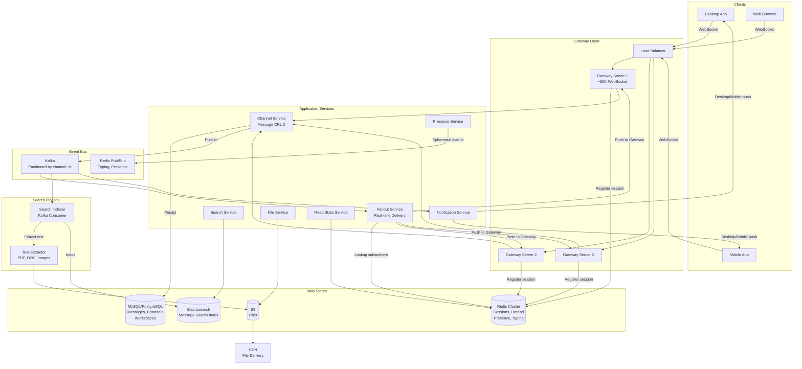
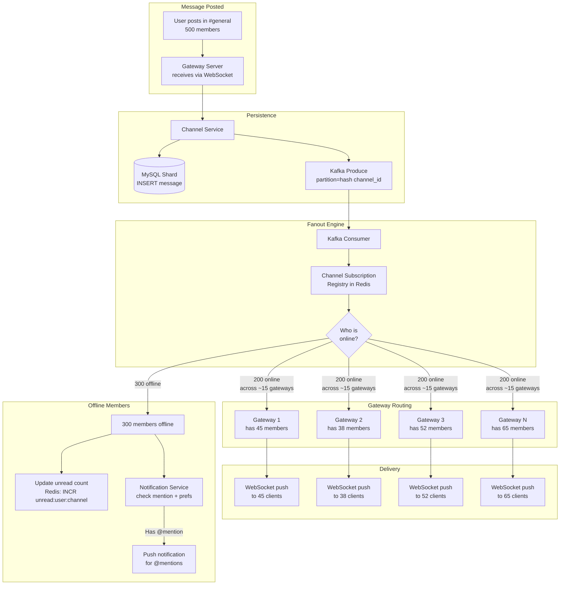
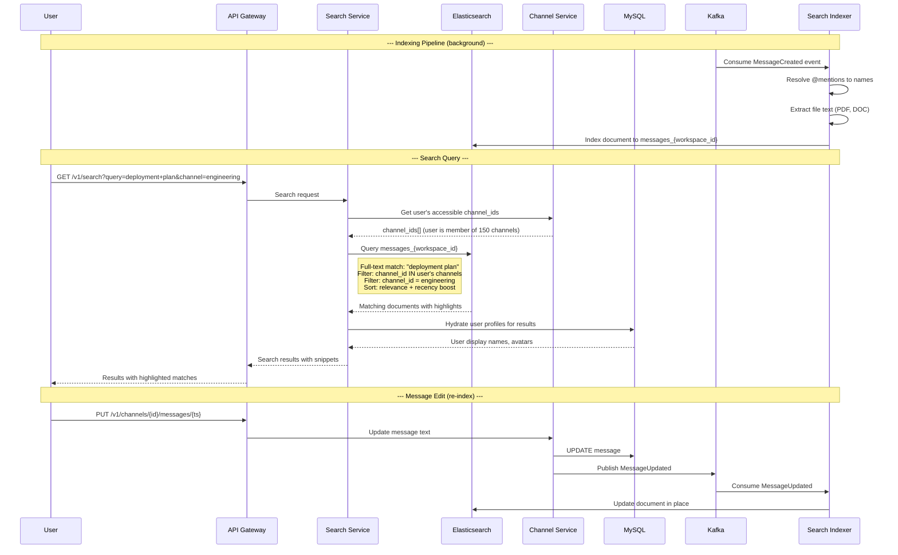

# Slack — Architecture Diagrams

## 1. High-Level Architecture

```mermaid
flowchart TB
    subgraph Clients["Clients"]
        DESK[Desktop App]
        MOB[Mobile App]
        WEB[Web Browser]
    end

    subgraph GatewayLayer["Gateway Layer"]
        LB[Load Balancer]
        GW1[Gateway Server 1<br/>~50K WebSocket]
        GW2[Gateway Server 2]
        GWN[Gateway Server N]
    end

    subgraph AppServices["Application Services"]
        CS[Channel Service<br/>Message CRUD]
        FS[Fanout Service<br/>Real-time Delivery]
        SS[Search Service]
        NS[Notification Service]
        FLS[File Service]
        PS[Presence Service]
        RS[Read State Service]
    end

    subgraph EventBus["Event Bus"]
        K[Kafka<br/>Partitioned by channel_id]
        RPUB[Redis Pub/Sub<br/>Typing, Presence]
    end

    subgraph DataStores["Data Stores"]
        MySQL[(MySQL/PostgreSQL<br/>Messages, Channels<br/>Workspaces)]
        REDIS[(Redis Cluster<br/>Sessions, Unread<br/>Presence, Typing)]
        ES[(Elasticsearch<br/>Message Search Index)]
        S3[(S3<br/>Files)]
    end

    subgraph SearchPipeline["Search Pipeline"]
        SI[Search Indexer<br/>Kafka Consumer]
        TE[Text Extractor<br/>PDF, DOC, Images]
    end

    CDN[CDN<br/>File Delivery]

    DESK & MOB & WEB -->|WebSocket| LB
    LB --> GW1 & GW2 & GWN

    GW1 & GW2 & GWN -->|Register session| REDIS
    GW1 & GW2 & GWN --> CS

    CS -->|Persist| MySQL
    CS -->|Publish| K

    K --> FS
    K --> SI
    K --> NS

    FS -->|Lookup subscribers| REDIS
    FS -->|Push to Gateway| GW1 & GW2 & GWN

    SI -->|Extract text| TE
    SI -->|Index| ES
    TE --> S3

    SS --> ES

    NS -->|Desktop/Mobile push| DESK & MOB
    PS -->|Ephemeral events| RPUB
    RS --> REDIS

    FLS --> S3
    S3 --> CDN
```

## 2. Channel Message Fanout — Deep Dive

```mermaid
flowchart TB
    subgraph MessagePost["Message Posted"]
        USER[User posts in #general<br/>500 members]
        GW[Gateway Server<br/>receives via WebSocket]
    end

    subgraph Persist["Persistence"]
        CS[Channel Service]
        DB[(MySQL Shard<br/>INSERT message)]
        KP[Kafka Produce<br/>partition=hash channel_id]
    end

    subgraph FanoutEngine["Fanout Engine"]
        KC[Kafka Consumer]
        SUB[Channel Subscription<br/>Registry in Redis]
        ONLINE{Who is<br/>online?}
    end

    subgraph GatewayRouting["Gateway Routing"]
        G1[Gateway 1<br/>has 45 members]
        G2[Gateway 2<br/>has 38 members]
        G3[Gateway 3<br/>has 52 members]
        GN[Gateway N<br/>has 65 members]
    end

    subgraph Delivery["Delivery"]
        WS1[WebSocket push<br/>to 45 clients]
        WS2[WebSocket push<br/>to 38 clients]
        WS3[WebSocket push<br/>to 52 clients]
        WSN[WebSocket push<br/>to 65 clients]
    end

    subgraph Offline["Offline Members"]
        OL[300 members offline]
        URC[Update unread count<br/>Redis: INCR unread:user:channel]
        NOTIF[Notification Service<br/>check mention + prefs]
        PUSH[Push notification<br/>for @mentions]
    end

    USER --> GW
    GW --> CS
    CS --> DB
    CS --> KP

    KP --> KC
    KC --> SUB
    SUB --> ONLINE

    ONLINE -->|"200 online<br/>across ~15 gateways"| G1 & G2 & G3 & GN
    G1 --> WS1
    G2 --> WS2
    G3 --> WS3
    GN --> WSN

    ONLINE -->|300 offline| OL
    OL --> URC
    OL --> NOTIF
    NOTIF -->|Has @mention| PUSH
```

## 3. Message Search — Sequence Diagram

```mermaid
sequenceDiagram
    participant U as User
    participant AG as API Gateway
    participant SS as Search Service
    participant ES as Elasticsearch
    participant CS as Channel Service
    participant DB as MySQL
    participant K as Kafka
    participant SI as Search Indexer

    Note over U,SI: --- Indexing Pipeline (background) ---

    K->>SI: Consume MessageCreated event
    SI->>SI: Resolve @mentions to names
    SI->>SI: Extract file text (PDF, DOC)
    SI->>ES: Index document to messages_{workspace_id}

    Note over U,SI: --- Search Query ---

    U->>AG: GET /v1/search?query=deployment+plan&channel=engineering
    AG->>SS: Search request

    SS->>CS: Get user's accessible channel_ids
    CS-->>SS: channel_ids[] (user is member of 150 channels)

    SS->>ES: Query messages_{workspace_id}
    Note right of SS: Full-text match: "deployment plan"<br/>Filter: channel_id IN user's channels<br/>Filter: channel_id = engineering<br/>Sort: relevance + recency boost

    ES-->>SS: Matching documents with highlights

    SS->>DB: Hydrate user profiles for results
    DB-->>SS: User display names, avatars

    SS-->>AG: Search results with snippets
    AG-->>U: Results with highlighted matches

    Note over U,SI: --- Message Edit (re-index) ---

    U->>AG: PUT /v1/channels/{id}/messages/{ts}
    AG->>CS: Update message text
    CS->>DB: UPDATE message
    CS->>K: Publish MessageUpdated

    K->>SI: Consume MessageUpdated
    SI->>ES: Update document in place
```
