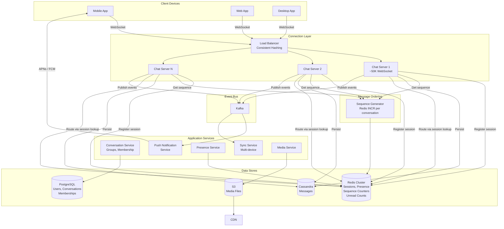
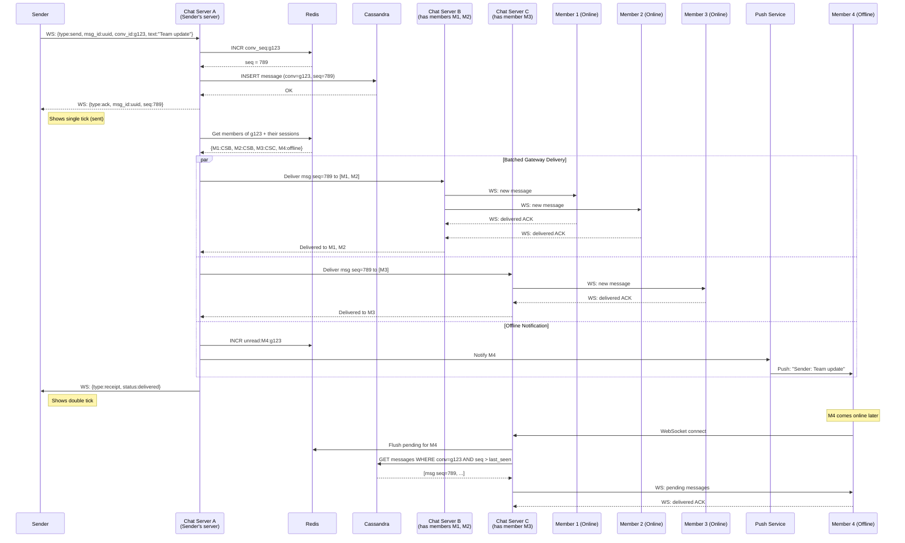

# Chat System — Architecture Diagrams

## 1. High-Level Architecture



## 2. Message Ordering with Sequence Numbers — Deep Dive

```mermaid
flowchart TB
    subgraph Senders["Concurrent Senders"]
        A[User A sends<br/>"Hello" at T=100ms]
        B[User B sends<br/>"Hi" at T=102ms]
    end

    subgraph ChatServers["Chat Servers"]
        CSA[Chat Server A<br/>receives "Hello"]
        CSB[Chat Server B<br/>receives "Hi"]
    end

    subgraph SequenceAssignment["Sequence Assignment (Redis)"]
        REDIS_INCR["Redis Key: conv_seq:c123<br/>Atomic INCR"]
        SEQ1["INCR → returns 4568<br/>(for Hello)"]
        SEQ2["INCR → returns 4569<br/>(for Hi)"]
    end

    subgraph Persistence["Message Persistence (Cassandra)"]
        W1["INSERT: conv=c123, seq=4568<br/>text=Hello, sender=A"]
        W2["INSERT: conv=c123, seq=4569<br/>text=Hi, sender=B"]
    end

    subgraph ClientView["All Clients See Same Order"]
        VIEW["4568: Hello (User A)<br/>4569: Hi (User B)"]
    end

    subgraph GapHandling["Gap Detection"]
        GAP["Client received seq 4569<br/>but not 4568 yet"]
        WAIT["Wait 2 seconds"]
        FETCH["GET /messages?conv=c123<br/>&after_seq=4567&limit=10"]
        FILL["Fill gap with seq 4568"]
    end

    A --> CSA
    B --> CSB

    CSA --> REDIS_INCR
    CSB --> REDIS_INCR
    REDIS_INCR --> SEQ1
    REDIS_INCR --> SEQ2

    SEQ1 --> W1
    SEQ2 --> W2

    W1 & W2 --> VIEW

    VIEW -.->|If gap detected| GAP
    GAP --> WAIT
    WAIT --> FETCH
    FETCH --> FILL
```

## 3. Group Message Delivery — Sequence Diagram


