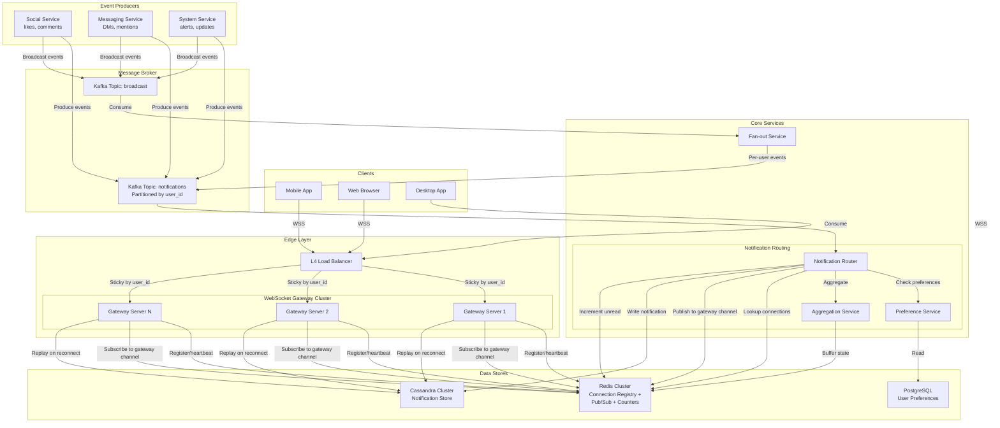
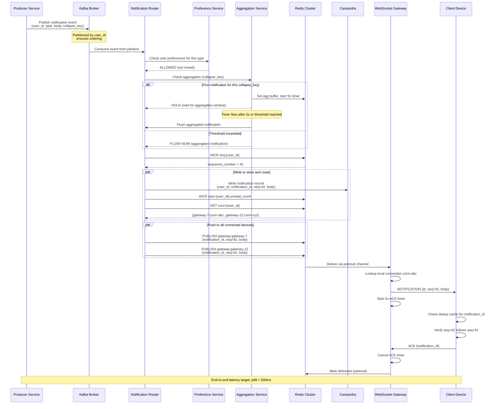

# WebSocket Notification System -- Architecture Diagrams

## 1. High-Level Architecture



## 2. Deep-Dive: Connection Management and Routing Subsystem

```mermaid
flowchart TB
    subgraph Client["Client Device"]
        WS[WebSocket Client]
        DEDUP[Dedup Cache<br/>notification_id set]
        SEQ[Sequence Tracker<br/>last_seen_seq]
    end

    subgraph Gateway["WebSocket Gateway Server"]
        CONN_MGR[Connection Manager]
        AUTH[JWT Authenticator]
        HB[Heartbeat Monitor<br/>30s interval]
        PUSH[Push Handler]
        ACK_TRACK[ACK Tracker<br/>5s timeout, 3 retries]
        DRAIN[Drain Controller]
    end

    subgraph Registry["Connection Registry (Redis)"]
        CR["conn:{user_id}<br/>SET of server:conn pairs"]
        SC["server:{server_id}:connections<br/>connection count"]
        PS["Pub/Sub Channel<br/>gateway:{server_id}"]
        UC["user:{user_id}:unread_count<br/>atomic counter"]
        SN["seq:{user_id}<br/>sequence number"]
    end

    subgraph Router["Notification Router"]
        LOOKUP[Connection Lookup]
        PUBLISH[Channel Publisher]
    end

    WS -->|1. WSS CONNECT + JWT| AUTH
    AUTH -->|2. Validate token| CONN_MGR
    CONN_MGR -->|3. Register| CR
    CONN_MGR -->|4. Increment| SC
    CONN_MGR -->|5. Replay undelivered| WS

    HB -->|Refresh TTL every 30s| CR
    HB -->|No ping for 60s| CONN_MGR
    CONN_MGR -->|Remove on disconnect| CR

    ROUTER_IN[Notification Event] --> LOOKUP
    LOOKUP -->|Query conn:{user_id}| CR
    LOOKUP -->|Get next seq| SN
    PUBLISH -->|Publish to gateway:{server_id}| PS

    PS -->|Receive| PUSH
    PUSH -->|Send notification| WS
    PUSH -->|Start timer| ACK_TRACK
    WS -->|ACK| ACK_TRACK
    ACK_TRACK -->|No ACK: retry| PUSH
    ACK_TRACK -->|3 failures: mark undelivered| Registry

    DRAIN -->|RECONNECT frame with jitter| WS
    DRAIN -->|Deregister from LB| Gateway

    WS -->|Check dedup| DEDUP
    WS -->|Verify sequence| SEQ
    SEQ -->|Gap detected: request fill| Gateway
```

## 3. Critical Path Sequence: Notification Delivery


