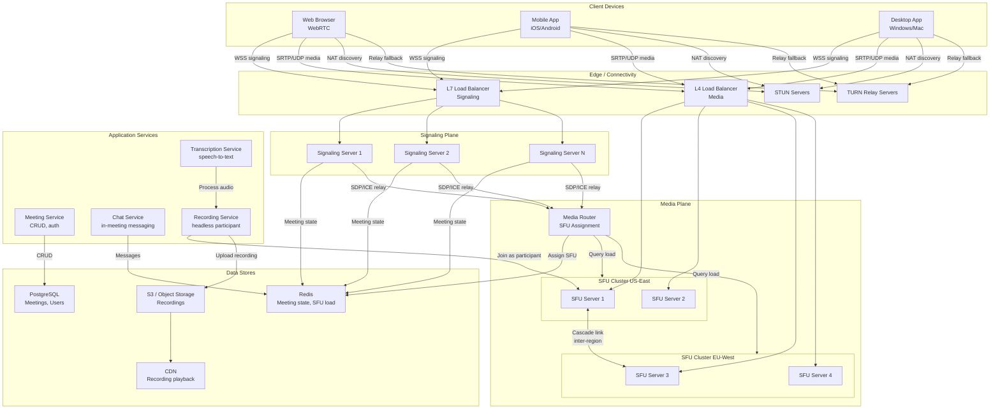
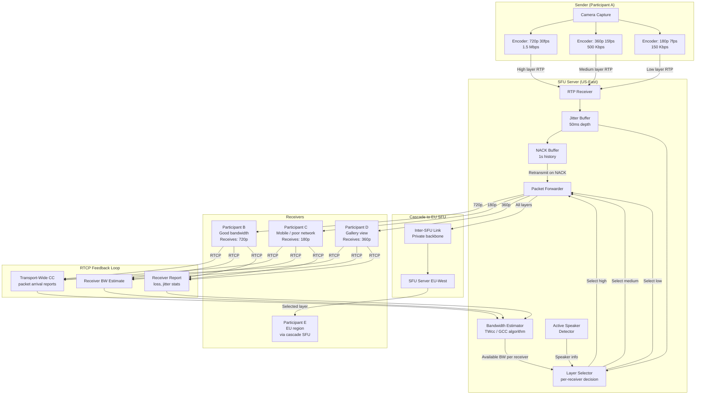
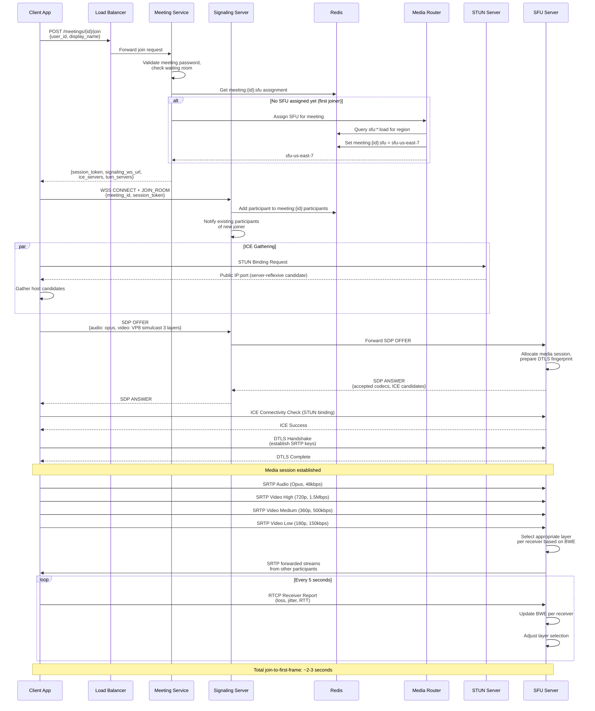

# Zoom / Video Conferencing -- Architecture Diagrams

## 1. High-Level Architecture

## 2. Deep-Dive: SFU Simulcast and Cascading Subsystem

## 3. Critical Path Sequence: Joining a Meeting and Establishing Media

