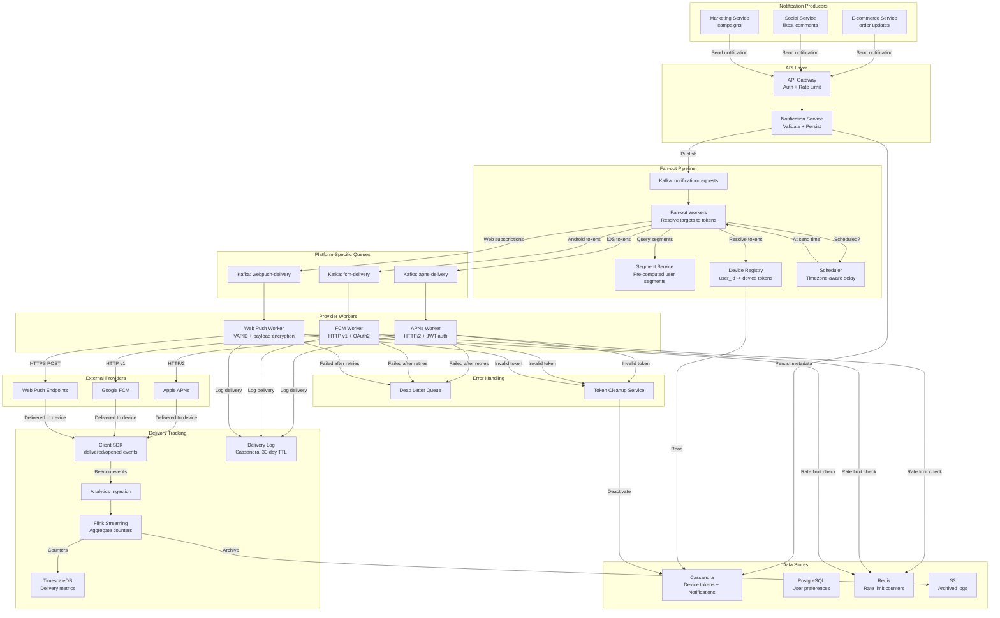
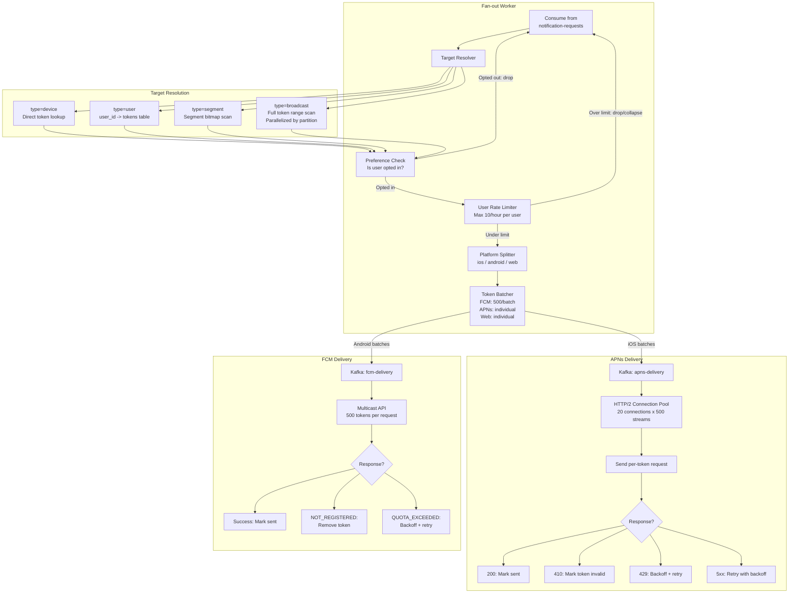
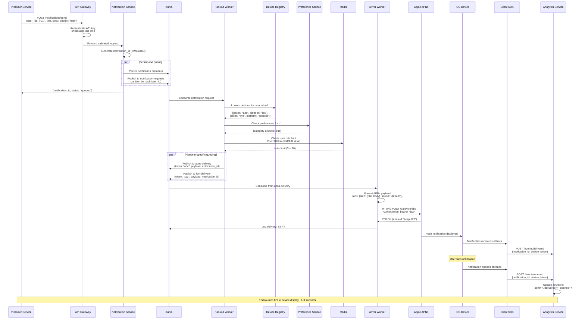

# Push Notifications -- Architecture Diagrams

## 1. High-Level Architecture

## 2. Deep-Dive: Fan-out and Provider Delivery Subsystem

## 3. Critical Path Sequence: Targeted Push Notification Delivery

