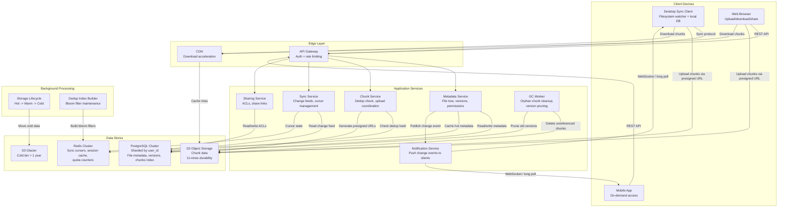
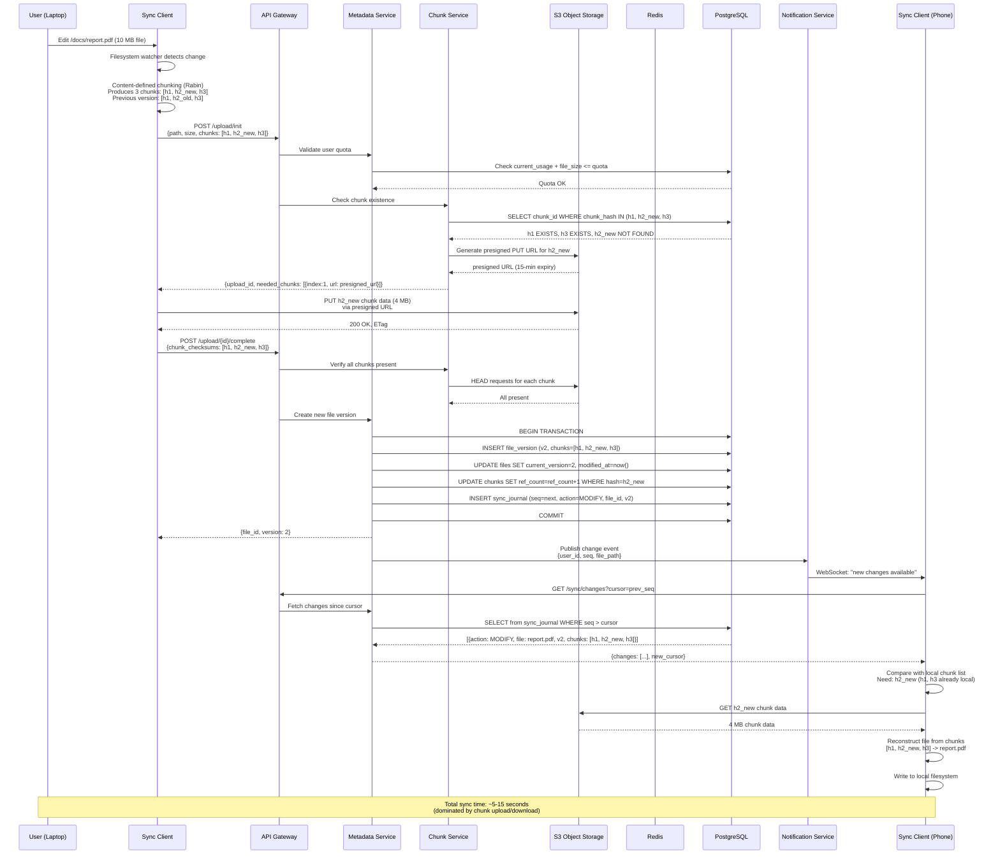

# Dropbox / Google Drive -- Architecture Diagrams

## 1. High-Level Architecture



## 2. Deep-Dive: Chunking and Delta Sync Subsystem

```mermaid
flowchart TB
    subgraph Client["Desktop Sync Client"]
        FS_WATCH[Filesystem Watcher<br/>inotify / FSEvents]
        CHUNKER[Content-Defined Chunker<br/>Rabin fingerprint<br/>Target: 4MB chunks]
        HASH[SHA-256 Hash<br/>per chunk]
        LOCAL_DB[Local SQLite<br/>File metadata + chunk hashes]
        DIFF[Chunk Diff Engine<br/>Compare old vs new chunk list]
        UPLOADER[Parallel Uploader<br/>4 concurrent chunk uploads]
        RESUME[Resume Manager<br/>Track uploaded chunks]
    end

    subgraph Server["Server-Side"]
        UPLOAD_INIT[Upload Init API<br/>Receive chunk hash list]
        DEDUP_CHECK[Dedup Check<br/>Bloom filter + DB lookup]
        PRESIGN[Presigned URL Generator<br/>15-min expiry]
        UPLOAD_COMPLETE[Upload Complete API<br/>Verify all chunks received]
        VERSION_CREATE[Version Creator<br/>New version = ordered chunk list]
        CHANGE_PUBLISH[Change Publisher<br/>Append to sync journal]
    end

    subgraph ObjectStore["Object Storage"]
        S3_PUT[S3 PUT<br/>Store new chunks]
        S3_EXISTING[Existing Chunks<br/>Reuse via ref_count++]
    end

    subgraph OtherDevices["Other Devices"]
        SYNC_PULL[Sync Client<br/>Pull change feed]
        CHUNK_DOWNLOAD[Download changed chunks]
        RECONSTRUCT[Reconstruct file<br/>from chunk list]
    end

    FS_WATCH -->|File changed: /docs/report.pdf| CHUNKER
    CHUNKER -->|Split into variable-size chunks<br/>using rolling hash| HASH
    HASH -->|Chunk hashes: [h1, h2, h3_new, h4]| DIFF
    DIFF -->|Compare with LOCAL_DB<br/>Previous: [h1, h2, h3_old, h4]| DIFF
    DIFF -->|Changed chunks: [h3_new]<br/>Unchanged: [h1, h2, h4]| UPLOAD_INIT

    UPLOAD_INIT -->|Check each hash| DEDUP_CHECK
    DEDUP_CHECK -->|h1: exists, h2: exists<br/>h3_new: NOT found, h4: exists| PRESIGN
    PRESIGN -->|Presigned URL for h3_new only| UPLOADER

    UPLOADER -->|PUT chunk data| S3_PUT
    DEDUP_CHECK -->|Increment ref_count| S3_EXISTING
    UPLOADER -->|Track progress| RESUME

    UPLOADER -->|All chunks uploaded| UPLOAD_COMPLETE
    UPLOAD_COMPLETE -->|Verify checksums| VERSION_CREATE
    VERSION_CREATE -->|v2 = [h1, h2, h3_new, h4]| CHANGE_PUBLISH
    CHANGE_PUBLISH -->|Notify| SYNC_PULL

    SYNC_PULL -->|GET /sync/changes| CHANGE_PUBLISH
    SYNC_PULL -->|Need chunk h3_new| CHUNK_DOWNLOAD
    CHUNK_DOWNLOAD -->|Download from S3/CDN| S3_PUT
    CHUNK_DOWNLOAD --> RECONSTRUCT
```

## 3. Critical Path Sequence: File Edit and Cross-Device Sync


