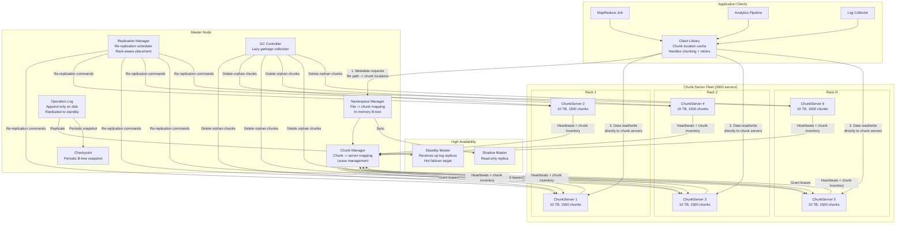
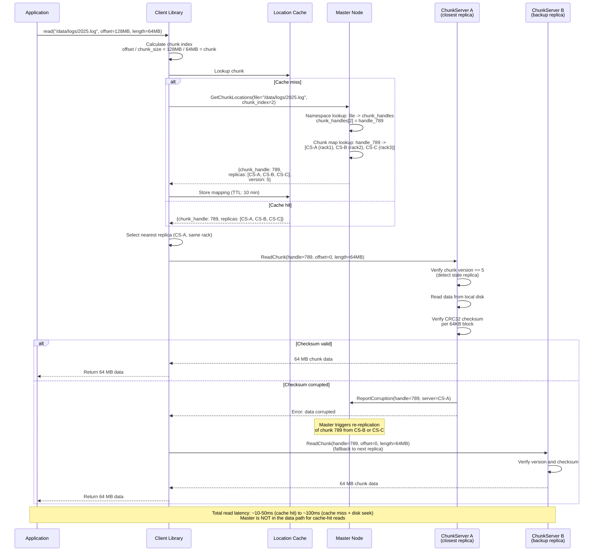

# Distributed File System -- Architecture Diagrams

## 1. High-Level Architecture



## 2. Deep-Dive: Lease-Based Mutation (Append) Protocol

```mermaid
flowchart TB
    subgraph Client["Client Library"]
        APP[Application: append data]
        FIND[Find last chunk of file]
        PUSH[Push data to replicas<br/>Pipelined chain transfer]
        WRITE_REQ[Send write request<br/>to primary]
        RETRY[Retry on failure<br/>at-least-once semantics]
    end

    subgraph Master["Master"]
        LEASE_MGR[Lease Manager]
        CHUNK_INFO[Chunk Info<br/>Replica locations]
        VERSION[Version Counter<br/>Increment on mutation]
    end

    subgraph Primary["Primary Replica (CS-A)"]
        RECV_P[Receive data in LRU cache]
        ASSIGN_SN[Assign serial number]
        APPLY_P[Apply mutation locally]
        FWD_SN[Forward serial number<br/>to secondaries]
        WAIT_ACK[Wait for secondary ACKs]
        REPLY[Reply success/failure<br/>to client]
    end

    subgraph Secondary1["Secondary Replica (CS-B)"]
        RECV_S1[Receive data in LRU cache]
        APPLY_S1[Apply mutation at<br/>serial number N]
        ACK_S1[ACK to primary]
    end

    subgraph Secondary2["Secondary Replica (CS-C)"]
        RECV_S2[Receive data in LRU cache]
        APPLY_S2[Apply mutation at<br/>serial number N]
        ACK_S2[ACK to primary]
    end

    APP -->|1| FIND
    FIND -->|2. Request chunk locations + primary| LEASE_MGR
    LEASE_MGR -->|Check lease exists?| CHUNK_INFO
    LEASE_MGR -->|No lease: grant to CS-A<br/>Increment version| VERSION
    LEASE_MGR -->|3. Return: primary=CS-A<br/>secondaries=[CS-B, CS-C]| FIND

    FIND -->|4. Push data in chain| PUSH
    PUSH -->|Data pipeline| RECV_P
    RECV_P -->|Forward immediately| RECV_S1
    RECV_S1 -->|Forward immediately| RECV_S2

    PUSH -->|5. All replicas have data| WRITE_REQ
    WRITE_REQ --> ASSIGN_SN
    ASSIGN_SN -->|serial_number = N| APPLY_P
    APPLY_P --> FWD_SN

    FWD_SN -->|6. Apply at SN=N| APPLY_S1
    FWD_SN -->|6. Apply at SN=N| APPLY_S2
    APPLY_S1 --> ACK_S1
    APPLY_S2 --> ACK_S2
    ACK_S1 --> WAIT_ACK
    ACK_S2 --> WAIT_ACK

    WAIT_ACK -->|7. All ACKed| REPLY
    REPLY -->|Success| APP

    WAIT_ACK -->|Secondary failed: partial success| REPLY
    REPLY -->|Error: client retries| RETRY
    RETRY --> PUSH
```

## 3. Critical Path Sequence: File Read Operation


