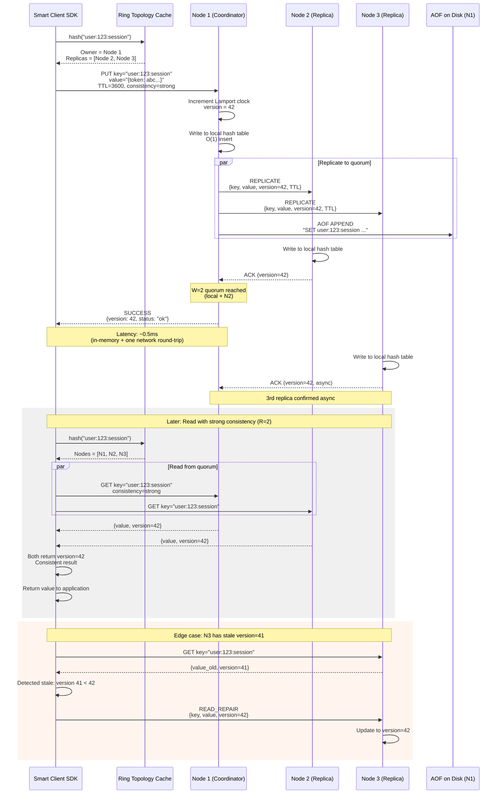

# Key-Value Store (like Redis) -- Architecture Diagrams

## 1. High-Level Architecture

```mermaid
flowchart TB
    subgraph Clients["Client Applications"]
        APP1[Web Service]
        APP2[API Server]
        APP3[Worker Process]
        SDK[Smart Client SDK<br/>Ring topology cache<br/>Direct node routing]
    end

    subgraph Cluster["KV Store Cluster (Consistent Hash Ring)"]
        subgraph Node1["Node 1 (vnodes: 0-99)"]
            HT1[Hash Table<br/>In-memory store]
            REP1[Replication Manager]
            GOS1[Gossip Agent]
            AOF1[AOF / RDB<br/>Persistence]
        end

        subgraph Node2["Node 2 (vnodes: 100-199)"]
            HT2[Hash Table<br/>In-memory store]
            REP2[Replication Manager]
            GOS2[Gossip Agent]
            AOF2[AOF / RDB<br/>Persistence]
        end

        subgraph Node3["Node 3 (vnodes: 200-299)"]
            HT3[Hash Table<br/>In-memory store]
            REP3[Replication Manager]
            GOS3[Gossip Agent]
            AOF3[AOF / RDB<br/>Persistence]
        end

        subgraph NodeN["Node N (vnodes: ...)"]
            HTN[Hash Table<br/>In-memory store]
            REPN[Replication Manager]
            GOSN[Gossip Agent]
            AOFN[AOF / RDB<br/>Persistence]
        end
    end

    subgraph AntiEntropy["Background Processes"]
        MERKLE[Merkle Tree Sync<br/>Detect replica divergence]
        HINTED[Hinted Handoff<br/>Buffer writes for down nodes]
        REBAL[Rebalancer<br/>Data migration on ring changes]
    end

    APP1 & APP2 & APP3 --> SDK
    SDK -->|hash(key) -> route to owner node| Node1 & Node2 & Node3 & NodeN

    REP1 <-->|Replicate writes| REP2 & REP3
    REP2 <-->|Replicate writes| REP3 & REPN

    GOS1 <-->|Heartbeat + state exchange| GOS2
    GOS2 <-->|Heartbeat + state exchange| GOS3
    GOS3 <-->|Heartbeat + state exchange| GOSN
    GOSN <-->|Heartbeat + state exchange| GOS1

    MERKLE -->|Compare hash trees| Node1 & Node2 & Node3 & NodeN
    HINTED -->|Forward buffered writes<br/>when node recovers| Node1 & Node2 & Node3 & NodeN
    REBAL -->|Stream key ranges<br/>on node join/leave| Node1 & Node2 & Node3 & NodeN

    AOF1 -->|Persist to disk| AOF1
```

## 2. Deep-Dive: Consistent Hashing and Replication Subsystem

```mermaid
flowchart TB
    subgraph Ring["Consistent Hash Ring (2^128 space)"]
        RING_VIS["Hash Ring Visualization<br/>Physical nodes mapped to<br/>100 virtual nodes each"]
    end

    subgraph NodeJoin["Node Join Process"]
        NEW[New Node N5 joins]
        ASSIGN[Assign 100 vnodes<br/>on the ring]
        IDENTIFY[Identify key ranges<br/>now owned by N5]
        STREAM[Stream affected keys<br/>from previous owners]
        ACTIVATE[Activate: N5 serves<br/>requests for its ranges]
        BUMP[Bump ring_version<br/>Notify all clients]
    end

    subgraph Replication["Replication (N=3)"]
        PRIMARY[Primary: First node<br/>clockwise from hash(key)]
        SEC1[Replica 2: Next distinct<br/>physical node clockwise]
        SEC2[Replica 3: Third distinct<br/>physical node clockwise]
    end

    subgraph WriteQuorum["Write with Quorum W=2"]
        CLIENT_W[Client: PUT key=X, value=V]
        COORD[Coordinator: Node owning key X]
        WRITE_LOCAL[Write to local hash table]
        WRITE_R1[Replicate to replica 2]
        WRITE_R2[Replicate to replica 3]
        ACK_W[Wait for W=2 ACKs<br/>Respond success]
        ASYNC_R[3rd replica ACKs async]
    end

    subgraph ReadQuorum["Read with Quorum R=2"]
        CLIENT_R[Client: GET key=X]
        READ_LOCAL[Read from local replica]
        READ_R1[Read from replica 2]
        COMPARE[Compare versions<br/>Return latest]
        READ_REPAIR[Send latest version to<br/>stale replica in background]
    end

    subgraph HotKey["Hot Key Mitigation"]
        DETECT[Detect: ops/sec > threshold]
        SPLIT[Option 1: Split key into<br/>N shards across nodes]
        CLIENT_CACHE[Option 2: Client-side cache<br/>with 100ms TTL]
        ALL_REPLICA[Option 3: Read from<br/>any replica, not just primary]
    end

    NEW --> ASSIGN --> IDENTIFY --> STREAM --> ACTIVATE --> BUMP

    CLIENT_W --> COORD
    COORD --> WRITE_LOCAL
    COORD --> WRITE_R1
    COORD --> WRITE_R2
    WRITE_LOCAL --> ACK_W
    WRITE_R1 --> ACK_W
    WRITE_R2 --> ASYNC_R

    CLIENT_R --> READ_LOCAL
    CLIENT_R --> READ_R1
    READ_LOCAL --> COMPARE
    READ_R1 --> COMPARE
    COMPARE --> READ_REPAIR

    DETECT --> SPLIT & CLIENT_CACHE & ALL_REPLICA
```

## 3. Critical Path Sequence: PUT with Quorum Replication


