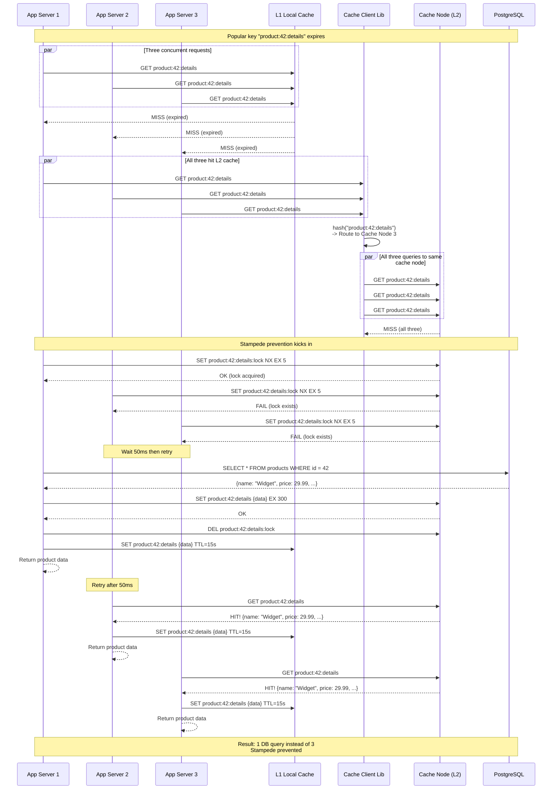

# Distributed Cache -- Architecture Diagrams

## 1. High-Level Architecture

```mermaid
flowchart TB
    subgraph AppServers["Application Servers"]
        subgraph App1["App Server 1"]
            L1_1[L1 Local Cache<br/>Caffeine, 256 MB<br/>TTL: 15s]
            CL1[Cache Client Library<br/>Consistent hashing<br/>Connection pooling]
        end
        subgraph App2["App Server 2"]
            L1_2[L1 Local Cache<br/>Caffeine, 256 MB<br/>TTL: 15s]
            CL2[Cache Client Library]
        end
        subgraph AppN["App Server N"]
            L1_N[L1 Local Cache]
            CLN[Cache Client Library]
        end
    end

    subgraph CacheCluster["L2 Distributed Cache Cluster"]
        subgraph Ring["Consistent Hash Ring"]
            CN1[Cache Node 1<br/>32 GB, ~12.5M keys]
            CN2[Cache Node 2<br/>32 GB, ~12.5M keys]
            CN3[Cache Node 3<br/>32 GB, ~12.5M keys]
            CNN[Cache Node N<br/>32 GB, ~12.5M keys]
        end
    end

    subgraph DataSources["Source of Truth"]
        PG[PostgreSQL<br/>Primary database]
        DDB[DynamoDB<br/>NoSQL store]
    end

    subgraph Infra["Infrastructure"]
        ZK[ZooKeeper / etcd<br/>Ring membership]
        KAFKA[Kafka<br/>Invalidation bus]
        WARMER[Cache Warmer<br/>Pre-load hot keys]
        MONITOR[Monitoring<br/>Hit rate, latency, evictions]
    end

    App1 & App2 & AppN -->|1. Check L1| L1_1 & L1_2 & L1_N
    CL1 & CL2 & CLN -->|2. L1 miss: check L2<br/>hash(key) -> route| CN1 & CN2 & CN3 & CNN
    CL1 & CL2 & CLN -->|3. L2 miss: query DB| PG & DDB
    CL1 & CL2 & CLN -->|4. Populate L2 on miss| CN1 & CN2 & CN3 & CNN

    PG & DDB -->|Write event| KAFKA
    KAFKA -->|Invalidation events| CL1 & CL2 & CLN
    CL1 & CL2 & CLN -->|Delete stale keys| CN1 & CN2 & CN3 & CNN
    CL1 & CL2 & CLN -->|Delete from L1| L1_1 & L1_2 & L1_N

    ZK -->|Ring topology updates| CL1 & CL2 & CLN
    WARMER -->|Pre-load hot keys| CN1 & CN2 & CN3 & CNN
    CN1 & CN2 & CN3 & CNN -->|Metrics| MONITOR
```

## 2. Deep-Dive: Cache Invalidation and Stampede Prevention

```mermaid
flowchart TB
    subgraph WriteFlow["Write Path (Invalidation)"]
        APP_WRITE[Application: update user profile]
        DB_WRITE[1. Write to PostgreSQL]
        CACHE_DEL[2. Delete from cache<br/>cache.delete key]
        INV_PUB[3. Publish invalidation event<br/>to Kafka]
        INV_CONSUME[Other app servers<br/>consume invalidation]
        L1_DEL[Delete from L1 local cache]
        L2_DEL[Delete from L2 distributed cache]
    end

    subgraph ReadFlow["Read Path (Cache-Aside)"]
        APP_READ[Application: get user profile]
        L1_CHECK{L1 Cache<br/>Hit?}
        L2_CHECK{L2 Cache<br/>Hit?}
        DB_READ[Query Database]
        L2_SET[Set in L2 with TTL]
        L1_SET[Set in L1 with short TTL]
        RETURN[Return to user]
    end

    subgraph StampedePrevention["Stampede Prevention"]
        MISS[Cache miss on<br/>popular key]
        LOCK_TRY{Try acquire lock<br/>SET key:lock NX EX 5}
        LOCK_SUCCESS[Lock acquired:<br/>Load from DB]
        LOCK_FAIL[Lock not acquired:<br/>Wait 50ms + retry]
        SWR[Stale-While-Revalidate:<br/>Return expired value<br/>Refresh in background]
        PER[Probabilistic Early Refresh:<br/>Refresh before expiry<br/>P increases near TTL]
    end

    subgraph DoubleDelete["Double-Delete Pattern"]
        DD1[1. DELETE key from cache]
        DD2[2. UPDATE database]
        DD3[3. Sleep 1 second<br/>Wait for in-flight reads]
        DD4[4. DELETE key again<br/>Catch race condition]
    end

    APP_WRITE --> DB_WRITE --> CACHE_DEL --> INV_PUB
    INV_PUB --> INV_CONSUME
    INV_CONSUME --> L1_DEL & L2_DEL

    APP_READ --> L1_CHECK
    L1_CHECK -->|Hit| RETURN
    L1_CHECK -->|Miss| L2_CHECK
    L2_CHECK -->|Hit| L1_SET --> RETURN
    L2_CHECK -->|Miss| DB_READ --> L2_SET --> L1_SET

    MISS --> LOCK_TRY
    LOCK_TRY -->|Acquired| LOCK_SUCCESS
    LOCK_TRY -->|Failed| LOCK_FAIL
    LOCK_FAIL -->|Retry| LOCK_TRY

    MISS -->|Alternative 1| SWR
    MISS -->|Alternative 2| PER

    DD1 --> DD2 --> DD3 --> DD4
```



## 3. Critical Path Sequence: Cache-Aside Read with Stampede Prevention


