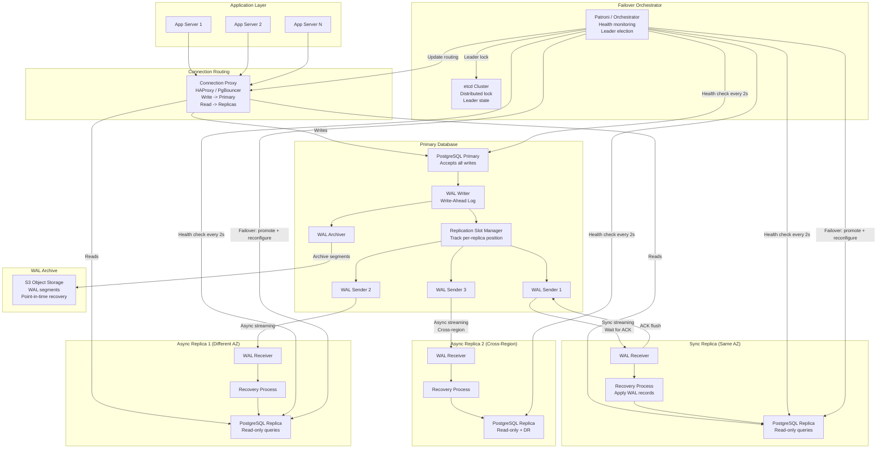
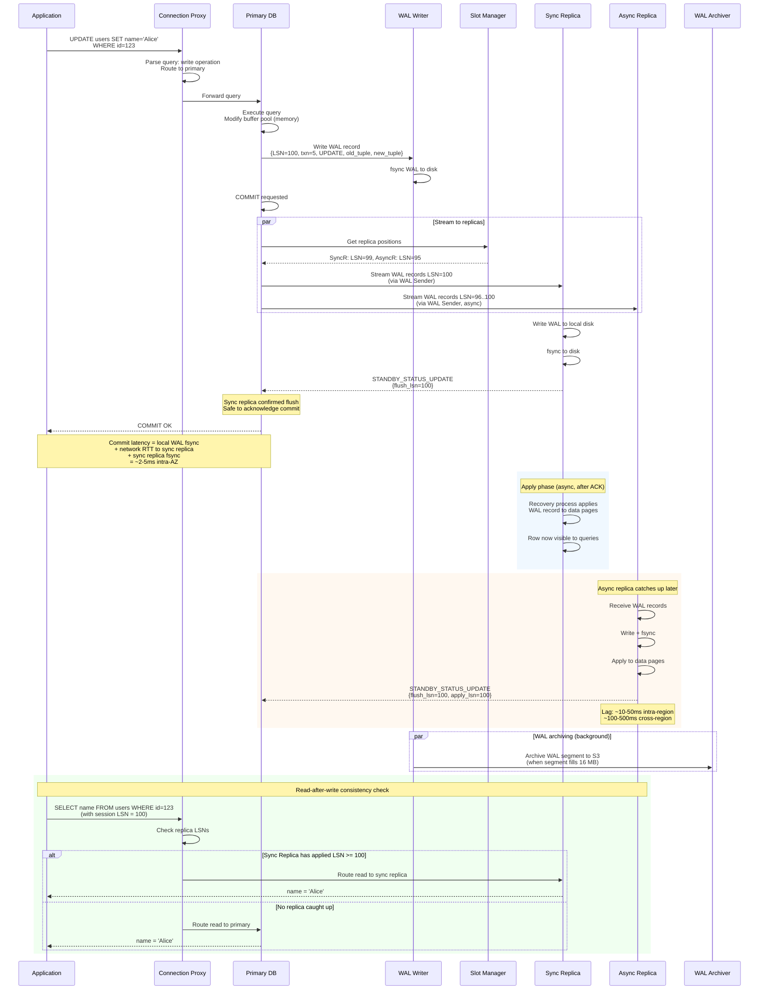

# Database Replication System -- Architecture Diagrams

## 1. High-Level Architecture



## 2. Deep-Dive: Failover Orchestration Subsystem

```mermaid
flowchart TB
    subgraph Detection["Failure Detection"]
        HEALTH[Health Check Loop<br/>TCP + SQL ping<br/>Every 2 seconds]
        SUSPECT[Mark Primary SUSPECT<br/>After 3 missed checks]
        QUORUM[Quorum Check<br/>Can replicas reach primary?]
        CONFIRM[Confirm DEAD<br/>Majority cannot reach primary]
    end

    subgraph Election["Leader Election"]
        CANDIDATES[Identify Candidate Replicas]
        RANK[Rank by:<br/>1. Sync replica preferred<br/>2. Lowest lag (LSN)<br/>3. Same region preferred]
        BEST[Select best candidate]
    end

    subgraph Fencing["Old Primary Fencing"]
        STONITH[STONITH<br/>Power off via IPMI/Cloud API]
        NET_FENCE[Network Fence<br/>Block via firewall/security group]
        WATCHDOG[Watchdog Self-Kill<br/>Old primary detects isolation]
        EPOCH[Epoch Increment<br/>New epoch rejects old primary writes]
    end

    subgraph Promotion["Replica Promotion"]
        DRAIN[Wait for replica to apply<br/>all received WAL]
        PROMOTE[pg_promote()<br/>Replica becomes read-write]
        TIMELINE[Create new timeline<br/>Timeline ID incremented]
        RECONF[Reconfigure other replicas<br/>Follow new primary]
        DNS[Update proxy routing<br/>Writes -> new primary]
        VERIFY[Verify: new primary<br/>accepts writes successfully]
    end

    subgraph PostFailover["Post-Failover"]
        OLD_PRIMARY[Old primary comes back]
        REWIND[pg_rewind<br/>Revert divergent WAL]
        REBUILD[Full rebuild if rewind fails<br/>Base backup + WAL replay]
        REJOIN[Rejoin as replica<br/>Follow new primary]
    end

    HEALTH -->|3 missed checks| SUSPECT
    SUSPECT --> QUORUM
    QUORUM -->|Majority confirms down| CONFIRM
    QUORUM -->|Minority: network issue<br/>Not a real failure| HEALTH

    CONFIRM --> CANDIDATES
    CANDIDATES --> RANK --> BEST

    CONFIRM --> STONITH & NET_FENCE & WATCHDOG
    BEST --> EPOCH

    EPOCH --> DRAIN --> PROMOTE --> TIMELINE
    TIMELINE --> RECONF --> DNS --> VERIFY

    OLD_PRIMARY --> REWIND
    REWIND -->|Success| REJOIN
    REWIND -->|Fail: too much divergence| REBUILD --> REJOIN
```

## 3. Critical Path Sequence: Synchronous Write with Replication


