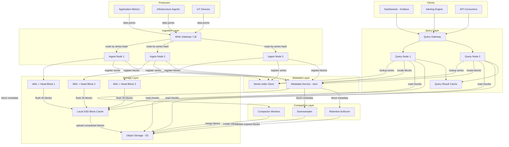
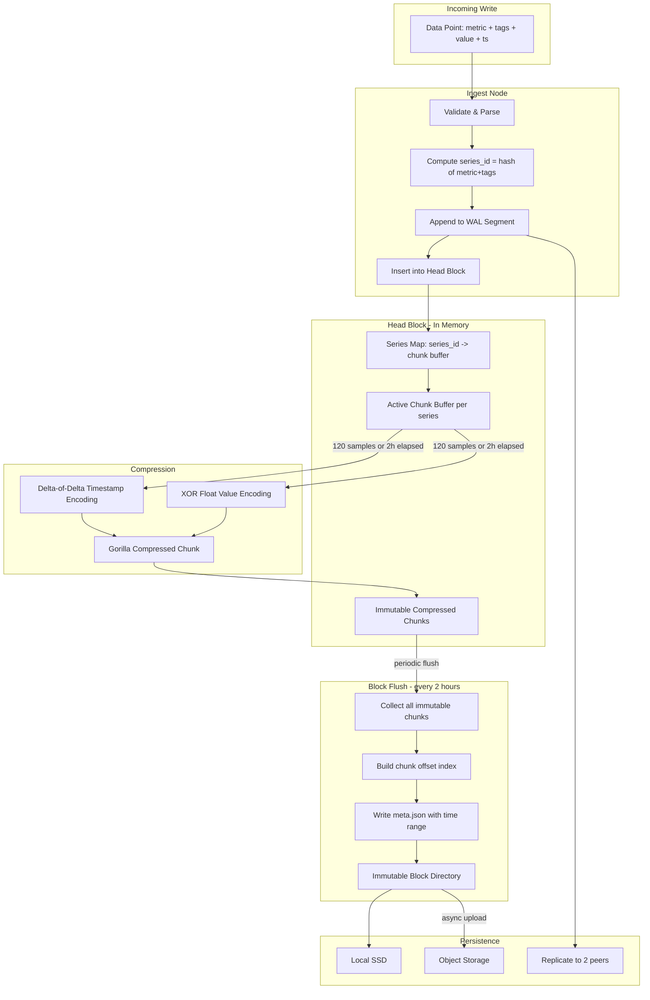
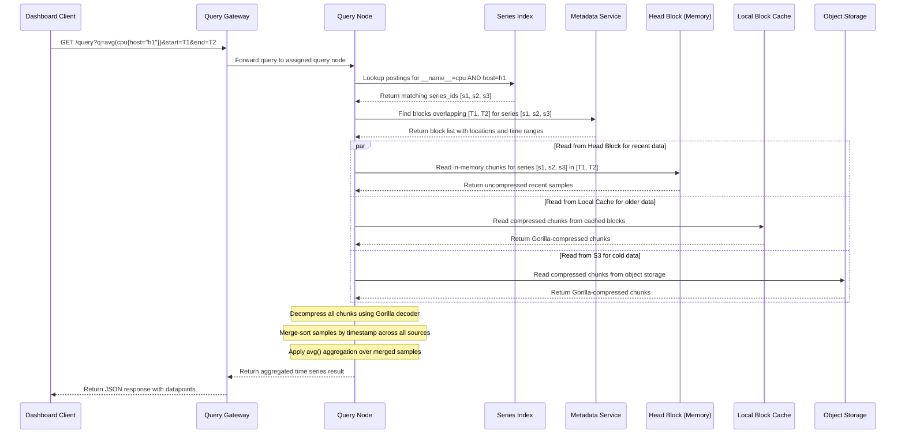

# Time-Series Database — Architecture Diagrams

## 1. High-Level Architecture

```mermaid
flowchart TB
    subgraph Producers
        P1[Application Metrics]
        P2[Infrastructure Agents]
        P3[IoT Devices]
    end

    subgraph Ingestion["Ingestion Layer"]
        GW[Write Gateway / LB]
        IN1[Ingest Node 1]
        IN2[Ingest Node 2]
        IN3[Ingest Node 3]
    end

    subgraph Storage["Storage Layer"]
        WAL1[WAL + Head Block 1]
        WAL2[WAL + Head Block 2]
        WAL3[WAL + Head Block 3]
        LOCAL[Local SSD Block Cache]
        OBJ[Object Storage - S3]
    end

    subgraph Compaction["Compaction Layer"]
        COMP[Compactor Workers]
        DS[Downsampler]
        RET[Retention Enforcer]
    end

    subgraph Query["Query Layer"]
        QGW[Query Gateway]
        QN1[Query Node 1]
        QN2[Query Node 2]
        CACHE[Query Result Cache]
    end

    subgraph Metadata["Metadata Layer"]
        META[Metadata Service - etcd]
        IDX[Series Index Store]
    end

    subgraph Clients
        DASH[Dashboards - Grafana]
        ALERT[Alerting Engine]
        API[API Consumers]
    end

    P1 & P2 & P3 -->|"data points"| GW
    GW -->|"route by series hash"| IN1 & IN2 & IN3
    IN1 --> WAL1
    IN2 --> WAL2
    IN3 --> WAL3
    WAL1 & WAL2 & WAL3 -->|"flush 2h blocks"| LOCAL
    LOCAL -->|"upload compacted blocks"| OBJ
    IN1 & IN2 & IN3 -->|"register series"| IDX
    IN1 & IN2 & IN3 -->|"register blocks"| META

    COMP -->|"merge blocks"| OBJ
    DS -->|"create rollups"| OBJ
    RET -->|"delete expired blocks"| OBJ
    META -->|"block metadata"| COMP & DS & RET

    DASH & ALERT & API --> QGW
    QGW --> QN1 & QN2
    QN1 & QN2 -->|"lookup series"| IDX
    QN1 & QN2 -->|"locate blocks"| META
    QN1 & QN2 -->|"read chunks"| LOCAL
    QN1 & QN2 -->|"read chunks"| OBJ
    QN1 & QN2 --> CACHE
```

## 2. Deep-Dive: Write Path and Storage Engine

```mermaid
flowchart TB
    subgraph WriteRequest["Incoming Write"]
        REQ[Data Point: metric + tags + value + ts]
    end

    subgraph Ingestion["Ingest Node"]
        VALIDATE[Validate & Parse]
        SID[Compute series_id = hash of metric+tags]
        WALW[Append to WAL Segment]
        HEAD[Insert into Head Block]
    end

    subgraph HeadBlock["Head Block - In Memory"]
        SERIES_MAP[Series Map: series_id -> chunk buffer]
        CHUNK_BUF[Active Chunk Buffer per series]
        IMM_CHUNK[Immutable Compressed Chunks]
    end

    subgraph Compression["Compression"]
        DOD[Delta-of-Delta Timestamp Encoding]
        XOR[XOR Float Value Encoding]
        GORILLA[Gorilla Compressed Chunk]
    end

    subgraph BlockFlush["Block Flush - every 2 hours"]
        COLLECT[Collect all immutable chunks]
        INDEX_BUILD[Build chunk offset index]
        META_WRITE[Write meta.json with time range]
        BLOCK[Immutable Block Directory]
    end

    subgraph Persist["Persistence"]
        SSD[Local SSD]
        S3[Object Storage]
        REP[Replicate to 2 peers]
    end

    REQ --> VALIDATE --> SID --> WALW --> HEAD
    HEAD --> SERIES_MAP --> CHUNK_BUF
    CHUNK_BUF -->|"120 samples or 2h elapsed"| DOD & XOR
    DOD & XOR --> GORILLA --> IMM_CHUNK
    IMM_CHUNK -->|"periodic flush"| COLLECT
    COLLECT --> INDEX_BUILD --> META_WRITE --> BLOCK
    BLOCK --> SSD
    BLOCK -->|"async upload"| S3
    WALW --> REP
```

## 3. Critical Path Sequence: Range Query Execution

```mermaid
sequenceDiagram
    participant Client as Dashboard Client
    participant QGW as Query Gateway
    participant QN as Query Node
    participant IDX as Series Index
    participant META as Metadata Service
    participant HEAD as Head Block (Memory)
    participant SSD as Local Block Cache
    participant S3 as Object Storage

    Client->>QGW: GET /query?q=avg(cpu{host="h1"})&start=T1&end=T2
    QGW->>QN: Forward query to assigned query node

    QN->>IDX: Lookup postings for __name__=cpu AND host=h1
    IDX-->>QN: Return matching series_ids [s1, s2, s3]

    QN->>META: Find blocks overlapping [T1, T2] for series [s1, s2, s3]
    META-->>QN: Return block list with locations and time ranges

    par Read from Head Block for recent data
        QN->>HEAD: Read in-memory chunks for series [s1, s2, s3] in [T1, T2]
        HEAD-->>QN: Return uncompressed recent samples
    and Read from Local Cache for older data
        QN->>SSD: Read compressed chunks from cached blocks
        SSD-->>QN: Return Gorilla-compressed chunks
    and Read from S3 for cold data
        QN->>S3: Read compressed chunks from object storage
        S3-->>QN: Return Gorilla-compressed chunks
    end

    Note over QN: Decompress all chunks using Gorilla decoder
    Note over QN: Merge-sort samples by timestamp across all sources
    Note over QN: Apply avg() aggregation over merged samples

    QN-->>QGW: Return aggregated time series result
    QGW-->>Client: Return JSON response with datapoints
```
