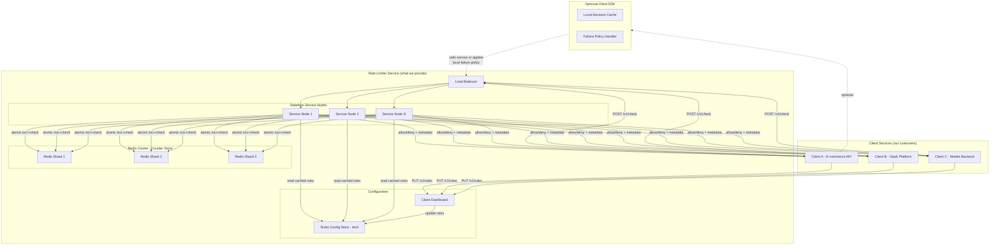
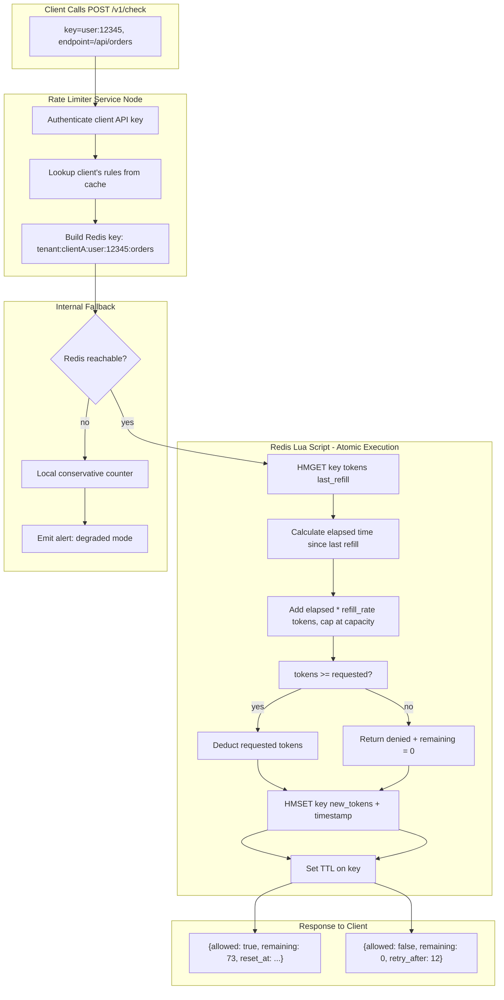
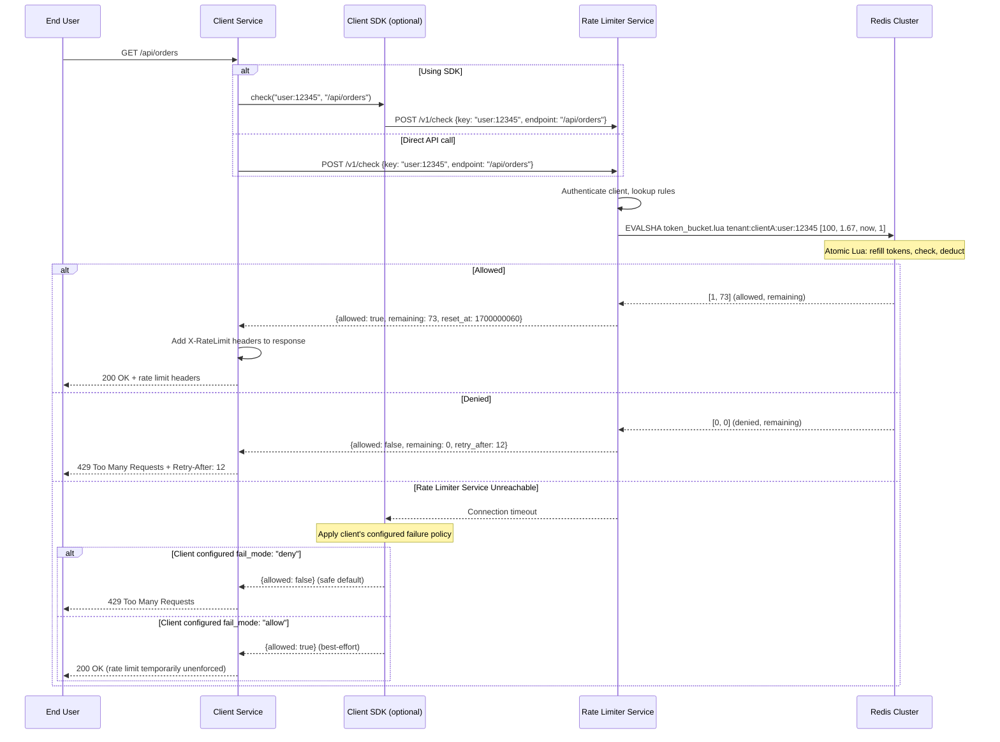

# Rate Limiter Service — Architecture Diagrams

## 1. High-Level Architecture

```mermaid
flowchart TB
    subgraph ClientServices["Client Services (our customers)"]
        C1[Client A - E-commerce API]
        C2[Client B - SaaS Platform]
        C3[Client C - Mobile Backend]
    end

    subgraph RateLimiterService["Rate Limiter Service (what we provide)"]
        LB[Load Balancer]

        subgraph ServiceNodes["Stateless Service Nodes"]
            N1[Service Node 1]
            N2[Service Node 2]
            N3[Service Node N]
        end

        subgraph RedisCluster["Redis Cluster - Counter Store"]
            R1[Redis Shard 1]
            R2[Redis Shard 2]
            R3[Redis Shard 3]
        end

        subgraph Config["Configuration"]
            ETCD[Rules Config Store - etcd]
            DASH[Client Dashboard]
        end
    end

    subgraph SDK["Optional Client SDK"]
        CACHE[Local Decision Cache]
        FAILPOL[Failure Policy Handler]
    end

    C1 & C2 & C3 -->|"POST /v1/check"| LB
    LB --> N1 & N2 & N3
    N1 & N2 & N3 -->|"atomic incr+check"| R1 & R2 & R3
    N1 & N2 & N3 -->|"read cached rules"| ETCD

    C1 & C2 & C3 -->|"PUT /v1/rules"| DASH
    DASH -->|"update rules"| ETCD

    N1 & N2 & N3 -->|"allow/deny + metadata"| C1 & C2 & C3

    C1 -.->|"optional"| SDK
    SDK -.->|"calls service or applies\nlocal failure policy"| LB
```

## 2. Deep-Dive: Token Bucket Algorithm with Redis

```mermaid
flowchart TB
    subgraph Request["Client Calls POST /v1/check"]
        REQ["key=user:12345, endpoint=/api/orders"]
    end

    subgraph ServiceNode["Rate Limiter Service Node"]
        AUTH[Authenticate client API key]
        LOOKUP[Lookup client's rules from cache]
        KEY[Build Redis key: tenant:clientA:user:12345:orders]
    end

    subgraph RedisLua["Redis Lua Script - Atomic Execution"]
        HMGET[HMGET key tokens last_refill]
        CALC_REFILL[Calculate elapsed time since last refill]
        ADD_TOKENS[Add elapsed * refill_rate tokens, cap at capacity]
        CHECK[tokens >= requested?]
        DEDUCT[Deduct requested tokens]
        DENY[Return denied + remaining = 0]
        SAVE[HMSET key new_tokens + timestamp]
        EXPIRE[Set TTL on key]
    end

    subgraph Response["Response to Client"]
        ALLOW_RESP["{allowed: true, remaining: 73, reset_at: ...}"]
        DENY_RESP["{allowed: false, remaining: 0, retry_after: 12}"]
    end

    subgraph InternalFallback["Internal Fallback"]
        REDIS_DOWN{Redis reachable?}
        LOCAL[Local conservative counter]
        ALERT[Emit alert: degraded mode]
    end

    REQ --> AUTH --> LOOKUP --> KEY
    KEY --> REDIS_DOWN
    REDIS_DOWN -->|"yes"| HMGET
    REDIS_DOWN -->|"no"| LOCAL --> ALERT

    HMGET --> CALC_REFILL --> ADD_TOKENS --> CHECK
    CHECK -->|"yes"| DEDUCT --> SAVE --> EXPIRE --> ALLOW_RESP
    CHECK -->|"no"| DENY --> SAVE --> EXPIRE --> DENY_RESP
```

## 3. Client Integration Flow

```mermaid
sequenceDiagram
    participant EndUser as End User
    participant Client as Client Service
    participant SDK as Client SDK (optional)
    participant RL as Rate Limiter Service
    participant Redis as Redis Cluster

    EndUser->>Client: GET /api/orders

    alt Using SDK
        Client->>SDK: check("user:12345", "/api/orders")
        SDK->>RL: POST /v1/check {key: "user:12345", endpoint: "/api/orders"}
    else Direct API call
        Client->>RL: POST /v1/check {key: "user:12345", endpoint: "/api/orders"}
    end

    RL->>RL: Authenticate client, lookup rules
    RL->>Redis: EVALSHA token_bucket.lua tenant:clientA:user:12345 [100, 1.67, now, 1]
    Note over Redis: Atomic Lua: refill tokens, check, deduct

    alt Allowed
        Redis-->>RL: [1, 73] (allowed, remaining)
        RL-->>Client: {allowed: true, remaining: 73, reset_at: 1700000060}
        Client->>Client: Add X-RateLimit headers to response
        Client-->>EndUser: 200 OK + rate limit headers
    else Denied
        Redis-->>RL: [0, 0] (denied, remaining)
        RL-->>Client: {allowed: false, remaining: 0, retry_after: 12}
        Client-->>EndUser: 429 Too Many Requests + Retry-After: 12
    else Rate Limiter Service Unreachable
        RL-->>SDK: Connection timeout
        Note over SDK: Apply client's configured failure policy
        alt Client configured fail_mode: "deny"
            SDK-->>Client: {allowed: false} (safe default)
            Client-->>EndUser: 429 Too Many Requests
        else Client configured fail_mode: "allow"
            SDK-->>Client: {allowed: true} (best-effort)
            Client-->>EndUser: 200 OK (rate limit temporarily unenforced)
        end
    end
```
