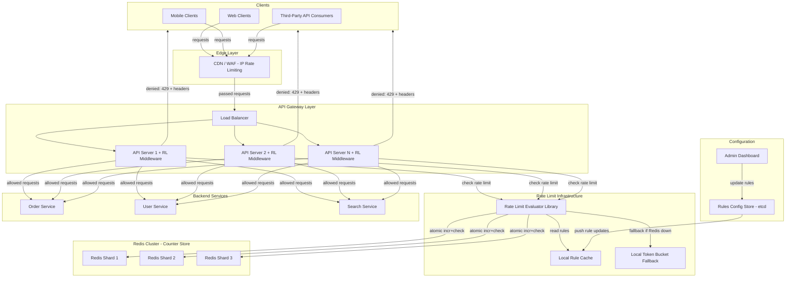
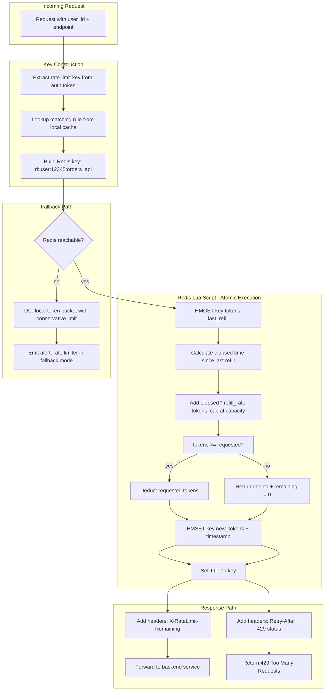
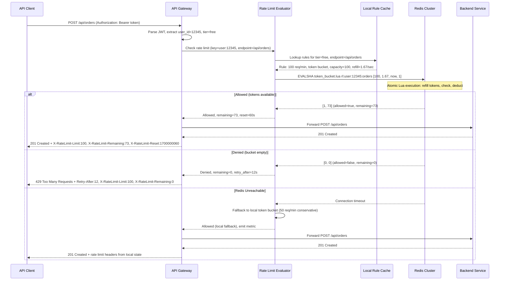

# Rate Limiter — Architecture Diagrams

## 1. High-Level Architecture

```mermaid
flowchart TB
    subgraph Clients
        WEB[Web Clients]
        MOB[Mobile Clients]
        EXT[Third-Party API Consumers]
    end

    subgraph Edge["Edge Layer"]
        CDN[CDN / WAF - IP Rate Limiting]
    end

    subgraph Gateway["API Gateway Layer"]
        LB[Load Balancer]
        GW1[API Server 1 + RL Middleware]
        GW2[API Server 2 + RL Middleware]
        GW3[API Server N + RL Middleware]
    end

    subgraph RateLimiter["Rate Limit Infrastructure"]
        EVAL[Rate Limit Evaluator Library]
        RCACHE[Local Rule Cache]
        LBUCKET[Local Token Bucket Fallback]
    end

    subgraph RedisCluster["Redis Cluster - Counter Store"]
        R1[Redis Shard 1]
        R2[Redis Shard 2]
        R3[Redis Shard 3]
    end

    subgraph Config["Configuration"]
        ETCD[Rules Config Store - etcd]
        ADMIN[Admin Dashboard]
    end

    subgraph Backend["Backend Services"]
        SVC1[Order Service]
        SVC2[User Service]
        SVC3[Search Service]
    end

    WEB & MOB & EXT -->|"requests"| CDN
    CDN -->|"passed requests"| LB
    LB --> GW1 & GW2 & GW3

    GW1 & GW2 & GW3 -->|"check rate limit"| EVAL
    EVAL -->|"read rules"| RCACHE
    EVAL -->|"atomic incr+check"| R1 & R2 & R3
    EVAL -->|"fallback if Redis down"| LBUCKET

    ETCD -->|"push rule updates"| RCACHE
    ADMIN -->|"update rules"| ETCD

    GW1 & GW2 & GW3 -->|"allowed requests"| SVC1 & SVC2 & SVC3
    GW1 & GW2 & GW3 -->|"denied: 429 + headers"| Clients
```

## 2. Deep-Dive: Token Bucket Algorithm with Redis

```mermaid
flowchart TB
    subgraph Request["Incoming Request"]
        REQ[Request with user_id + endpoint]
    end

    subgraph KeyBuild["Key Construction"]
        EXTRACT[Extract rate-limit key from auth token]
        LOOKUP[Lookup matching rule from local cache]
        KEY[Build Redis key: rl:user:12345:orders_api]
    end

    subgraph RedisLua["Redis Lua Script - Atomic Execution"]
        HMGET[HMGET key tokens last_refill]
        CALC_REFILL[Calculate elapsed time since last refill]
        ADD_TOKENS[Add elapsed * refill_rate tokens, cap at capacity]
        CHECK[tokens >= requested?]
        DEDUCT[Deduct requested tokens]
        DENY[Return denied + remaining = 0]
        SAVE[HMSET key new_tokens + timestamp]
        EXPIRE[Set TTL on key]
    end

    subgraph Response["Response Path"]
        ALLOW_HDR[Add headers: X-RateLimit-Remaining]
        DENY_HDR[Add headers: Retry-After + 429 status]
        FORWARD[Forward to backend service]
        REJECT[Return 429 Too Many Requests]
    end

    subgraph Fallback["Fallback Path"]
        REDIS_DOWN{Redis reachable?}
        LOCAL[Use local token bucket with conservative limit]
        ALERT[Emit alert: rate limiter in fallback mode]
    end

    REQ --> EXTRACT --> LOOKUP --> KEY
    KEY --> REDIS_DOWN
    REDIS_DOWN -->|"yes"| HMGET
    REDIS_DOWN -->|"no"| LOCAL --> ALERT

    HMGET --> CALC_REFILL --> ADD_TOKENS --> CHECK
    CHECK -->|"yes"| DEDUCT --> SAVE --> EXPIRE --> ALLOW_HDR --> FORWARD
    CHECK -->|"no"| DENY --> SAVE --> EXPIRE --> DENY_HDR --> REJECT
```

## 3. Critical Path Sequence: Rate-Limited API Request

```mermaid
sequenceDiagram
    participant Client as API Client
    participant GW as API Gateway
    participant RL as Rate Limit Evaluator
    participant Cache as Local Rule Cache
    participant Redis as Redis Cluster
    participant SVC as Backend Service

    Client->>GW: POST /api/orders (Authorization: Bearer token)
    GW->>GW: Parse JWT, extract user_id=12345, tier=free

    GW->>RL: Check rate limit (key=user:12345, endpoint=/api/orders)
    RL->>Cache: Lookup rules for tier=free, endpoint=/api/orders
    Cache-->>RL: Rule: 100 req/min, token bucket, capacity=100, refill=1.67/sec

    RL->>Redis: EVALSHA token_bucket.lua rl:user:12345:orders [100, 1.67, now, 1]
    Note over Redis: Atomic Lua execution: refill tokens, check, deduct

    alt Allowed (tokens available)
        Redis-->>RL: [1, 73] (allowed=true, remaining=73)
        RL-->>GW: Allowed, remaining=73, reset=60s
        GW->>SVC: Forward POST /api/orders
        SVC-->>GW: 201 Created
        GW-->>Client: 201 Created + X-RateLimit-Limit:100, X-RateLimit-Remaining:73, X-RateLimit-Reset:1700000060
    else Denied (bucket empty)
        Redis-->>RL: [0, 0] (allowed=false, remaining=0)
        RL-->>GW: Denied, remaining=0, retry_after=12s
        GW-->>Client: 429 Too Many Requests + Retry-After:12, X-RateLimit-Limit:100, X-RateLimit-Remaining:0
    else Redis Unreachable
        Redis-->>RL: Connection timeout
        RL->>RL: Fallback to local token bucket (50 req/min conservative)
        RL-->>GW: Allowed (local fallback), emit metric
        GW->>SVC: Forward POST /api/orders
        SVC-->>GW: 201 Created
        GW-->>Client: 201 Created + rate limit headers from local state
    end
```
