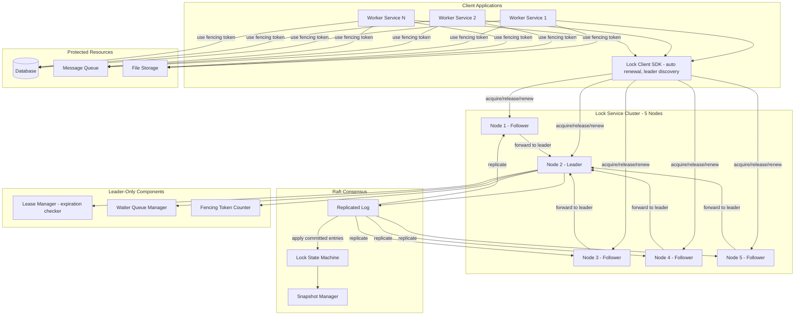
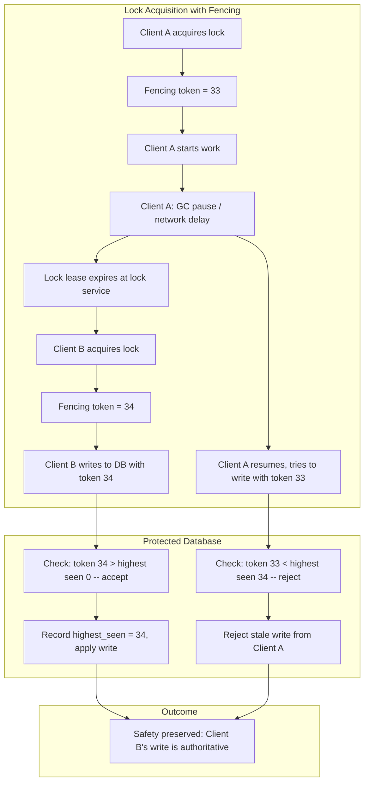
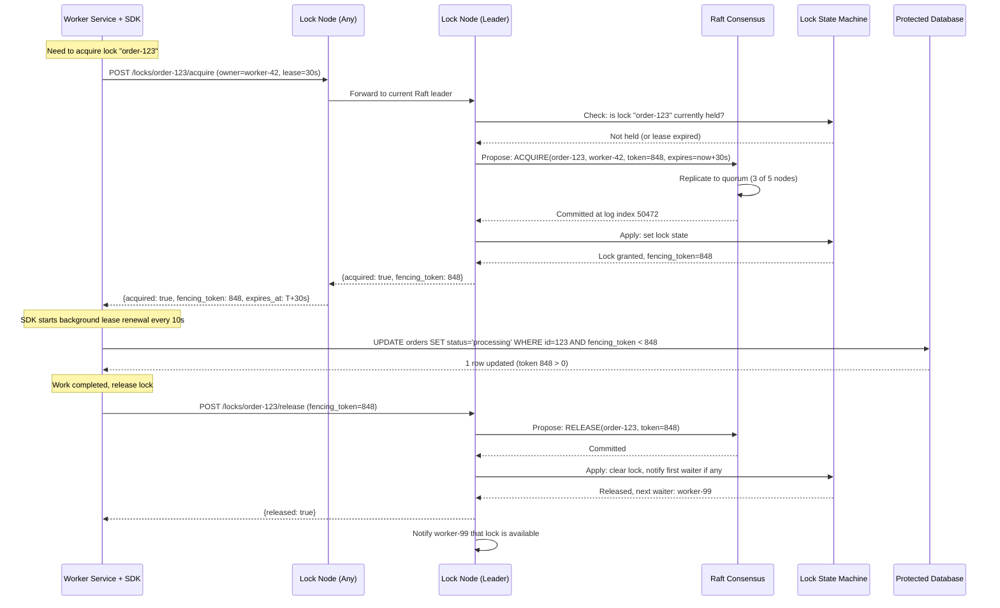

# Distributed Lock Service — Architecture Diagrams

## 1. High-Level Architecture

## 2. Deep-Dive: Fencing Token Correctness Protocol

## 3. Critical Path Sequence: Lock Acquisition and Release

