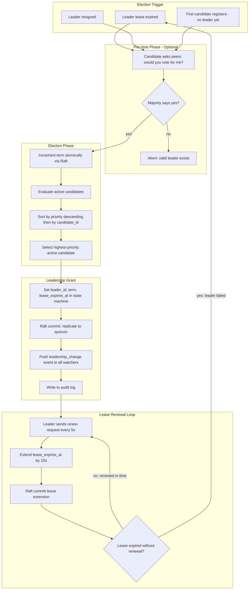
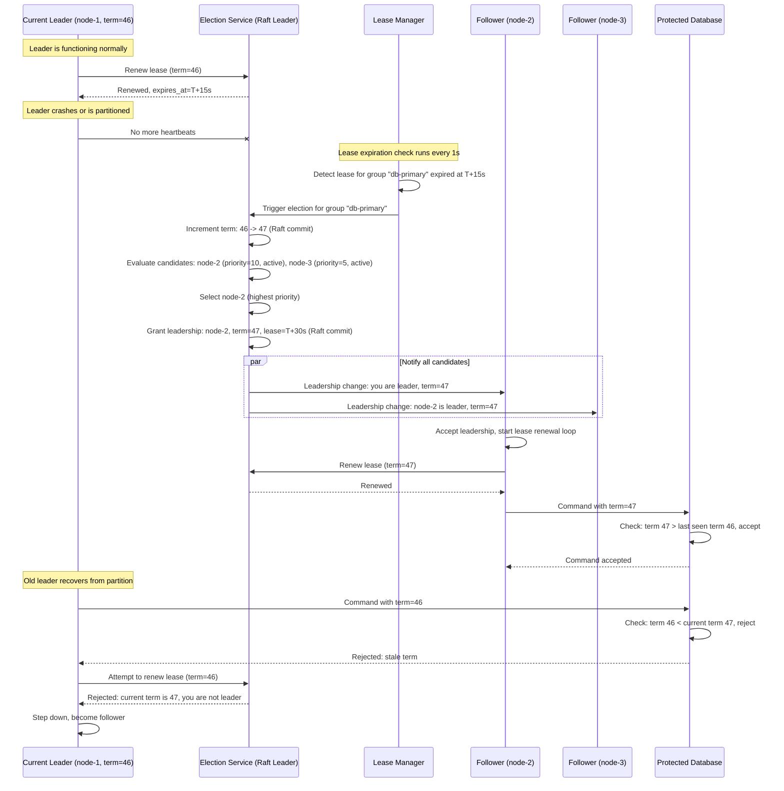

# Leader Election — Architecture Diagrams

## 1. High-Level Architecture

```mermaid
flowchart TB
    subgraph Group1["Election Group: db-primary"]
        C1A[Candidate: db-node-1]
        C1B[Candidate: db-node-2]
        C1C[Candidate: db-node-3]
    end

    subgraph Group2["Election Group: partition-0"]
        C2A[Candidate: consumer-A]
        C2B[Candidate: consumer-B]
    end

    subgraph ElectionService["Election Service Cluster - 5 Nodes"]
        ES1[Node 1 - Follower]
        ES2[Node 2 - Leader]
        ES3[Node 3 - Follower]
        ES4[Node 4 - Follower]
        ES5[Node 5 - Follower]
    end

    subgraph Internal["Leader Node Internal Components"]
        RAFT[Raft Consensus Layer]
        SM[Election State Machine]
        LM[Lease Manager]
        REG[Candidate Registry]
        WATCH[Watch / Notification Service]
        AUDIT[Audit Log]
    end

    subgraph Downstream["Downstream Systems"]
        DB[(Database - checks term)]
        QUEUE[Message Queue - checks term]
    end

    C1A & C1B & C1C -->|"campaign / renew / watch"| ES1 & ES2 & ES3 & ES4 & ES5
    C2A & C2B -->|"campaign / renew / watch"| ES1 & ES2 & ES3 & ES4 & ES5

    ES1 & ES3 & ES4 & ES5 -->|"forward writes"| ES2
    ES2 --> RAFT --> SM
    ES2 --> LM
    ES2 --> REG
    ES2 --> WATCH
    SM --> AUDIT

    WATCH -->|"leadership_change events"| C1A & C1B & C1C & C2A & C2B

    C1A -->|"commands with term=47"| DB
    C2A -->|"commands with term=12"| QUEUE
```

## 2. Deep-Dive: Election Protocol State Machine

```mermaid
flowchart TB
    subgraph Trigger["Election Trigger"]
        LEASE_EXP[Leader lease expired]
        RESIGN[Leader resigned]
        FIRST[First candidate registers - no leader yet]
    end

    subgraph PreVote["Pre-Vote Phase - Optional"]
        ASK[Candidate asks peers: would you vote for me?]
        MAJORITY{Majority says yes?}
        ABORT[Abort: valid leader exists]
    end

    subgraph Election["Election Phase"]
        INC_TERM[Increment term atomically via Raft]
        EVAL[Evaluate active candidates]
        PRIORITY[Sort by priority descending then by candidate_id]
        SELECT[Select highest-priority active candidate]
    end

    subgraph Grant["Leadership Grant"]
        SET_LEADER[Set leader_id, term, lease_expires_at in state machine]
        RAFT_COMMIT[Raft commit: replicate to quorum]
        NOTIFY[Push leadership_change event to all watchers]
        LOG[Write to audit log]
    end

    subgraph Renewal["Lease Renewal Loop"]
        RENEW[Leader sends renew request every 5s]
        EXTEND[Extend lease_expires_at by 15s]
        RAFT_RENEW[Raft commit lease extension]
        CHECK_EXP{Lease expired without renewal?}
    end

    LEASE_EXP & RESIGN & FIRST --> ASK
    ASK --> MAJORITY
    MAJORITY -->|"yes"| INC_TERM
    MAJORITY -->|"no"| ABORT

    INC_TERM --> EVAL --> PRIORITY --> SELECT
    SELECT --> SET_LEADER --> RAFT_COMMIT --> NOTIFY --> LOG

    LOG --> RENEW --> EXTEND --> RAFT_RENEW --> CHECK_EXP
    CHECK_EXP -->|"no: renewed in time"| RENEW
    CHECK_EXP -->|"yes: leader failed"| LEASE_EXP
```

## 3. Critical Path Sequence: Leader Failure and Re-Election

```mermaid
sequenceDiagram
    participant L as Current Leader (node-1, term=46)
    participant ES as Election Service (Raft Leader)
    participant LM as Lease Manager
    participant F1 as Follower (node-2)
    participant F2 as Follower (node-3)
    participant DB as Protected Database

    Note over L: Leader is functioning normally
    L->>ES: Renew lease (term=46)
    ES-->>L: Renewed, expires_at=T+15s

    Note over L: Leader crashes or is partitioned
    L-xES: No more heartbeats

    Note over LM: Lease expiration check runs every 1s
    LM->>LM: Detect lease for group "db-primary" expired at T+15s
    LM->>ES: Trigger election for group "db-primary"

    ES->>ES: Increment term: 46 -> 47 (Raft commit)
    ES->>ES: Evaluate candidates: node-2 (priority=10, active), node-3 (priority=5, active)
    ES->>ES: Select node-2 (highest priority)
    ES->>ES: Grant leadership: node-2, term=47, lease=T+30s (Raft commit)

    par Notify all candidates
        ES->>F1: Leadership change: you are leader, term=47
        ES->>F2: Leadership change: node-2 is leader, term=47
    end

    F1->>F1: Accept leadership, start lease renewal loop
    F1->>ES: Renew lease (term=47)
    ES-->>F1: Renewed

    F1->>DB: Command with term=47
    DB->>DB: Check: term 47 > last seen term 46, accept
    DB-->>F1: Command accepted

    Note over L: Old leader recovers from partition
    L->>DB: Command with term=46
    DB->>DB: Check: term 46 < current term 47, reject
    DB-->>L: Rejected: stale term

    L->>ES: Attempt to renew lease (term=46)
    ES-->>L: Rejected: current term is 47, you are not leader
    L->>L: Step down, become follower
```
