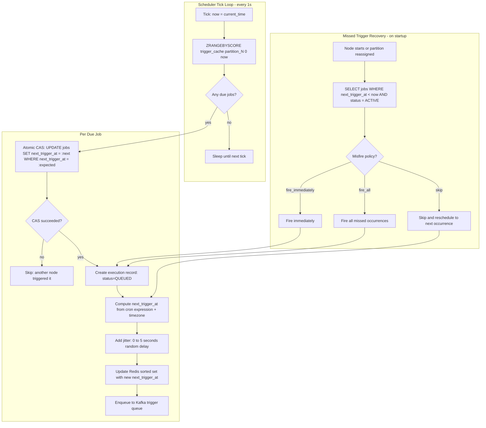
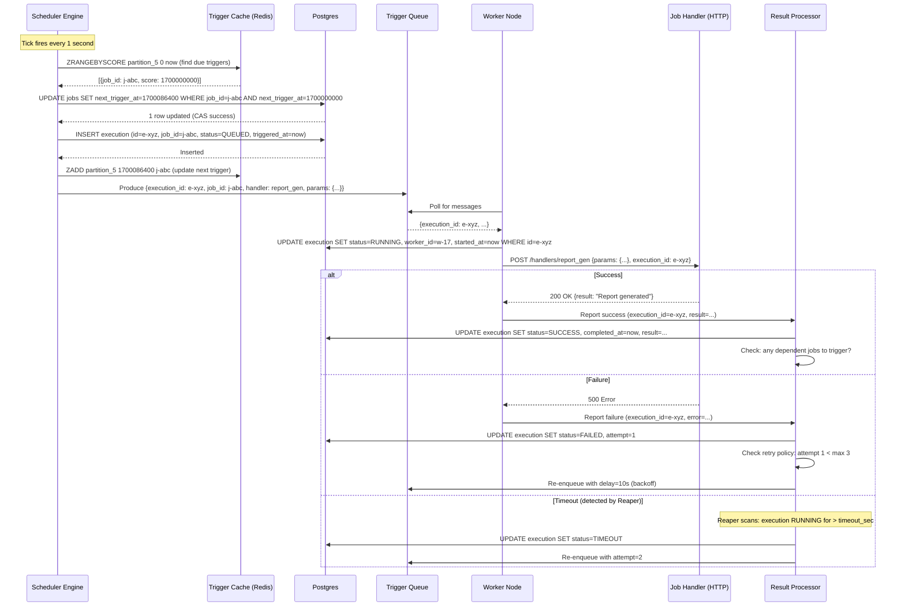

# Job Scheduler (Cron at Scale) — Architecture Diagrams

## 1. High-Level Architecture

```mermaid
flowchart TB
    subgraph Users["Users / Services"]
        API_CLIENT[API Clients]
        DASH[Scheduler Dashboard]
    end

    subgraph APILayer["API Layer"]
        GW[API Gateway]
        CRUD[Job CRUD Service]
    end

    subgraph Scheduler["Scheduler Engine - Partitioned"]
        SE1[Scheduler Node 1 - Partitions 0-9]
        SE2[Scheduler Node 2 - Partitions 10-19]
        SE3[Scheduler Node N - Partitions 90-99]
        CRON[Cron Parser + TZ Handler]
        COORD[Partition Coordinator - leader election]
    end

    subgraph Cache["Trigger Cache"]
        REDIS[Redis Sorted Sets - next_trigger_at per partition]
    end

    subgraph Queue["Trigger Queue"]
        K1[Kafka Partition 0]
        K2[Kafka Partition 1]
        K3[Kafka Partition N]
    end

    subgraph Workers["Worker Fleet - Auto-scaled"]
        W1[Worker 1]
        W2[Worker 2]
        W3[Worker N]
    end

    subgraph Storage["Persistent Storage"]
        PG[(Postgres - Jobs + Executions)]
        VAULT[Secret Vault]
    end

    subgraph Maintenance["Background Processes"]
        REAPER[Execution Reaper - timeout detection]
        RESULT[Result Processor - dependency trigger]
    end

    API_CLIENT & DASH --> GW --> CRUD --> PG
    CRUD -->|"update trigger cache"| REDIS

    SE1 & SE2 & SE3 -->|"scan for due triggers"| REDIS
    SE1 & SE2 & SE3 -->|"compute next trigger"| CRON
    SE1 & SE2 & SE3 -->|"enqueue executions"| K1 & K2 & K3
    SE1 & SE2 & SE3 -->|"write execution records"| PG
    COORD -->|"assign partitions"| SE1 & SE2 & SE3

    W1 & W2 & W3 -->|"poll for work"| K1 & K2 & K3
    W1 & W2 & W3 -->|"fetch secrets"| VAULT
    W1 & W2 & W3 -->|"report results"| RESULT
    RESULT -->|"update execution status"| PG
    RESULT -->|"trigger dependent jobs"| REDIS

    REAPER -->|"scan stuck executions"| PG
    REAPER -->|"re-enqueue timed out"| K1 & K2 & K3
```

## 2. Deep-Dive: Scheduler Trigger Engine

```mermaid
flowchart TB
    subgraph TickLoop["Scheduler Tick Loop - every 1s"]
        TICK[Tick: now = current_time]
        SCAN[ZRANGEBYSCORE trigger_cache partition_N 0 now]
        DUE{Any due jobs?}
        NONE[Sleep until next tick]
    end

    subgraph TriggerProcess["Per Due Job"]
        CAS[Atomic CAS: UPDATE jobs SET next_trigger_at = :next WHERE next_trigger_at = :expected]
        CAS_OK{CAS succeeded?}
        SKIP[Skip: another node triggered it]
        CREATE_EXEC[Create execution record: status=QUEUED]
        COMPUTE_NEXT[Compute next_trigger_at from cron expression + timezone]
        UPDATE_CACHE[Update Redis sorted set with new next_trigger_at]
        ENQUEUE[Enqueue to Kafka trigger queue]
        ADD_JITTER[Add jitter: 0 to 5 seconds random delay]
    end

    subgraph MissedRecovery["Missed Trigger Recovery - on startup"]
        STARTUP[Node starts or partition reassigned]
        SCAN_OVERDUE[SELECT jobs WHERE next_trigger_at < now AND status = ACTIVE]
        MISFIRE{Misfire policy?}
        FIRE_NOW[Fire immediately]
        SKIP_RESCHED[Skip and reschedule to next occurrence]
        FIRE_ALL[Fire all missed occurrences]
    end

    TICK --> SCAN --> DUE
    DUE -->|"yes"| CAS
    DUE -->|"no"| NONE

    CAS --> CAS_OK
    CAS_OK -->|"yes"| CREATE_EXEC --> COMPUTE_NEXT --> ADD_JITTER --> UPDATE_CACHE --> ENQUEUE
    CAS_OK -->|"no"| SKIP

    STARTUP --> SCAN_OVERDUE --> MISFIRE
    MISFIRE -->|"fire_immediately"| FIRE_NOW --> CREATE_EXEC
    MISFIRE -->|"skip"| SKIP_RESCHED --> COMPUTE_NEXT
    MISFIRE -->|"fire_all"| FIRE_ALL --> CREATE_EXEC
```

## 3. Critical Path Sequence: Job Trigger and Execution

```mermaid
sequenceDiagram
    participant SE as Scheduler Engine
    participant Redis as Trigger Cache (Redis)
    participant PG as Postgres
    participant Kafka as Trigger Queue
    participant Worker as Worker Node
    participant Handler as Job Handler (HTTP)
    participant Result as Result Processor

    Note over SE: Tick fires every 1 second

    SE->>Redis: ZRANGEBYSCORE partition_5 0 now (find due triggers)
    Redis-->>SE: [{job_id: j-abc, score: 1700000000}]

    SE->>PG: UPDATE jobs SET next_trigger_at=1700086400 WHERE job_id=j-abc AND next_trigger_at=1700000000
    PG-->>SE: 1 row updated (CAS success)

    SE->>PG: INSERT execution (id=e-xyz, job_id=j-abc, status=QUEUED, triggered_at=now)
    PG-->>SE: Inserted

    SE->>Redis: ZADD partition_5 1700086400 j-abc (update next trigger)
    SE->>Kafka: Produce {execution_id: e-xyz, job_id: j-abc, handler: report_gen, params: {...}}

    Worker->>Kafka: Poll for messages
    Kafka-->>Worker: {execution_id: e-xyz, ...}

    Worker->>PG: UPDATE execution SET status=RUNNING, worker_id=w-17, started_at=now WHERE id=e-xyz
    Worker->>Handler: POST /handlers/report_gen {params: {...}, execution_id: e-xyz}

    alt Success
        Handler-->>Worker: 200 OK {result: "Report generated"}
        Worker->>Result: Report success (execution_id=e-xyz, result=...)
        Result->>PG: UPDATE execution SET status=SUCCESS, completed_at=now, result=...
        Result->>Result: Check: any dependent jobs to trigger?
    else Failure
        Handler-->>Worker: 500 Error
        Worker->>Result: Report failure (execution_id=e-xyz, error=...)
        Result->>PG: UPDATE execution SET status=FAILED, attempt=1
        Result->>Result: Check retry policy: attempt 1 < max 3
        Result->>Kafka: Re-enqueue with delay=10s (backoff)
    else Timeout (detected by Reaper)
        Note over Result: Reaper scans: execution RUNNING for > timeout_sec
        Result->>PG: UPDATE execution SET status=TIMEOUT
        Result->>Kafka: Re-enqueue with attempt=2
    end
```
