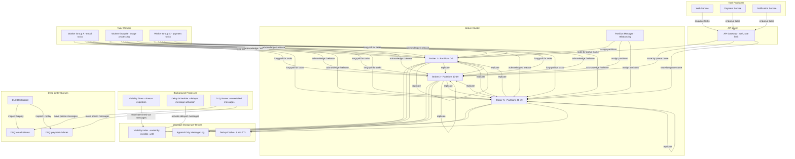
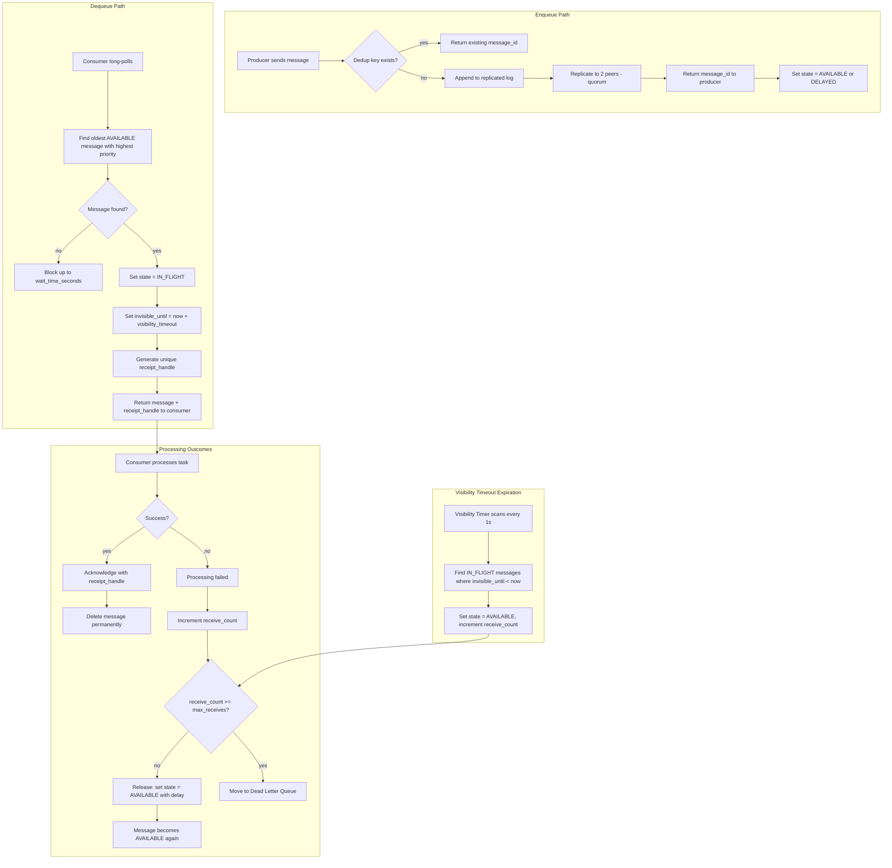
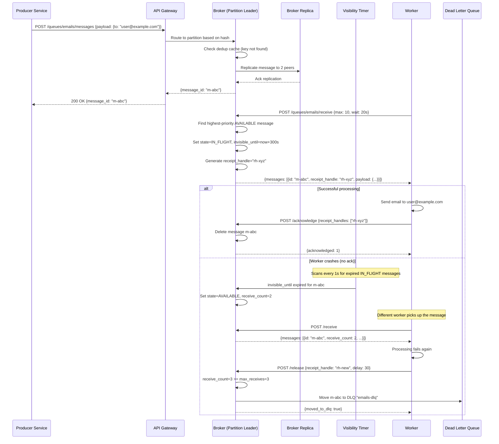

# Task Queue System — Architecture Diagrams

## 1. High-Level Architecture

## 2. Deep-Dive: Visibility Timeout and Message Lifecycle

## 3. Critical Path Sequence: Task Enqueue, Process, and Acknowledge

