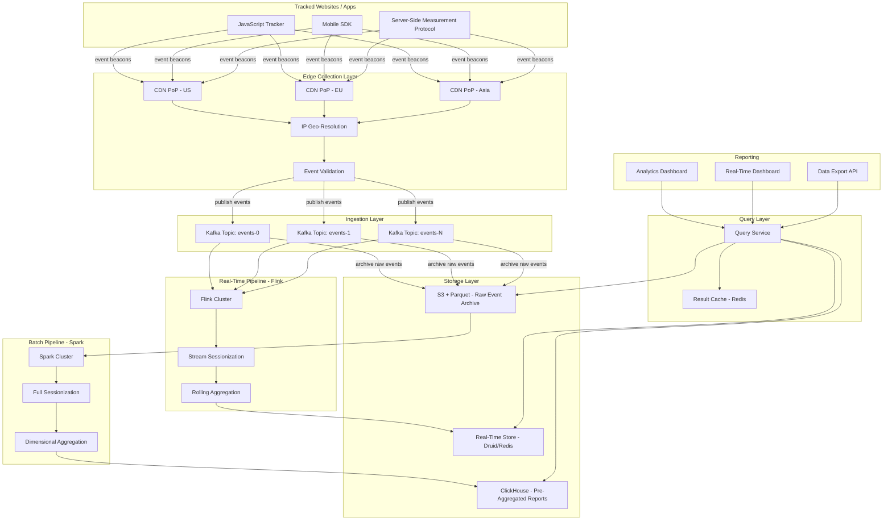
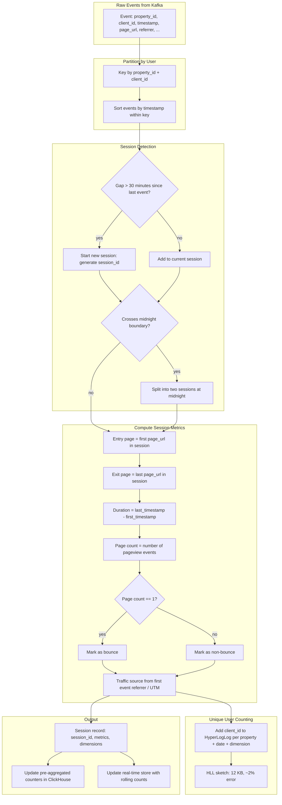
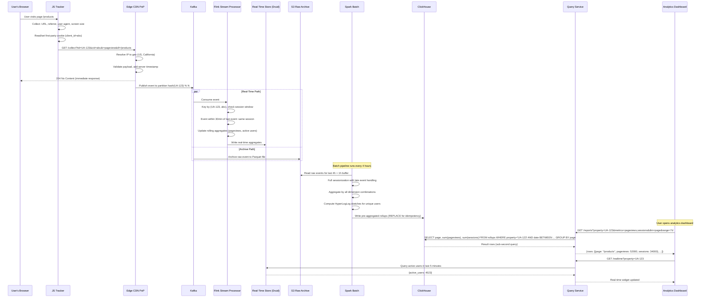

# Google Analytics — Architecture Diagrams

## 1. High-Level Architecture

```mermaid
flowchart TB
    subgraph Clients["Tracked Websites / Apps"]
        JS[JavaScript Tracker]
        MOB[Mobile SDK]
        SRV[Server-Side Measurement Protocol]
    end

    subgraph Edge["Edge Collection Layer"]
        CDN1[CDN PoP - US]
        CDN2[CDN PoP - EU]
        CDN3[CDN PoP - Asia]
        GEO[IP Geo-Resolution]
        VALIDATE[Event Validation]
    end

    subgraph Ingestion["Ingestion Layer"]
        K1[Kafka Topic: events-0]
        K2[Kafka Topic: events-1]
        K3[Kafka Topic: events-N]
    end

    subgraph StreamPath["Real-Time Pipeline - Flink"]
        FLINK[Flink Cluster]
        SESSION_RT[Stream Sessionization]
        AGG_RT[Rolling Aggregation]
    end

    subgraph BatchPath["Batch Pipeline - Spark"]
        SPARK[Spark Cluster]
        SESSION_BATCH[Full Sessionization]
        AGG_BATCH[Dimensional Aggregation]
    end

    subgraph Storage["Storage Layer"]
        RT_STORE[Real-Time Store - Druid/Redis]
        OLAP[ClickHouse - Pre-Aggregated Reports]
        RAW[S3 + Parquet - Raw Event Archive]
    end

    subgraph QueryLayer["Query Layer"]
        QS[Query Service]
        CACHE[Result Cache - Redis]
    end

    subgraph Reporting["Reporting"]
        DASH[Analytics Dashboard]
        RT_DASH[Real-Time Dashboard]
        EXPORT[Data Export API]
    end

    JS & MOB & SRV -->|"event beacons"| CDN1 & CDN2 & CDN3
    CDN1 & CDN2 & CDN3 --> GEO --> VALIDATE
    VALIDATE -->|"publish events"| K1 & K2 & K3

    K1 & K2 & K3 --> FLINK
    FLINK --> SESSION_RT --> AGG_RT --> RT_STORE

    K1 & K2 & K3 -->|"archive raw events"| RAW
    RAW --> SPARK --> SESSION_BATCH --> AGG_BATCH --> OLAP

    DASH --> QS --> OLAP
    RT_DASH --> QS --> RT_STORE
    EXPORT --> QS --> RAW
    QS --> CACHE
```

## 2. Deep-Dive: Sessionization Pipeline

```mermaid
flowchart TB
    subgraph Input["Raw Events from Kafka"]
        EVT[Event: property_id, client_id, timestamp, page_url, referrer, ...]
    end

    subgraph KeyPartition["Partition by User"]
        KEY[Key by property_id + client_id]
        SORT[Sort events by timestamp within key]
    end

    subgraph SessionDetect["Session Detection"]
        GAP{Gap > 30 minutes since last event?}
        NEW_SESSION[Start new session: generate session_id]
        SAME_SESSION[Add to current session]
        MIDNIGHT{Crosses midnight boundary?}
        SPLIT[Split into two sessions at midnight]
    end

    subgraph SessionMetrics["Compute Session Metrics"]
        ENTRY[Entry page = first page_url in session]
        EXIT[Exit page = last page_url in session]
        DURATION[Duration = last_timestamp - first_timestamp]
        PAGES[Page count = number of pageview events]
        BOUNCE{Page count == 1?}
        IS_BOUNCE[Mark as bounce]
        NOT_BOUNCE[Mark as non-bounce]
        SOURCE[Traffic source from first event referrer / UTM]
    end

    subgraph UserCount["Unique User Counting"]
        HLL[Add client_id to HyperLogLog per property + date + dimension]
        SKETCH[HLL sketch: 12 KB, ~2% error]
    end

    subgraph Output["Output"]
        SESSION_REC[Session record: session_id, metrics, dimensions]
        AGG_UPDATE[Update pre-aggregated counters in ClickHouse]
        RT_UPDATE[Update real-time store with rolling counts]
    end

    EVT --> KEY --> SORT
    SORT --> GAP
    GAP -->|"yes"| NEW_SESSION
    GAP -->|"no"| SAME_SESSION
    NEW_SESSION --> MIDNIGHT
    SAME_SESSION --> MIDNIGHT
    MIDNIGHT -->|"yes"| SPLIT
    MIDNIGHT -->|"no"| ENTRY

    SPLIT --> ENTRY
    ENTRY --> EXIT --> DURATION --> PAGES --> BOUNCE
    BOUNCE -->|"yes"| IS_BOUNCE --> SOURCE
    BOUNCE -->|"no"| NOT_BOUNCE --> SOURCE
    SOURCE --> HLL --> SKETCH

    SOURCE --> SESSION_REC
    SESSION_REC --> AGG_UPDATE
    SESSION_REC --> RT_UPDATE
```

## 3. Critical Path Sequence: Event Collection to Dashboard Query

```mermaid
sequenceDiagram
    participant Browser as User's Browser
    participant Tracker as JS Tracker
    participant CDN as Edge CDN PoP
    participant Kafka as Kafka
    participant Flink as Flink Stream Processor
    participant RT as Real-Time Store (Druid)
    participant S3 as S3 Raw Archive
    participant Spark as Spark Batch
    participant CH as ClickHouse
    participant QS as Query Service
    participant Dashboard as Analytics Dashboard

    Browser->>Tracker: User visits page /products
    Tracker->>Tracker: Collect: URL, referrer, user agent, screen size
    Tracker->>Tracker: Read/set first-party cookie (client_id=abc)
    Tracker->>CDN: GET /collect?tid=UA-123&cid=abc&t=pageview&dl=/products
    CDN->>CDN: Resolve IP to geo (US, California)
    CDN->>CDN: Validate payload, add server timestamp
    CDN-->>Browser: 204 No Content (immediate response)

    CDN->>Kafka: Publish event to partition hash(UA-123) % N

    par Real-Time Path
        Kafka->>Flink: Consume event
        Flink->>Flink: Key by (UA-123, abc), check session window
        Flink->>Flink: Event within 30min of last event: same session
        Flink->>Flink: Update rolling aggregates (pageviews, active users)
        Flink->>RT: Write real-time aggregates
    and Archive Path
        Kafka->>S3: Archive raw event to Parquet file
    end

    Note over Spark: Batch pipeline runs every 4 hours
    Spark->>S3: Read raw events for last 4h + 1h buffer
    Spark->>Spark: Full sessionization with late event handling
    Spark->>Spark: Aggregate by all dimension combinations
    Spark->>Spark: Compute HyperLogLog sketches for unique users
    Spark->>CH: Write pre-aggregated rollups (REPLACE for idempotency)

    Note over Dashboard: User opens analytics dashboard
    Dashboard->>QS: GET /reports?property=UA-123&metrics=pageviews,sessions&dim=page&range=7d
    QS->>CH: SELECT page, sum(pageviews), sum(sessions) FROM rollups WHERE property='UA-123' AND date BETWEEN ... GROUP BY page
    CH-->>QS: Result rows (sub-second query)
    QS-->>Dashboard: {rows: [{page: "/products", pageviews: 52000, sessions: 34000}, ...]}

    Dashboard->>QS: GET /realtime?property=UA-123
    QS->>RT: Query active users in last 5 minutes
    RT-->>QS: {active_users: 4523}
    QS-->>Dashboard: Real-time widget updated
```
