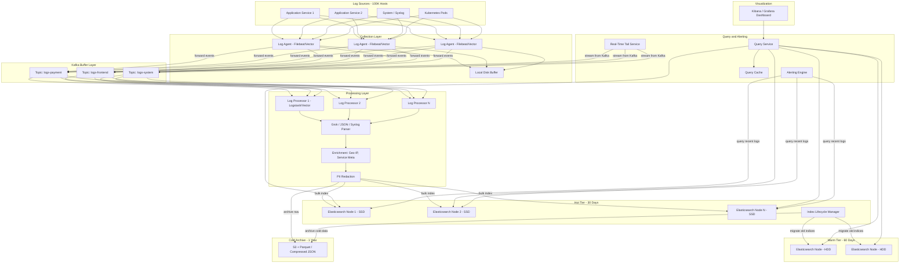
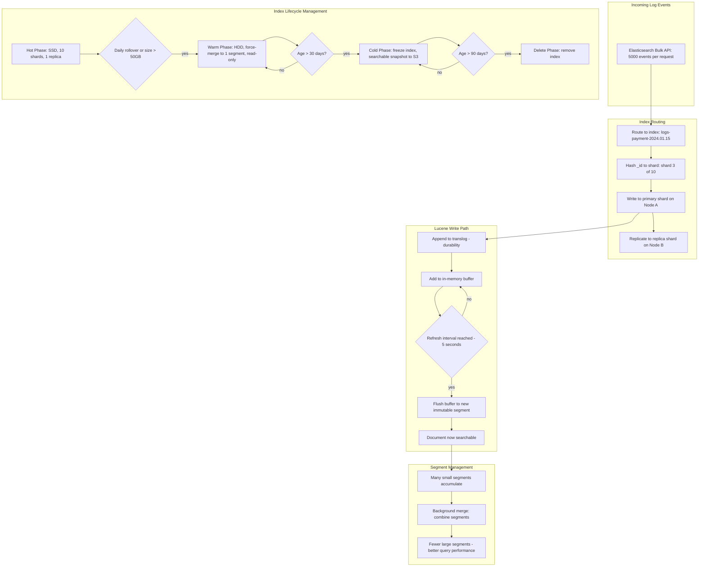
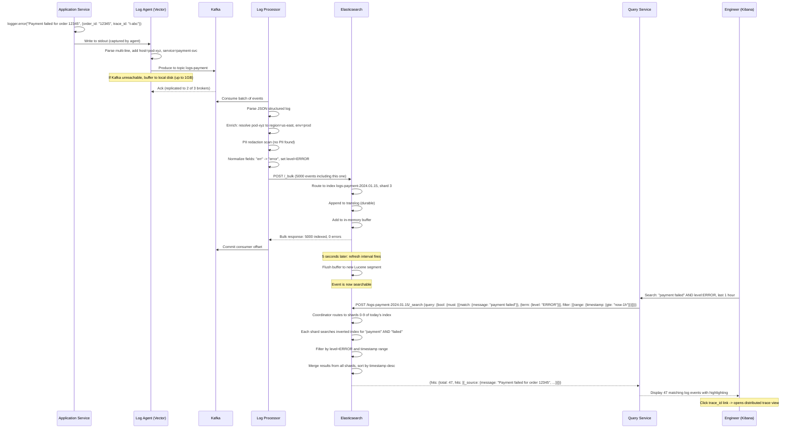

# Logging Pipeline (like ELK) — Architecture Diagrams

## 1. High-Level Architecture

## 2. Deep-Dive: Elasticsearch Indexing and Tiered Storage

## 3. Critical Path Sequence: Log Event from Application to Search Result

