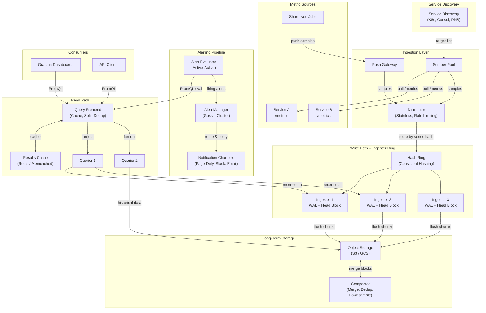
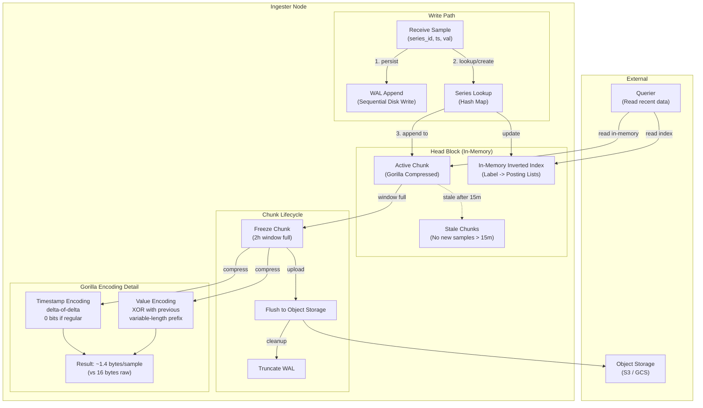
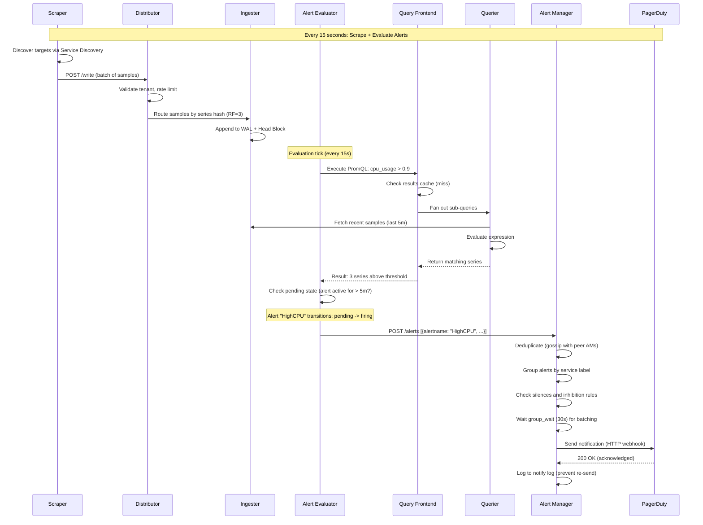

# Metrics Collection System -- Architecture Diagrams

## 1. High-Level Architecture

## 2. Deep-Dive: Time-Series Storage Engine (Ingester)

## 3. Critical Path Sequence: Alert Evaluation and Notification

