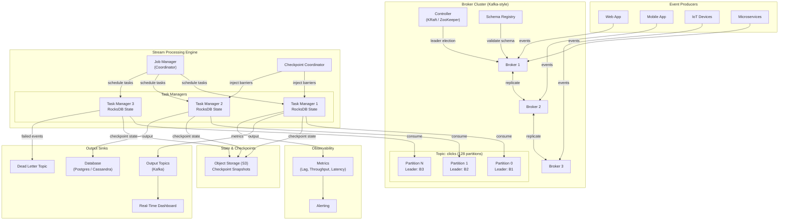
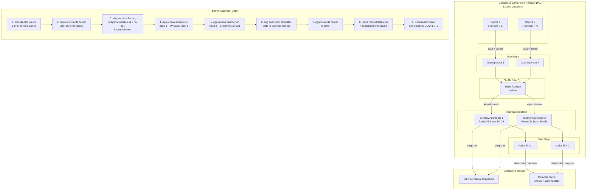
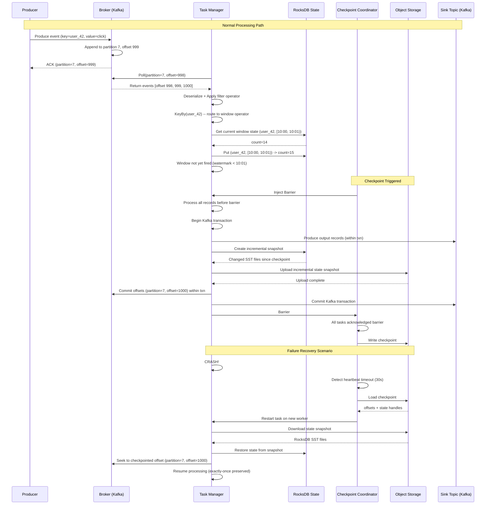

# Real-Time Stream Processing -- Architecture Diagrams

## 1. High-Level Architecture

## 2. Deep-Dive: Checkpoint Barrier Protocol (Chandy-Lamport)

## 3. Critical Path Sequence: Event Processing with Exactly-Once

