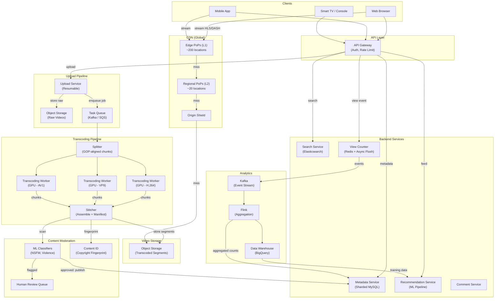
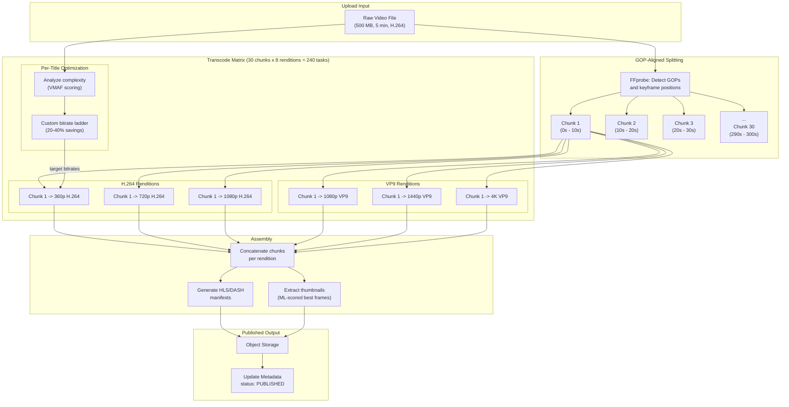
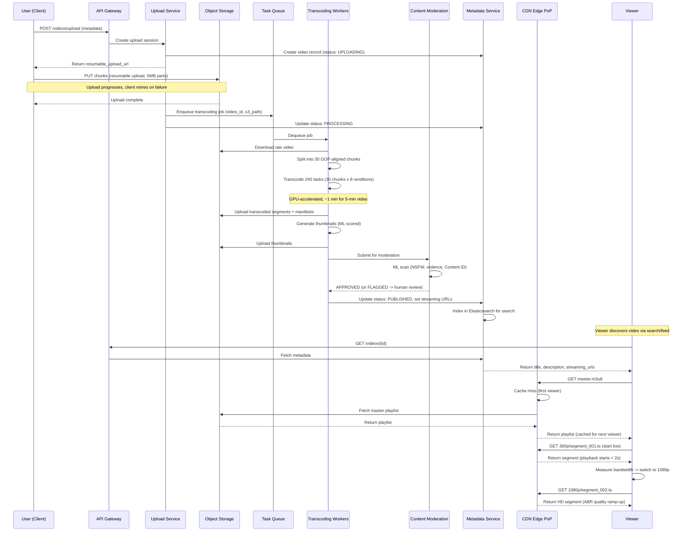

# YouTube -- Architecture Diagrams

## 1. High-Level Architecture

```mermaid
flowchart TB
    subgraph Clients["Clients"]
        WEB["Web Browser"]
        MOBILE["Mobile App"]
        TV["Smart TV / Console"]
    end

    subgraph Gateway["API Layer"]
        APIGW["API Gateway<br/>(Auth, Rate Limit)"]
    end

    subgraph Upload["Upload Pipeline"]
        UPLOAD["Upload Service<br/>(Resumable)"]
        RAW["Object Storage<br/>(Raw Videos)"]
        QUEUE["Task Queue<br/>(Kafka / SQS)"]
    end

    subgraph Transcode["Transcoding Pipeline"]
        SPLIT["Splitter<br/>(GOP-aligned chunks)"]
        TW1["Transcoding Worker<br/>(GPU - H.264)"]
        TW2["Transcoding Worker<br/>(GPU - VP9)"]
        TW3["Transcoding Worker<br/>(GPU - AV1)"]
        STITCH["Stitcher<br/>(Assemble + Manifest)"]
    end

    subgraph Moderation["Content Moderation"]
        MLMOD["ML Classifiers<br/>(NSFW, Violence)"]
        CID["Content ID<br/>(Copyright Fingerprint)"]
        HUMAN["Human Review Queue"]
    end

    subgraph Storage["Video Storage"]
        TRANSCODED["Object Storage<br/>(Transcoded Segments)"]
    end

    subgraph CDN["CDN (Global)"]
        EDGE["Edge PoPs (L1)<br/>~200 locations"]
        REGIONAL["Regional PoPs (L2)<br/>~20 locations"]
        SHIELD["Origin Shield"]
    end

    subgraph Backend["Backend Services"]
        META["Metadata Service<br/>(Sharded MySQL)"]
        SEARCH["Search Service<br/>(Elasticsearch)"]
        RECO["Recommendation Service<br/>(ML Pipeline)"]
        VIEW["View Counter<br/>(Redis + Async Flush)"]
        COMMENT["Comment Service"]
    end

    subgraph Analytics["Analytics"]
        KAFKA["Kafka<br/>(Event Stream)"]
        FLINK["Flink<br/>(Aggregation)"]
        DW["Data Warehouse<br/>(BigQuery)"]
    end

    WEB --> APIGW
    MOBILE --> APIGW
    TV --> APIGW

    APIGW -->|"upload"| UPLOAD
    UPLOAD -->|"store raw"| RAW
    UPLOAD -->|"enqueue job"| QUEUE
    QUEUE --> SPLIT
    SPLIT --> TW1
    SPLIT --> TW2
    SPLIT --> TW3
    TW1 -->|"chunks"| STITCH
    TW2 -->|"chunks"| STITCH
    TW3 -->|"chunks"| STITCH
    STITCH -->|"store segments"| TRANSCODED
    STITCH -->|"scan"| MLMOD
    STITCH -->|"fingerprint"| CID
    MLMOD -->|"flagged"| HUMAN
    MLMOD -->|"approved: publish"| META

    APIGW -->|"metadata"| META
    APIGW -->|"search"| SEARCH
    APIGW -->|"feed"| RECO
    APIGW -->|"view event"| VIEW

    WEB -->|"stream HLS/DASH"| EDGE
    MOBILE -->|"stream"| EDGE
    EDGE -->|"miss"| REGIONAL
    REGIONAL -->|"miss"| SHIELD
    SHIELD -->|"miss"| TRANSCODED

    VIEW -->|"events"| KAFKA
    KAFKA --> FLINK
    FLINK -->|"aggregated counts"| META
    FLINK --> DW
    DW -->|"training data"| RECO
```

## 2. Deep-Dive: Parallel Chunk Transcoding Pipeline

```mermaid
flowchart TB
    subgraph Input["Upload Input"]
        RAW["Raw Video File<br/>(500 MB, 5 min, H.264)"]
    end

    subgraph Splitting["GOP-Aligned Splitting"]
        PROBE["FFprobe: Detect GOPs<br/>and keyframe positions"]
        SPLIT1["Chunk 1<br/>(0s - 10s)"]
        SPLIT2["Chunk 2<br/>(10s - 20s)"]
        SPLIT3["Chunk 3<br/>(20s - 30s)"]
        SPLITN["...<br/>Chunk 30<br/>(290s - 300s)"]
    end

    subgraph TranscodeMatrix["Transcode Matrix (30 chunks x 8 renditions = 240 tasks)"]
        subgraph Rendition1["H.264 Renditions"]
            R1C1["Chunk 1 -> 360p H.264"]
            R1C2["Chunk 1 -> 720p H.264"]
            R1C3["Chunk 1 -> 1080p H.264"]
        end
        subgraph Rendition2["VP9 Renditions"]
            R2C1["Chunk 1 -> 1080p VP9"]
            R2C2["Chunk 1 -> 1440p VP9"]
            R2C3["Chunk 1 -> 4K VP9"]
        end
        subgraph PerTitle["Per-Title Optimization"]
            ANALYZE["Analyze complexity<br/>(VMAF scoring)"]
            LADDER["Custom bitrate ladder<br/>(20-40% savings)"]
        end
    end

    subgraph Assembly["Assembly"]
        CONCAT["Concatenate chunks<br/>per rendition"]
        MANIFEST["Generate HLS/DASH<br/>manifests"]
        THUMB["Extract thumbnails<br/>(ML-scored best frames)"]
    end

    subgraph Output["Published Output"]
        S3["Object Storage"]
        DB["Update Metadata<br/>status: PUBLISHED"]
    end

    RAW --> PROBE
    PROBE --> SPLIT1
    PROBE --> SPLIT2
    PROBE --> SPLIT3
    PROBE --> SPLITN

    SPLIT1 --> R1C1
    SPLIT1 --> R1C2
    SPLIT1 --> R1C3
    SPLIT1 --> R2C1
    SPLIT1 --> R2C2
    SPLIT1 --> R2C3

    RAW --> ANALYZE
    ANALYZE --> LADDER
    LADDER -->|"target bitrates"| R1C1

    R1C1 --> CONCAT
    R1C2 --> CONCAT
    R1C3 --> CONCAT
    R2C1 --> CONCAT
    R2C2 --> CONCAT
    R2C3 --> CONCAT

    CONCAT --> MANIFEST
    CONCAT --> THUMB
    MANIFEST --> S3
    THUMB --> S3
    S3 --> DB
```

## 3. Critical Path Sequence: Video Upload to First Playback

```mermaid
sequenceDiagram
    participant U as User (Client)
    participant API as API Gateway
    participant US as Upload Service
    participant S3 as Object Storage
    participant Q as Task Queue
    participant TW as Transcoding Workers
    participant MOD as Content Moderation
    participant META as Metadata Service
    participant CDN as CDN Edge PoP
    participant V as Viewer

    U->>API: POST /videos/upload (metadata)
    API->>US: Create upload session
    US->>META: Create video record (status: UPLOADING)
    US-->>U: Return resumable_upload_url

    U->>S3: PUT chunks (resumable upload, 5MB parts)
    Note over U,S3: Upload progresses, client retries on failure
    S3-->>U: Upload complete

    US->>Q: Enqueue transcoding job (video_id, s3_path)
    US->>META: Update status: PROCESSING

    Q->>TW: Dequeue job
    TW->>S3: Download raw video
    TW->>TW: Split into 30 GOP-aligned chunks
    TW->>TW: Transcode 240 tasks (30 chunks x 8 renditions)
    Note over TW: GPU-accelerated, ~1 min for 5-min video
    TW->>S3: Upload transcoded segments + manifests
    TW->>TW: Generate thumbnails (ML-scored)
    TW->>S3: Upload thumbnails

    TW->>MOD: Submit for moderation
    MOD->>MOD: ML scan (NSFW, violence, Content ID)
    MOD-->>TW: APPROVED (or FLAGGED -> human review)

    TW->>META: Update status: PUBLISHED, set streaming URLs
    META->>META: Index in Elasticsearch for search

    Note over V: Viewer discovers video via search/feed

    V->>API: GET /videos/{id}
    API->>META: Fetch metadata
    META-->>V: Return title, description, streaming_urls

    V->>CDN: GET master.m3u8
    CDN->>CDN: Cache miss (first viewer)
    CDN->>S3: Fetch master playlist
    S3-->>CDN: Return playlist
    CDN-->>V: Return playlist (cached for next viewer)

    V->>CDN: GET 360p/segment_001.ts (start low)
    CDN-->>V: Return segment (playback starts < 2s)

    V->>V: Measure bandwidth -> switch to 1080p
    V->>CDN: GET 1080p/segment_002.ts
    CDN-->>V: Return HD segment (ABR quality ramp-up)
```
