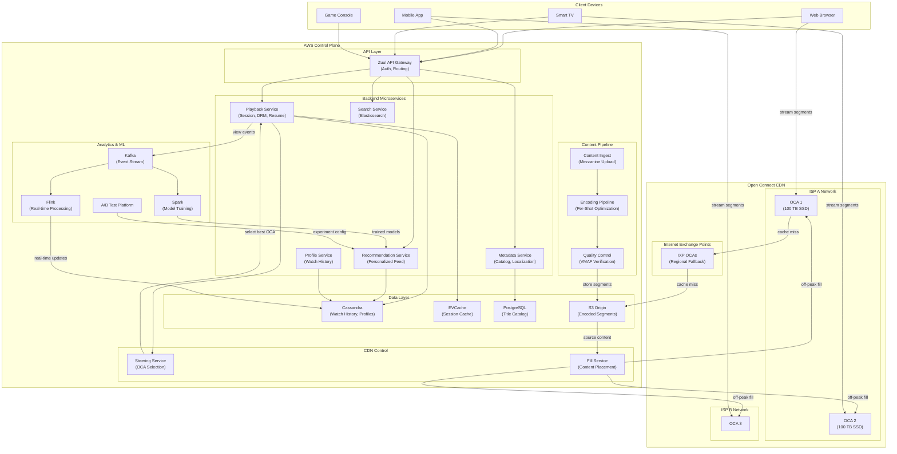
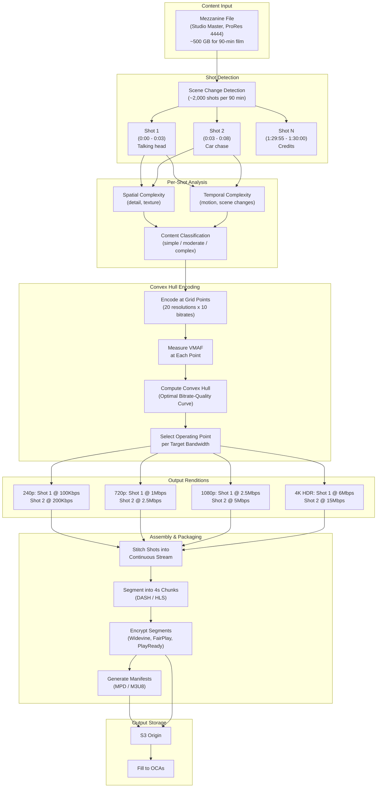
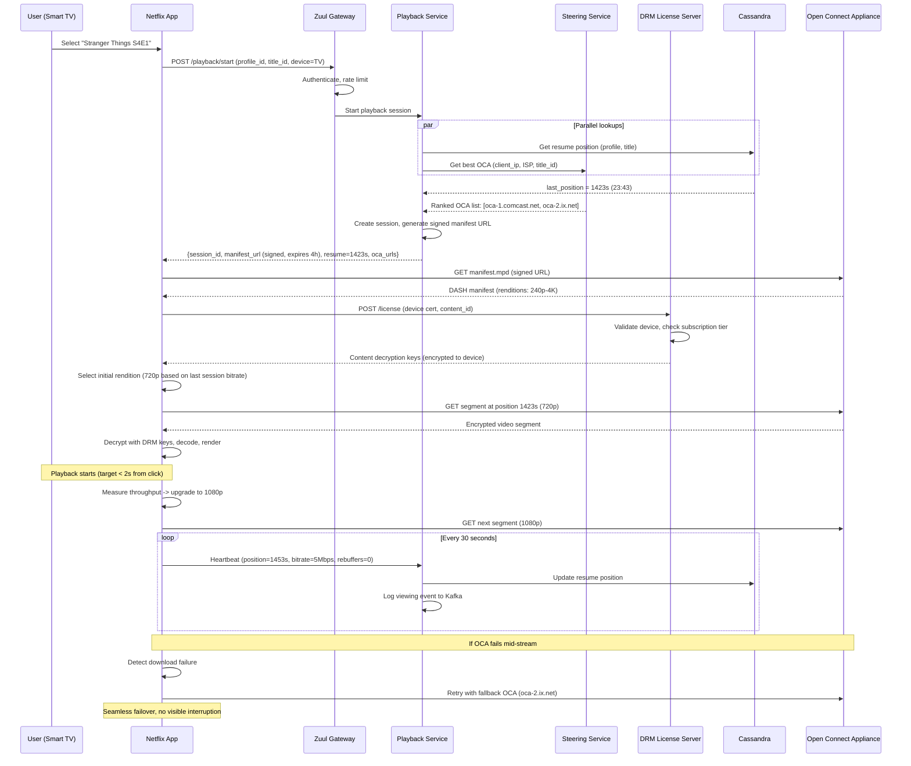

# Netflix -- Architecture Diagrams

## 1. High-Level Architecture

```mermaid
flowchart TB
    subgraph Clients["Client Devices"]
        WEB["Web Browser"]
        MOBILE["Mobile App"]
        TV["Smart TV"]
        CONSOLE["Game Console"]
    end

    subgraph AWS["AWS Control Plane"]
        subgraph Gateway["API Layer"]
            ZUUL["Zuul API Gateway<br/>(Auth, Routing)"]
        end

        subgraph Services["Backend Microservices"]
            PLAY["Playback Service<br/>(Session, DRM, Resume)"]
            META["Metadata Service<br/>(Catalog, Localization)"]
            RECO["Recommendation Service<br/>(Personalized Feed)"]
            SEARCH["Search Service<br/>(Elasticsearch)"]
            PROFILE["Profile Service<br/>(Watch History)"]
        end

        subgraph Encoding["Content Pipeline"]
            INGEST["Content Ingest<br/>(Mezzanine Upload)"]
            ENCODER["Encoding Pipeline<br/>(Per-Shot Optimization)"]
            QC["Quality Control<br/>(VMAF Verification)"]
        end

        subgraph Data["Data Layer"]
            CASS["Cassandra<br/>(Watch History, Profiles)"]
            EVS["EVCache<br/>(Session Cache)"]
            PG["PostgreSQL<br/>(Title Catalog)"]
            S3["S3 Origin<br/>(Encoded Segments)"]
        end

        subgraph Analytics["Analytics & ML"]
            KAFKA["Kafka<br/>(Event Stream)"]
            FLINK["Flink<br/>(Real-time Processing)"]
            SPARK["Spark<br/>(Model Training)"]
            AB["A/B Test Platform"]
        end

        subgraph Steering["CDN Control"]
            STEER["Steering Service<br/>(OCA Selection)"]
            FILL["Fill Service<br/>(Content Placement)"]
        end
    end

    subgraph OpenConnect["Open Connect CDN"]
        subgraph ISP1["ISP A Network"]
            OCA1["OCA 1<br/>(100 TB SSD)"]
            OCA2["OCA 2<br/>(100 TB SSD)"]
        end
        subgraph ISP2["ISP B Network"]
            OCA3["OCA 3"]
        end
        subgraph IXP["Internet Exchange Points"]
            OCA_IXP["IXP OCAs<br/>(Regional Fallback)"]
        end
    end

    WEB --> ZUUL
    MOBILE --> ZUUL
    TV --> ZUUL
    CONSOLE --> ZUUL

    ZUUL --> PLAY
    ZUUL --> META
    ZUUL --> RECO
    ZUUL --> SEARCH

    PLAY --> CASS
    PLAY --> EVS
    PLAY --> STEER
    RECO --> CASS
    META --> PG
    PROFILE --> CASS

    INGEST --> ENCODER
    ENCODER --> QC
    QC -->|"store segments"| S3

    FILL -->|"off-peak fill"| OCA1
    FILL -->|"off-peak fill"| OCA2
    FILL -->|"off-peak fill"| OCA3
    S3 -->|"source content"| FILL

    STEER -->|"select best OCA"| PLAY

    WEB -->|"stream segments"| OCA1
    MOBILE -->|"stream segments"| OCA3
    TV -->|"stream segments"| OCA2
    OCA1 -->|"cache miss"| OCA_IXP
    OCA_IXP -->|"cache miss"| S3

    PLAY -->|"view events"| KAFKA
    KAFKA --> FLINK
    FLINK -->|"real-time updates"| CASS
    KAFKA --> SPARK
    SPARK -->|"trained models"| RECO
    AB -->|"experiment config"| RECO
```

## 2. Deep-Dive: Per-Shot Encoding Pipeline

```mermaid
flowchart TB
    subgraph Input["Content Input"]
        MEZ["Mezzanine File<br/>(Studio Master, ProRes 4444)<br/>~500 GB for 90-min film"]
    end

    subgraph ShotDetection["Shot Detection"]
        DETECT["Scene Change Detection<br/>(~2,000 shots per 90 min)"]
        SHOT1["Shot 1<br/>(0:00 - 0:03)<br/>Talking head"]
        SHOT2["Shot 2<br/>(0:03 - 0:08)<br/>Car chase"]
        SHOTN["Shot N<br/>(1:29:55 - 1:30:00)<br/>Credits"]
    end

    subgraph Analysis["Per-Shot Analysis"]
        SPATIAL["Spatial Complexity<br/>(detail, texture)"]
        TEMPORAL["Temporal Complexity<br/>(motion, scene changes)"]
        CLASS["Content Classification<br/>(simple / moderate / complex)"]
    end

    subgraph ConvexHull["Convex Hull Encoding"]
        ENCODE_GRID["Encode at Grid Points<br/>(20 resolutions x 10 bitrates)"]
        VMAF["Measure VMAF<br/>at Each Point"]
        HULL["Compute Convex Hull<br/>(Optimal Bitrate-Quality Curve)"]
        SELECT["Select Operating Point<br/>per Target Bandwidth"]
    end

    subgraph OutputRenditions["Output Renditions"]
        R240["240p: Shot 1 @ 100Kbps<br/>Shot 2 @ 200Kbps"]
        R720["720p: Shot 1 @ 1Mbps<br/>Shot 2 @ 2.5Mbps"]
        R1080["1080p: Shot 1 @ 2.5Mbps<br/>Shot 2 @ 5Mbps"]
        R4K["4K HDR: Shot 1 @ 6Mbps<br/>Shot 2 @ 15Mbps"]
    end

    subgraph Assembly["Assembly & Packaging"]
        STITCH["Stitch Shots into<br/>Continuous Stream"]
        SEGMENT["Segment into 4s Chunks<br/>(DASH / HLS)"]
        MANIFEST["Generate Manifests<br/>(MPD / M3U8)"]
        DRM_ENC["Encrypt Segments<br/>(Widevine, FairPlay, PlayReady)"]
    end

    subgraph Storage["Output Storage"]
        S3["S3 Origin"]
        FILL["Fill to OCAs"]
    end

    MEZ --> DETECT
    DETECT --> SHOT1
    DETECT --> SHOT2
    DETECT --> SHOTN

    SHOT1 --> SPATIAL
    SHOT2 --> SPATIAL
    SPATIAL --> CLASS
    TEMPORAL --> CLASS
    SHOT1 --> TEMPORAL
    SHOT2 --> TEMPORAL

    CLASS --> ENCODE_GRID
    ENCODE_GRID --> VMAF
    VMAF --> HULL
    HULL --> SELECT

    SELECT --> R240
    SELECT --> R720
    SELECT --> R1080
    SELECT --> R4K

    R240 --> STITCH
    R720 --> STITCH
    R1080 --> STITCH
    R4K --> STITCH

    STITCH --> SEGMENT
    SEGMENT --> DRM_ENC
    DRM_ENC --> MANIFEST
    MANIFEST --> S3
    DRM_ENC --> S3
    S3 --> FILL
```

## 3. Critical Path Sequence: Playback Start

```mermaid
sequenceDiagram
    participant U as User (Smart TV)
    participant APP as Netflix App
    participant ZUUL as Zuul Gateway
    participant PLAY as Playback Service
    participant STEER as Steering Service
    participant DRM as DRM License Server
    participant CASS as Cassandra
    participant OCA as Open Connect Appliance

    U->>APP: Select "Stranger Things S4E1"
    APP->>ZUUL: POST /playback/start (profile_id, title_id, device=TV)
    ZUUL->>ZUUL: Authenticate, rate limit

    ZUUL->>PLAY: Start playback session

    par Parallel lookups
        PLAY->>CASS: Get resume position (profile, title)
        PLAY->>STEER: Get best OCA (client_ip, ISP, title_id)
    end

    CASS-->>PLAY: last_position = 1423s (23:43)
    STEER-->>PLAY: Ranked OCA list: [oca-1.comcast.net, oca-2.ix.net]

    PLAY->>PLAY: Create session, generate signed manifest URL
    PLAY-->>APP: {session_id, manifest_url (signed, expires 4h), resume=1423s, oca_urls}

    APP->>OCA: GET manifest.mpd (signed URL)
    OCA-->>APP: DASH manifest (renditions: 240p-4K)

    APP->>DRM: POST /license (device cert, content_id)
    DRM->>DRM: Validate device, check subscription tier
    DRM-->>APP: Content decryption keys (encrypted to device)

    APP->>APP: Select initial rendition (720p based on last session bitrate)
    APP->>OCA: GET segment at position 1423s (720p)
    OCA-->>APP: Encrypted video segment
    APP->>APP: Decrypt with DRM keys, decode, render

    Note over U,APP: Playback starts (target < 2s from click)

    APP->>APP: Measure throughput -> upgrade to 1080p
    APP->>OCA: GET next segment (1080p)

    loop Every 30 seconds
        APP->>PLAY: Heartbeat (position=1453s, bitrate=5Mbps, rebuffers=0)
        PLAY->>CASS: Update resume position
        PLAY->>PLAY: Log viewing event to Kafka
    end

    Note over APP,OCA: If OCA fails mid-stream
    APP->>APP: Detect download failure
    APP->>OCA: Retry with fallback OCA (oca-2.ix.net)
    Note over APP: Seamless failover, no visible interruption
```
