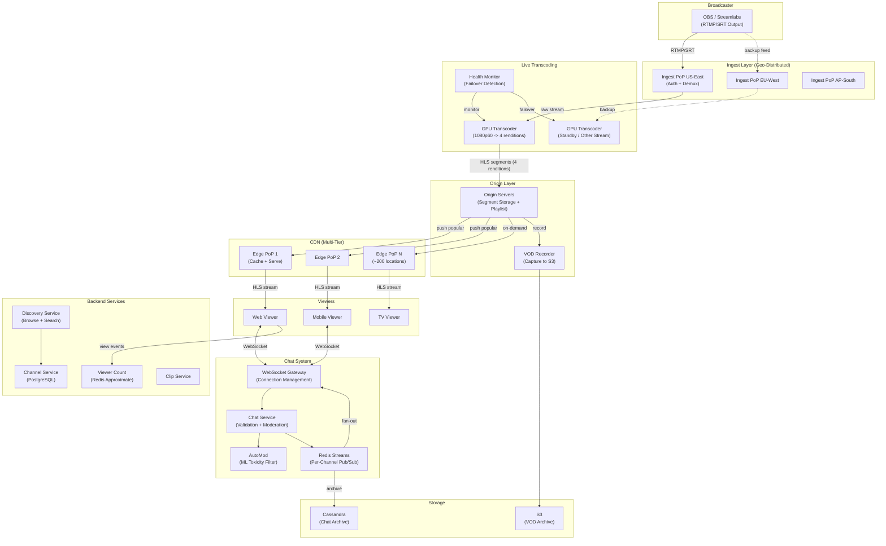
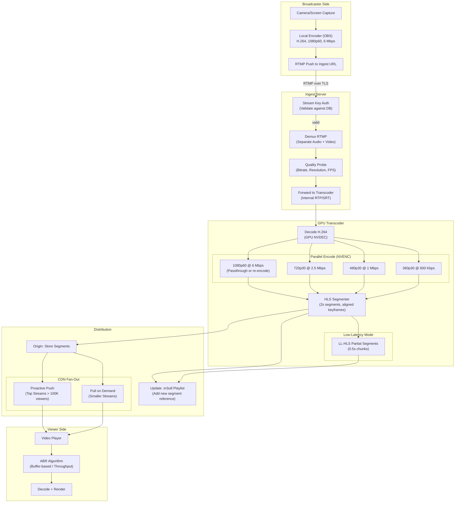
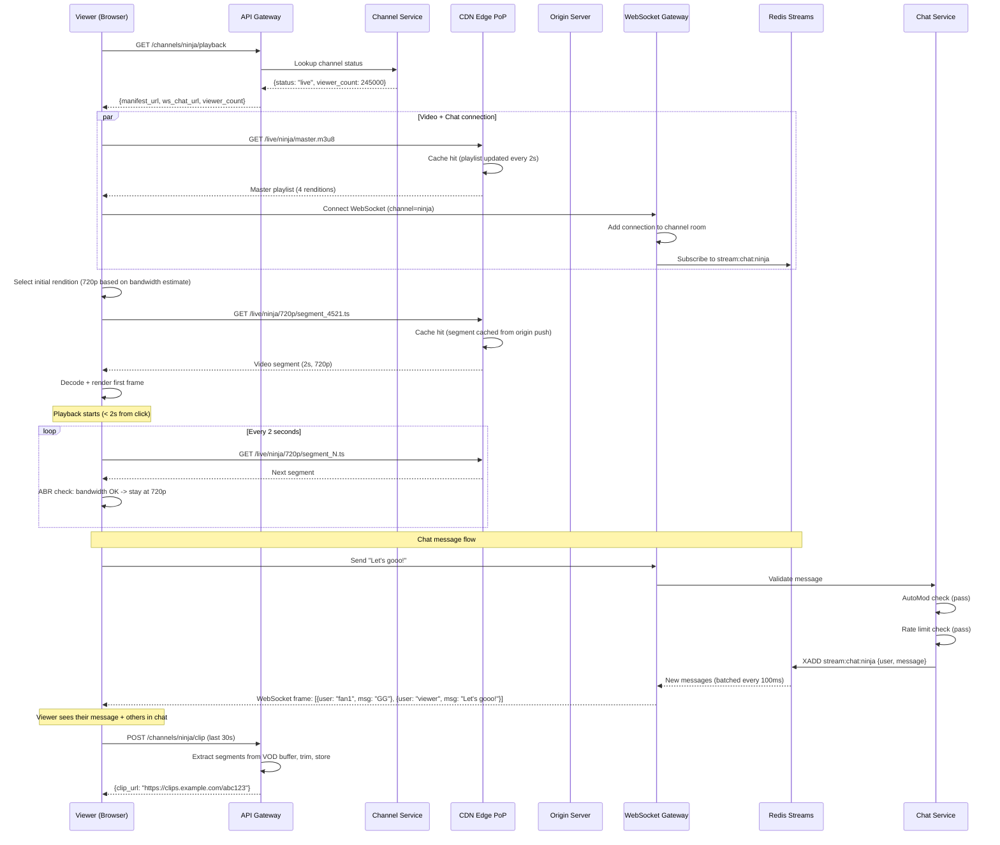

# Live Streaming Platform -- Architecture Diagrams

## 1. High-Level Architecture

## 2. Deep-Dive: Live Video Pipeline (Ingest to Viewer)

## 3. Critical Path Sequence: Viewer Joins Live Stream

