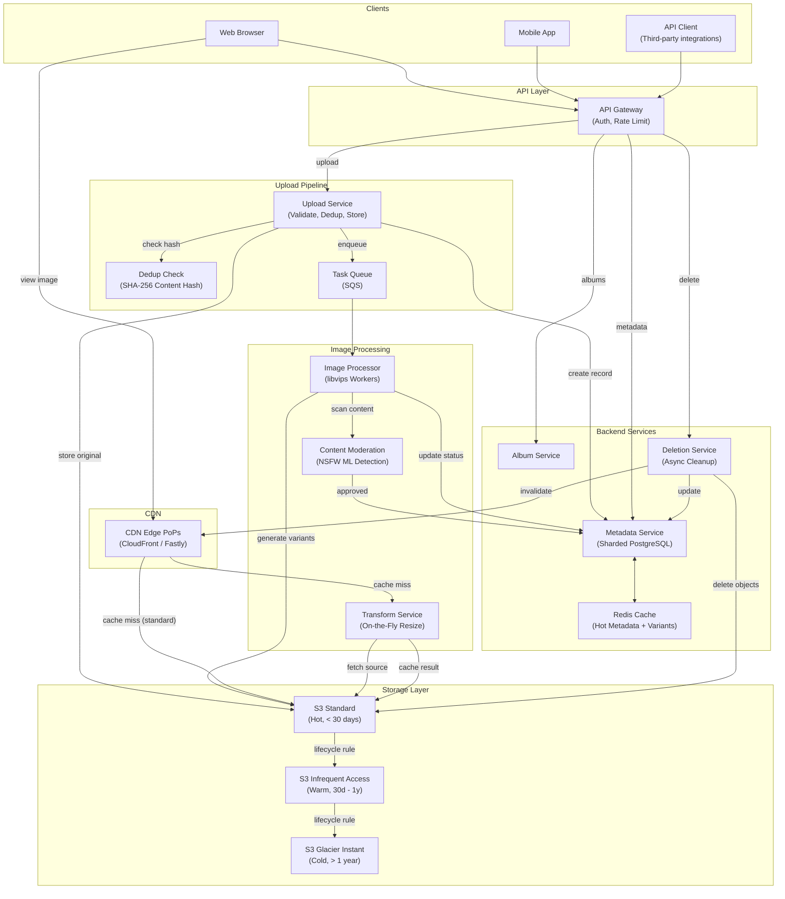
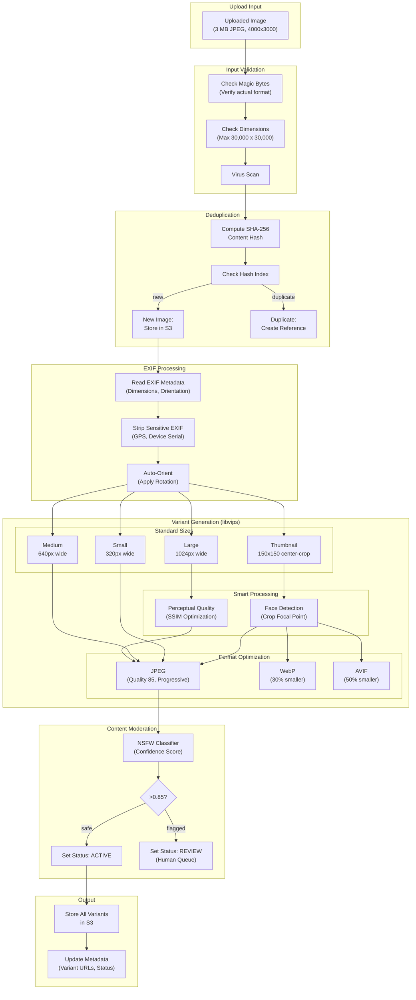
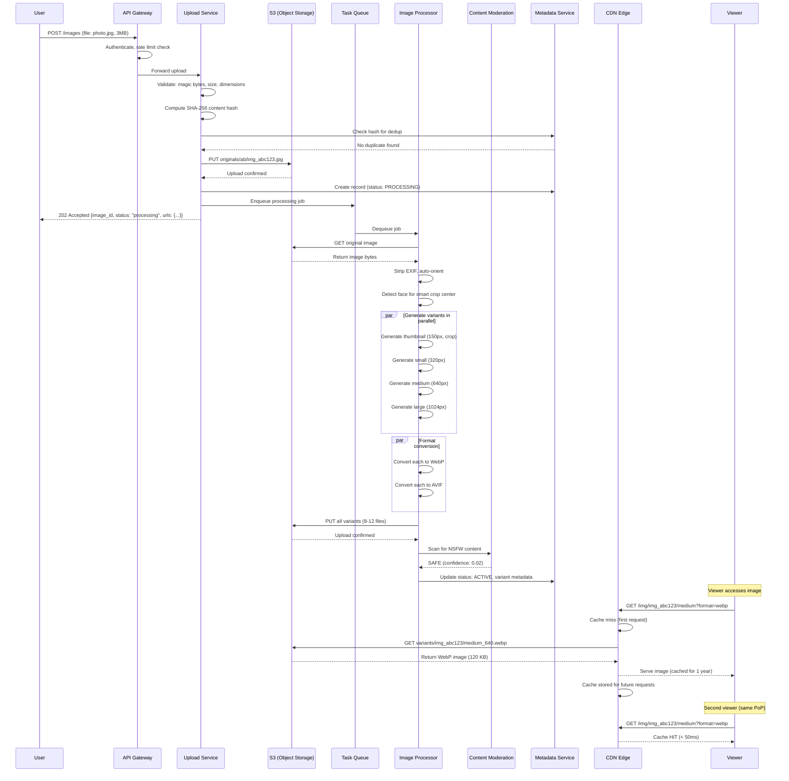

# Image Hosting Service -- Architecture Diagrams

## 1. High-Level Architecture

```mermaid
flowchart TB
    subgraph Clients["Clients"]
        WEB["Web Browser"]
        MOBILE["Mobile App"]
        API_CLIENT["API Client<br/>(Third-party integrations)"]
    end

    subgraph Gateway["API Layer"]
        APIGW["API Gateway<br/>(Auth, Rate Limit)"]
    end

    subgraph Upload["Upload Pipeline"]
        UPLOAD["Upload Service<br/>(Validate, Dedup, Store)"]
        DEDUP["Dedup Check<br/>(SHA-256 Content Hash)"]
        QUEUE["Task Queue<br/>(SQS)"]
    end

    subgraph Processing["Image Processing"]
        PROC["Image Processor<br/>(libvips Workers)"]
        MOD["Content Moderation<br/>(NSFW ML Detection)"]
        TRANSFORM["Transform Service<br/>(On-the-Fly Resize)"]
    end

    subgraph Storage["Storage Layer"]
        S3_HOT["S3 Standard<br/>(Hot, < 30 days)"]
        S3_IA["S3 Infrequent Access<br/>(Warm, 30d - 1y)"]
        S3_GLACIER["S3 Glacier Instant<br/>(Cold, > 1 year)"]
    end

    subgraph CDN_Layer["CDN"]
        CDN["CDN Edge PoPs<br/>(CloudFront / Fastly)"]
    end

    subgraph Backend["Backend Services"]
        META["Metadata Service<br/>(Sharded PostgreSQL)"]
        ALBUM["Album Service"]
        REDIS["Redis Cache<br/>(Hot Metadata + Variants)"]
        DEL["Deletion Service<br/>(Async Cleanup)"]
    end

    WEB --> APIGW
    MOBILE --> APIGW
    API_CLIENT --> APIGW

    APIGW -->|"upload"| UPLOAD
    UPLOAD -->|"check hash"| DEDUP
    UPLOAD -->|"store original"| S3_HOT
    UPLOAD -->|"create record"| META
    UPLOAD -->|"enqueue"| QUEUE

    QUEUE --> PROC
    PROC -->|"generate variants"| S3_HOT
    PROC -->|"scan content"| MOD
    MOD -->|"approved"| META
    PROC -->|"update status"| META

    APIGW -->|"metadata"| META
    APIGW -->|"albums"| ALBUM
    META <--> REDIS

    WEB -->|"view image"| CDN
    CDN -->|"cache miss"| TRANSFORM
    CDN -->|"cache miss (standard)"| S3_HOT
    TRANSFORM -->|"fetch source"| S3_HOT
    TRANSFORM -->|"cache result"| S3_HOT

    S3_HOT -->|"lifecycle rule"| S3_IA
    S3_IA -->|"lifecycle rule"| S3_GLACIER

    APIGW -->|"delete"| DEL
    DEL -->|"delete objects"| S3_HOT
    DEL -->|"invalidate"| CDN
    DEL -->|"update"| META
```

## 2. Deep-Dive: Image Processing Pipeline

```mermaid
flowchart TB
    subgraph Input["Upload Input"]
        RAW["Uploaded Image<br/>(3 MB JPEG, 4000x3000)"]
    end

    subgraph Validation["Input Validation"]
        MAGIC["Check Magic Bytes<br/>(Verify actual format)"]
        SIZE["Check Dimensions<br/>(Max 30,000 x 30,000)"]
        VIRUS["Virus Scan"]
    end

    subgraph Dedup["Deduplication"]
        HASH["Compute SHA-256<br/>Content Hash"]
        LOOKUP["Check Hash Index"]
        NEW["New Image:<br/>Store in S3"]
        EXISTING["Duplicate:<br/>Create Reference"]
    end

    subgraph EXIFProcess["EXIF Processing"]
        EXIF_READ["Read EXIF Metadata<br/>(Dimensions, Orientation)"]
        EXIF_STRIP["Strip Sensitive EXIF<br/>(GPS, Device Serial)"]
        AUTO_ORIENT["Auto-Orient<br/>(Apply Rotation)"]
    end

    subgraph VariantGen["Variant Generation (libvips)"]
        subgraph StandardSizes["Standard Sizes"]
            THUMB["Thumbnail<br/>150x150 center-crop"]
            SMALL["Small<br/>320px wide"]
            MEDIUM["Medium<br/>640px wide"]
            LARGE["Large<br/>1024px wide"]
        end
        subgraph Formats["Format Optimization"]
            JPEG_OPT["JPEG<br/>(Quality 85, Progressive)"]
            WEBP["WebP<br/>(30% smaller)"]
            AVIF["AVIF<br/>(50% smaller)"]
        end
        subgraph SmartCrop["Smart Processing"]
            FACE["Face Detection<br/>(Crop Focal Point)"]
            QUALITY["Perceptual Quality<br/>(SSIM Optimization)"]
        end
    end

    subgraph Moderation["Content Moderation"]
        NSFW["NSFW Classifier<br/>(Confidence Score)"]
        DECISION{">0.85?"}
        APPROVE["Set Status: ACTIVE"]
        FLAG["Set Status: REVIEW<br/>(Human Queue)"]
    end

    subgraph Output["Output"]
        S3_STORE["Store All Variants<br/>in S3"]
        META_UPDATE["Update Metadata<br/>(Variant URLs, Status)"]
    end

    RAW --> MAGIC --> SIZE --> VIRUS
    VIRUS --> HASH
    HASH --> LOOKUP
    LOOKUP -->|"new"| NEW
    LOOKUP -->|"duplicate"| EXISTING

    NEW --> EXIF_READ
    EXIF_READ --> EXIF_STRIP
    EXIF_STRIP --> AUTO_ORIENT

    AUTO_ORIENT --> THUMB
    AUTO_ORIENT --> SMALL
    AUTO_ORIENT --> MEDIUM
    AUTO_ORIENT --> LARGE

    THUMB --> FACE
    FACE --> JPEG_OPT
    FACE --> WEBP
    FACE --> AVIF
    SMALL --> JPEG_OPT
    MEDIUM --> JPEG_OPT
    LARGE --> QUALITY
    QUALITY --> JPEG_OPT

    JPEG_OPT --> NSFW
    NSFW --> DECISION
    DECISION -->|"safe"| APPROVE
    DECISION -->|"flagged"| FLAG

    APPROVE --> S3_STORE
    S3_STORE --> META_UPDATE
```

## 3. Critical Path Sequence: Image Upload to First View

```mermaid
sequenceDiagram
    participant U as User
    participant API as API Gateway
    participant US as Upload Service
    participant S3 as S3 (Object Storage)
    participant Q as Task Queue
    participant IP as Image Processor
    participant MOD as Content Moderation
    participant META as Metadata Service
    participant CDN as CDN Edge
    participant V as Viewer

    U->>API: POST /images (file: photo.jpg, 3MB)
    API->>API: Authenticate, rate limit check

    API->>US: Forward upload
    US->>US: Validate: magic bytes, size, dimensions
    US->>US: Compute SHA-256 content hash

    US->>META: Check hash for dedup
    META-->>US: No duplicate found

    US->>S3: PUT originals/ab/img_abc123.jpg
    S3-->>US: Upload confirmed

    US->>META: Create record (status: PROCESSING)
    US->>Q: Enqueue processing job

    US-->>U: 202 Accepted {image_id, status: "processing", urls: {...}}

    Q->>IP: Dequeue job
    IP->>S3: GET original image
    S3-->>IP: Return image bytes

    IP->>IP: Strip EXIF, auto-orient
    IP->>IP: Detect face for smart crop center

    par Generate variants in parallel
        IP->>IP: Generate thumbnail (150px, crop)
        IP->>IP: Generate small (320px)
        IP->>IP: Generate medium (640px)
        IP->>IP: Generate large (1024px)
    end

    par Format conversion
        IP->>IP: Convert each to WebP
        IP->>IP: Convert each to AVIF
    end

    IP->>S3: PUT all variants (8-12 files)
    S3-->>IP: Upload confirmed

    IP->>MOD: Scan for NSFW content
    MOD-->>IP: SAFE (confidence: 0.02)

    IP->>META: Update status: ACTIVE, variant metadata

    Note over V: Viewer accesses image

    V->>CDN: GET /img/img_abc123/medium?format=webp
    CDN->>CDN: Cache miss (first request)
    CDN->>S3: GET variants/img_abc123/medium_640.webp
    S3-->>CDN: Return WebP image (120 KB)
    CDN-->>V: Serve image (cached for 1 year)
    CDN->>CDN: Cache stored for future requests

    Note over V: Second viewer (same PoP)
    V->>CDN: GET /img/img_abc123/medium?format=webp
    CDN-->>V: Cache HIT (< 50ms)
```
