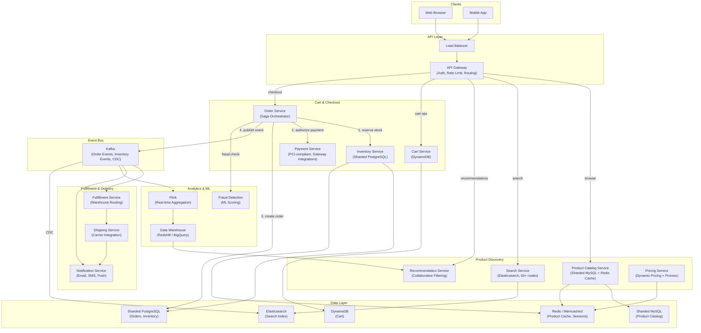
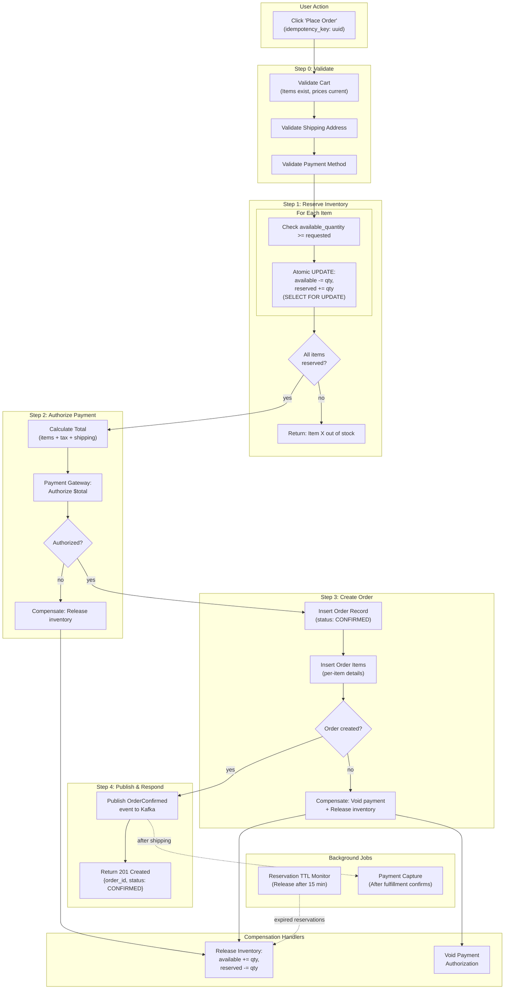

# Amazon E-Commerce Backend -- Architecture Diagrams

## 1. High-Level Architecture



## 2. Deep-Dive: Checkout Flow (Saga Pattern)



## 3. Critical Path Sequence: Search to Order Delivery

```mermaid
sequenceDiagram
    participant U as User
    participant API as API Gateway
    participant SRCH as Search Service
    participant CAT as Catalog Service
    participant CART as Cart Service
    participant ORD as Order Service
    participant INV as Inventory Service
    participant PAY as Payment Service
    participant K as Kafka
    participant FF as Fulfillment Service
    participant SHIP as Shipping Service
    participant NOTIF as Notification Service

    U->>API: GET /search?q=wireless headphones&max_price=50
    API->>SRCH: Query Elasticsearch
    SRCH->>SRCH: BM25 + LTR ranking, facet computation
    SRCH-->>U: Results: [{product_id, title, price, rating, ...}]

    U->>API: GET /products/PROD_123
    API->>CAT: Fetch product details (cache hit: Redis)
    CAT-->>U: {title, price, variants, reviews, delivery_estimate}

    U->>API: POST /cart/items {product_id: PROD_123, qty: 1}
    API->>CART: Add to DynamoDB cart
    CART-->>U: {cart: {items: [...], subtotal: $39.99}}

    U->>API: POST /orders {cart_id, address_id, payment_id}
    API->>ORD: Begin checkout saga (idempotency_key: uuid)

    ORD->>ORD: Validate cart items and prices

    ORD->>INV: Reserve inventory (PROD_123, qty=1, FC=warehouse-east)
    INV->>INV: SELECT FOR UPDATE; available -= 1, reserved += 1
    INV-->>ORD: Reserved (reservation_id: RES_456)

    ORD->>PAY: Authorize $42.49 (items + tax + shipping)
    PAY->>PAY: Call payment gateway (Stripe)
    PAY-->>ORD: Authorized (auth_id: AUTH_789)

    ORD->>ORD: Create order record (status: CONFIRMED)
    ORD->>K: Publish OrderConfirmed event
    ORD-->>U: {order_id: ORD_001, status: CONFIRMED, delivery: "Mar 9"}

    K->>FF: OrderConfirmed event
    FF->>FF: Route to warehouse-east (nearest with stock)
    FF->>FF: Generate pick list

    K->>NOTIF: OrderConfirmed event
    NOTIF-->>U: Email: "Order confirmed! Delivery by Mar 9"

    Note over FF: Warehouse picks and packs order

    FF->>SHIP: Create shipment (carrier: UPS)
    SHIP-->>FF: Tracking number: 1Z999AA1
    FF->>K: OrderShipped event

    K->>PAY: OrderShipped -> Capture payment
    PAY->>PAY: Capture $42.49

    K->>NOTIF: OrderShipped event
    NOTIF-->>U: Email: "Your order has shipped! Track: 1Z999AA1"

    SHIP->>K: OrderDelivered event
    K->>NOTIF: OrderDelivered
    NOTIF-->>U: "Your order has been delivered!"
```
