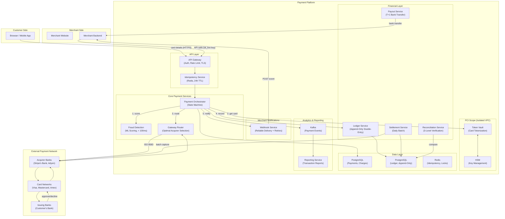
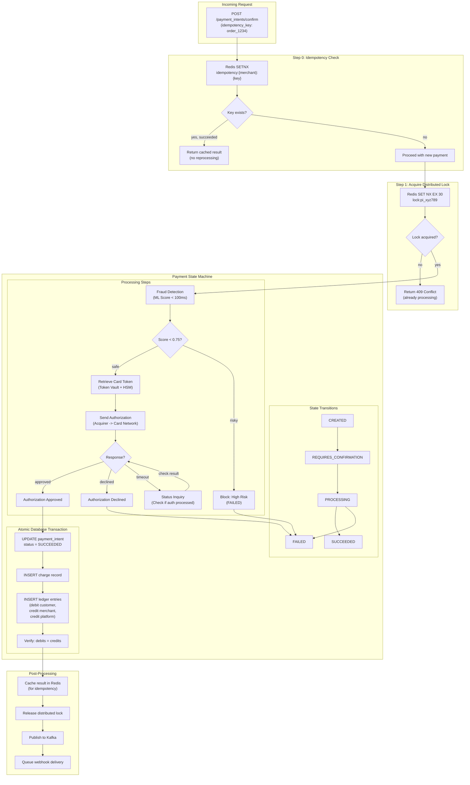
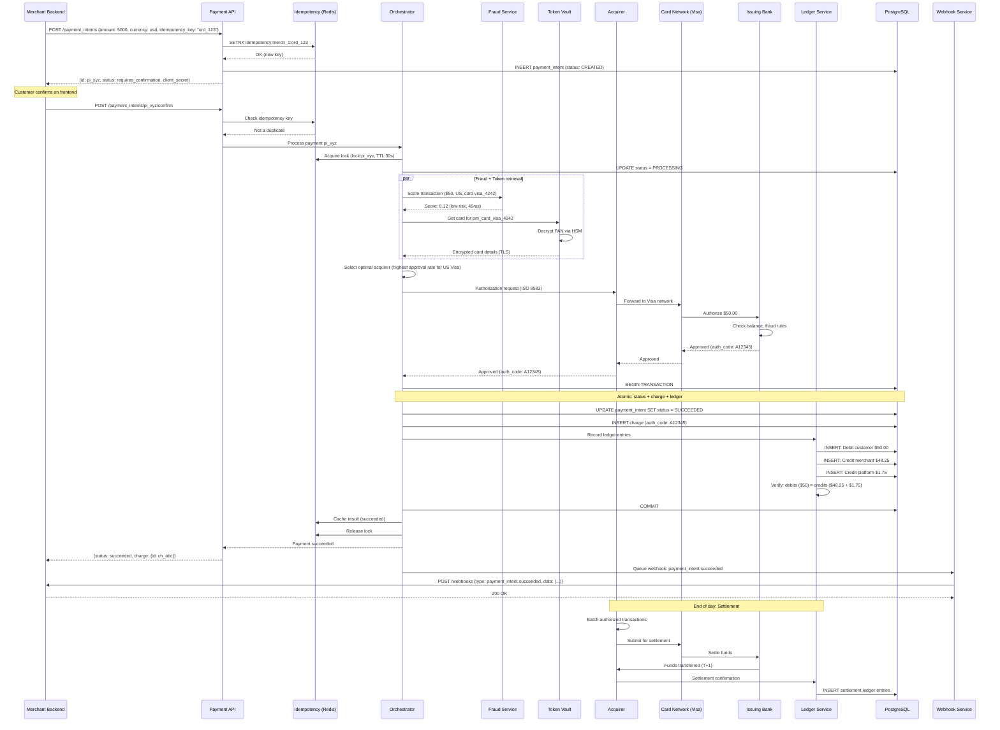

# Payment Processing System -- Architecture Diagrams

## 1. High-Level Architecture

```mermaid
flowchart TB
    subgraph Merchant["Merchant Side"]
        MWEB["Merchant Website"]
        MAPI["Merchant Backend"]
    end

    subgraph Customer["Customer Side"]
        BROWSER["Browser / Mobile App"]
    end

    subgraph PaymentPlatform["Payment Platform"]
        subgraph APILayer["API Layer"]
            APIGW["API Gateway<br/>(Auth, Rate Limit, TLS)"]
            IDEM["Idempotency Service<br/>(Redis, 24h TTL)"]
        end

        subgraph Core["Core Payment Services"]
            ORCH["Payment Orchestrator<br/>(State Machine)"]
            FRAUD["Fraud Detection<br/>(ML Scoring, < 100ms)"]
            ROUTER["Gateway Router<br/>(Optimal Acquirer Selection)"]
        end

        subgraph Vault["PCI Scope (Isolated VPC)"]
            TOKEN["Token Vault<br/>(Card Tokenization)"]
            HSM["HSM<br/>(Key Management)"]
        end

        subgraph Ledger["Financial Layer"]
            LED["Ledger Service<br/>(Append-Only Double-Entry)"]
            SETTLE["Settlement Service<br/>(Daily Batch)"]
            PAYOUT["Payout Service<br/>(T+1 Bank Transfer)"]
            RECON["Reconciliation Service<br/>(3-Level Verification)"]
        end

        subgraph Notifications["Merchant Notifications"]
            WEBHOOK["Webhook Service<br/>(Reliable Delivery + Retries)"]
        end

        subgraph DataLayer["Data Layer"]
            PG_PAY["PostgreSQL<br/>(Payments, Charges)"]
            PG_LED["PostgreSQL<br/>(Ledger, Append-Only)"]
            REDIS["Redis<br/>(Idempotency, Locks)"]
        end

        subgraph Analytics["Analytics & Reporting"]
            KAFKA["Kafka<br/>(Payment Events)"]
            REPORT["Reporting Service<br/>(Transaction Reports)"]
        end
    end

    subgraph External["External Payment Network"]
        ACQ["Acquirer Banks<br/>(Stripe's Bank, Adyen)"]
        NETWORK["Card Networks<br/>(Visa, Mastercard, Amex)"]
        ISSUER["Issuing Banks<br/>(Customer's Bank)"]
    end

    BROWSER -->|"card details (HTTPS)"| APIGW
    MAPI -->|"API calls (sk_live key)"| APIGW

    APIGW --> IDEM
    IDEM --> ORCH

    ORCH -->|"1. score"| FRAUD
    ORCH -->|"2. get card"| TOKEN
    TOKEN <--> HSM
    ORCH -->|"3. route"| ROUTER
    ROUTER -->|"ISO 8583"| ACQ
    ACQ --> NETWORK
    NETWORK --> ISSUER
    ISSUER -->|"approve/decline"| NETWORK
    NETWORK --> ACQ
    ACQ --> ROUTER

    ORCH -->|"4. record"| LED
    ORCH --> PG_PAY
    LED --> PG_LED

    ORCH -->|"5. notify"| WEBHOOK
    WEBHOOK -->|"POST event"| MAPI

    ORCH --> KAFKA
    KAFKA --> REPORT

    SETTLE -->|"batch capture"| ACQ
    SETTLE --> PG_LED
    PAYOUT -->|"bank transfer"| MAPI
    RECON -->|"compare"| PG_LED
```

## 2. Deep-Dive: Exactly-Once Payment Orchestration

```mermaid
flowchart TB
    subgraph Request["Incoming Request"]
        REQ["POST /payment_intents/confirm<br/>(idempotency_key: order_1234)"]
    end

    subgraph IdempotencyCheck["Step 0: Idempotency Check"]
        REDIS_CHECK["Redis SETNX<br/>idempotency:{merchant}:{key}"]
        EXISTS{"Key exists?"}
        CACHED["Return cached result<br/>(no reprocessing)"]
        NEW["Proceed with new payment"]
    end

    subgraph AcquireLock["Step 1: Acquire Distributed Lock"]
        LOCK["Redis SET NX EX 30<br/>lock:pi_xyz789"]
        LOCKED{"Lock acquired?"}
        CONFLICT["Return 409 Conflict<br/>(already processing)"]
    end

    subgraph StateMachine["Payment State Machine"]
        subgraph States["State Transitions"]
            CREATED["CREATED"]
            CONFIRM["REQUIRES_CONFIRMATION"]
            PROCESSING["PROCESSING"]
            SUCCEEDED["SUCCEEDED"]
            FAILED["FAILED"]
        end

        subgraph Steps["Processing Steps"]
            FRAUD_SCORE["Fraud Detection<br/>(ML Score < 100ms)"]
            FRAUD_OK{"Score < 0.75?"}
            FRAUD_BLOCK["Block: High Risk<br/>(FAILED)"]

            GET_TOKEN["Retrieve Card Token<br/>(Token Vault + HSM)"]
            AUTH_REQ["Send Authorization<br/>(Acquirer -> Card Network)"]
            AUTH_RESP{"Response?"}
            AUTH_TIMEOUT["Status Inquiry<br/>(Check if auth processed)"]
            AUTH_APPROVED["Authorization Approved"]
            AUTH_DECLINED["Authorization Declined"]
        end

        subgraph AtomicCommit["Atomic Database Transaction"]
            UPDATE_STATUS["UPDATE payment_intent<br/>status = SUCCEEDED"]
            INSERT_CHARGE["INSERT charge record"]
            INSERT_LEDGER["INSERT ledger entries<br/>(debit customer,<br/>credit merchant,<br/>credit platform)"]
            VERIFY["Verify: debits = credits"]
        end
    end

    subgraph PostProcess["Post-Processing"]
        CACHE_RESULT["Cache result in Redis<br/>(for idempotency)"]
        RELEASE_LOCK["Release distributed lock"]
        PUBLISH["Publish to Kafka"]
        SEND_WEBHOOK["Queue webhook delivery"]
    end

    REQ --> REDIS_CHECK
    REDIS_CHECK --> EXISTS
    EXISTS -->|"yes, succeeded"| CACHED
    EXISTS -->|"no"| NEW

    NEW --> LOCK
    LOCK --> LOCKED
    LOCKED -->|"no"| CONFLICT
    LOCKED -->|"yes"| FRAUD_SCORE

    CREATED --> CONFIRM --> PROCESSING

    FRAUD_SCORE --> FRAUD_OK
    FRAUD_OK -->|"safe"| GET_TOKEN
    FRAUD_OK -->|"risky"| FRAUD_BLOCK
    FRAUD_BLOCK --> FAILED

    GET_TOKEN --> AUTH_REQ
    AUTH_REQ --> AUTH_RESP
    AUTH_RESP -->|"approved"| AUTH_APPROVED
    AUTH_RESP -->|"declined"| AUTH_DECLINED
    AUTH_RESP -->|"timeout"| AUTH_TIMEOUT
    AUTH_TIMEOUT -->|"check result"| AUTH_RESP

    AUTH_APPROVED --> UPDATE_STATUS
    AUTH_DECLINED --> FAILED

    UPDATE_STATUS --> INSERT_CHARGE
    INSERT_CHARGE --> INSERT_LEDGER
    INSERT_LEDGER --> VERIFY

    PROCESSING --> SUCCEEDED
    PROCESSING --> FAILED

    VERIFY --> CACHE_RESULT
    CACHE_RESULT --> RELEASE_LOCK
    RELEASE_LOCK --> PUBLISH
    PUBLISH --> SEND_WEBHOOK
```

## 3. Critical Path Sequence: Complete Payment Flow

```mermaid
sequenceDiagram
    participant M as Merchant Backend
    participant API as Payment API
    participant IDEM as Idempotency (Redis)
    participant ORCH as Orchestrator
    participant FRAUD as Fraud Service
    participant VAULT as Token Vault
    participant ACQ as Acquirer
    participant NET as Card Network (Visa)
    participant ISS as Issuing Bank
    participant LED as Ledger Service
    participant DB as PostgreSQL
    participant WH as Webhook Service

    M->>API: POST /payment_intents {amount: 5000, currency: usd, idempotency_key: "ord_123"}
    API->>IDEM: SETNX idempotency:merch_1:ord_123
    IDEM-->>API: OK (new key)
    API->>DB: INSERT payment_intent (status: CREATED)
    API-->>M: {id: pi_xyz, status: requires_confirmation, client_secret}

    Note over M: Customer confirms on frontend

    M->>API: POST /payment_intents/pi_xyz/confirm
    API->>IDEM: Check idempotency key
    IDEM-->>API: Not a duplicate

    API->>ORCH: Process payment pi_xyz
    ORCH->>IDEM: Acquire lock (lock:pi_xyz, TTL 30s)
    ORCH->>DB: UPDATE status = PROCESSING

    par Fraud + Token retrieval
        ORCH->>FRAUD: Score transaction ($50, US, card visa_4242)
        FRAUD-->>ORCH: Score: 0.12 (low risk, 45ms)
        ORCH->>VAULT: Get card for pm_card_visa_4242
        VAULT->>VAULT: Decrypt PAN via HSM
        VAULT-->>ORCH: Encrypted card details (TLS)
    end

    ORCH->>ORCH: Select optimal acquirer (highest approval rate for US Visa)

    ORCH->>ACQ: Authorization request (ISO 8583)
    ACQ->>NET: Forward to Visa network
    NET->>ISS: Authorize $50.00
    ISS->>ISS: Check balance, fraud rules
    ISS-->>NET: Approved (auth_code: A12345)
    NET-->>ACQ: Approved
    ACQ-->>ORCH: Approved (auth_code: A12345)

    ORCH->>DB: BEGIN TRANSACTION
    Note over ORCH,DB: Atomic: status + charge + ledger
    ORCH->>DB: UPDATE payment_intent SET status = SUCCEEDED
    ORCH->>DB: INSERT charge (auth_code: A12345)
    ORCH->>LED: Record ledger entries
    LED->>DB: INSERT: Debit customer $50.00
    LED->>DB: INSERT: Credit merchant $48.25
    LED->>DB: INSERT: Credit platform $1.75
    LED->>LED: Verify: debits ($50) = credits ($48.25 + $1.75)
    ORCH->>DB: COMMIT

    ORCH->>IDEM: Cache result (succeeded)
    ORCH->>IDEM: Release lock

    ORCH-->>API: Payment succeeded
    API-->>M: {status: succeeded, charge: {id: ch_abc}}

    ORCH->>WH: Queue webhook: payment_intent.succeeded
    WH->>M: POST /webhooks {type: payment_intent.succeeded, data: {...}}
    M-->>WH: 200 OK

    Note over ACQ,LED: End of day: Settlement
    ACQ->>ACQ: Batch authorized transactions
    ACQ->>NET: Submit for settlement
    NET->>ISS: Settle funds
    ISS->>ACQ: Funds transferred (T+1)
    ACQ->>LED: Settlement confirmation
    LED->>DB: INSERT settlement ledger entries
```
