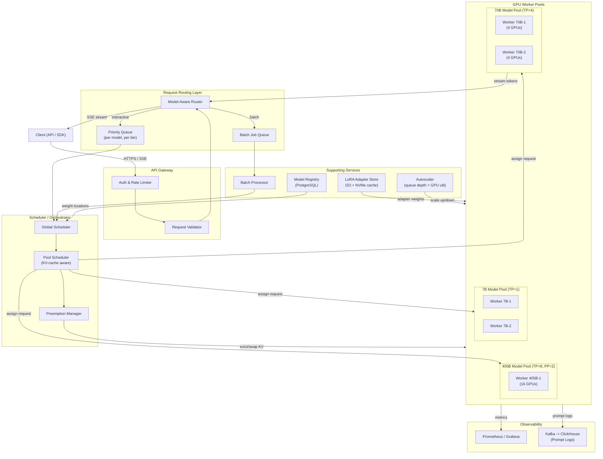
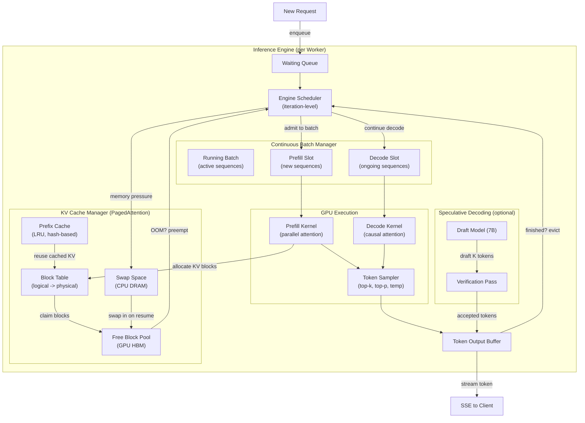
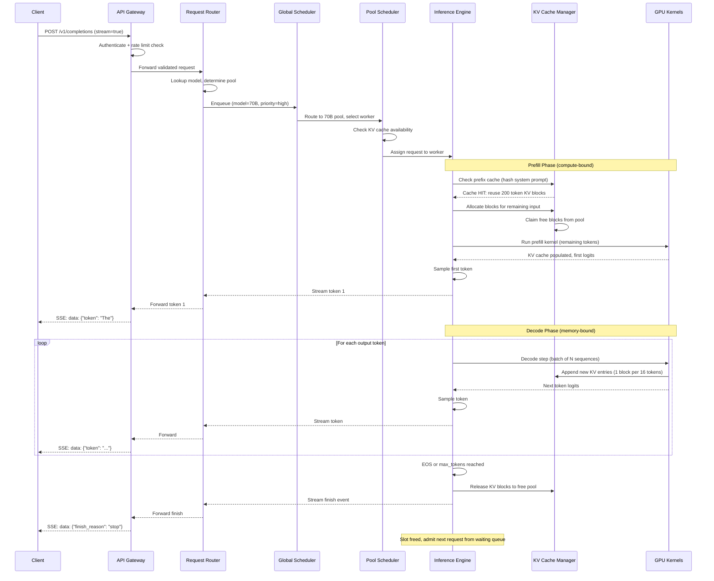

# LLM Inference System -- Architecture Diagrams

## 1. High-Level Architecture

## 2. Deep-Dive: Inference Engine with Continuous Batching and Paged KV Cache

## 3. Critical Path: Interactive Request Lifecycle

