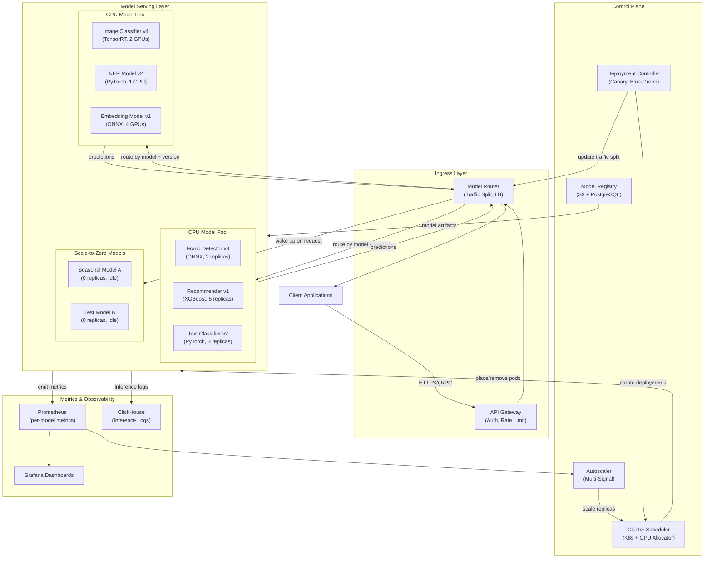
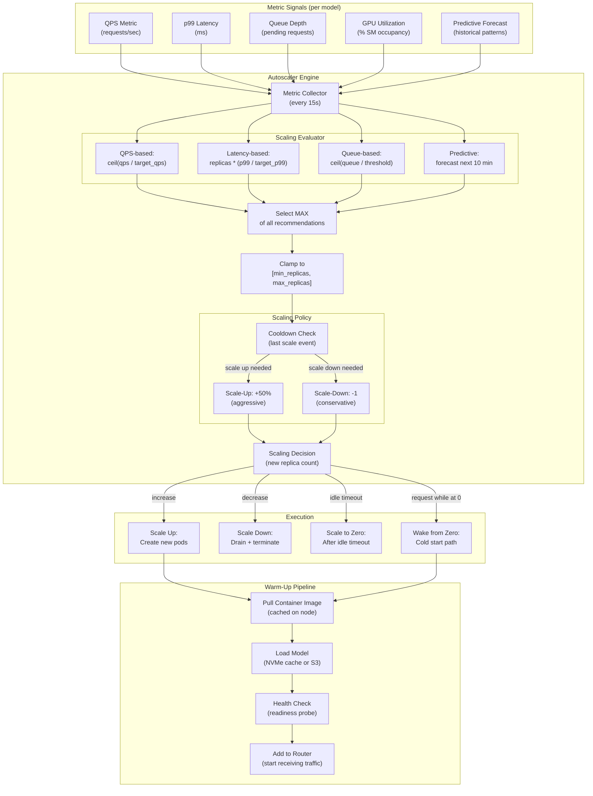
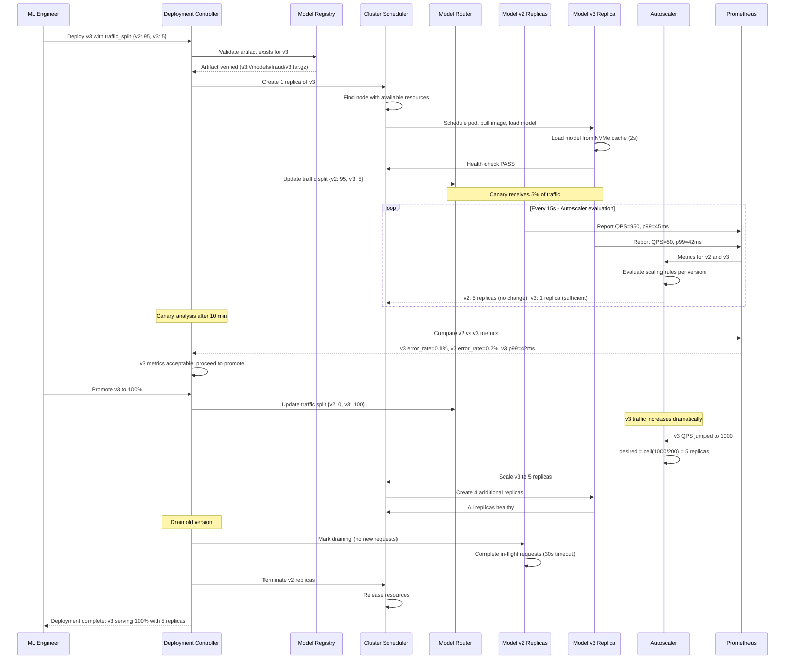

# Model Serving Platform with Autoscaling -- Architecture Diagrams

## 1. High-Level Architecture

## 2. Deep-Dive: Multi-Signal Autoscaler

## 3. Critical Path: Canary Deployment with Autoscaling

