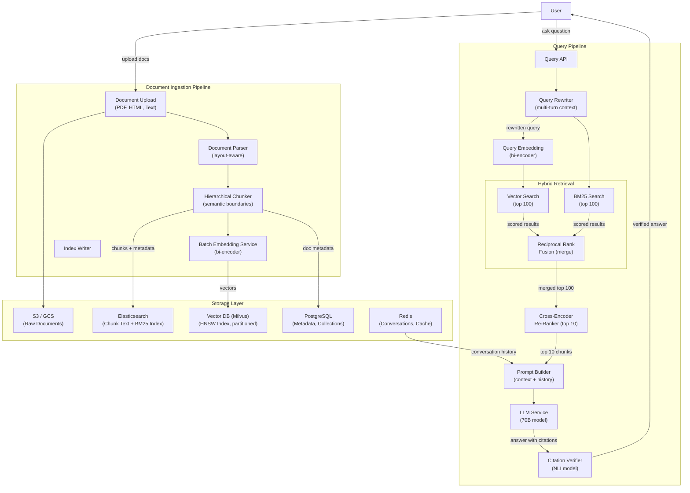
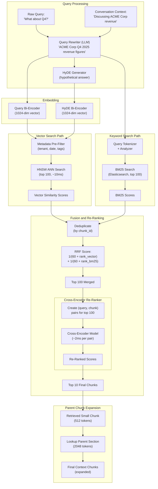
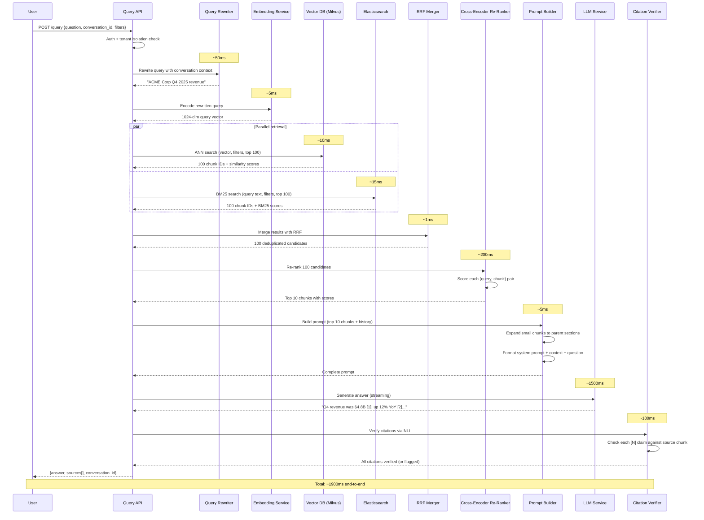

# RAG System -- Architecture Diagrams

## 1. High-Level Architecture

```mermaid
flowchart TD
    User["User"]

    subgraph Ingestion["Document Ingestion Pipeline"]
        Upload["Document Upload\n(PDF, HTML, Text)"]
        Parser["Document Parser\n(layout-aware)"]
        Chunker["Hierarchical Chunker\n(semantic boundaries)"]
        EmbedBatch["Batch Embedding Service\n(bi-encoder)"]
        Indexer["Index Writer"]
    end

    subgraph Storage["Storage Layer"]
        S3["S3 / GCS\n(Raw Documents)"]
        ES["Elasticsearch\n(Chunk Text + BM25 Index)"]
        VectorDB["Vector DB (Milvus)\n(HNSW Index, partitioned)"]
        PG["PostgreSQL\n(Metadata, Collections)"]
        Redis["Redis\n(Conversations, Cache)"]
    end

    subgraph QueryPath["Query Pipeline"]
        QueryAPI["Query API"]
        QueryRewriter["Query Rewriter\n(multi-turn context)"]
        EmbedQuery["Query Embedding\n(bi-encoder)"]

        subgraph HybridRetrieval["Hybrid Retrieval"]
            VectorSearch["Vector Search\n(top 100)"]
            BM25Search["BM25 Search\n(top 100)"]
            RRF["Reciprocal Rank\nFusion (merge)"]
        end

        Reranker["Cross-Encoder\nRe-Ranker (top 10)"]
        PromptBuilder["Prompt Builder\n(context + history)"]
        LLM["LLM Service\n(70B model)"]
        CitationVerifier["Citation Verifier\n(NLI model)"]
    end

    User -->|"upload docs"| Upload
    Upload --> S3
    Upload --> Parser
    Parser --> Chunker
    Chunker -->|"chunks + metadata"| ES
    Chunker --> EmbedBatch
    EmbedBatch -->|"vectors"| VectorDB
    Chunker -->|"doc metadata"| PG

    User -->|"ask question"| QueryAPI
    QueryAPI --> QueryRewriter
    QueryRewriter -->|"rewritten query"| EmbedQuery
    EmbedQuery --> VectorSearch
    QueryRewriter --> BM25Search

    VectorSearch -->|"scored results"| RRF
    BM25Search -->|"scored results"| RRF
    RRF -->|"merged top 100"| Reranker
    Reranker -->|"top 10 chunks"| PromptBuilder
    Redis -->|"conversation history"| PromptBuilder
    PromptBuilder --> LLM
    LLM -->|"answer with citations"| CitationVerifier
    CitationVerifier -->|"verified answer"| User
```

## 2. Deep-Dive: Hybrid Retrieval and Re-Ranking Pipeline

```mermaid
flowchart TD
    subgraph Input["Query Processing"]
        RawQuery["Raw Query:\n'What about Q4?'"]
        ConvCtx["Conversation Context:\n'Discussing ACME Corp revenue'"]
        Rewriter["Query Rewriter (LLM)\n'ACME Corp Q4 2025 revenue figures'"]
        HyDE["HyDE Generator\n(hypothetical answer)"]
    end

    subgraph Embedding["Embedding"]
        QueryEmbed["Query Bi-Encoder\n(1024-dim vector)"]
        HyDEEmbed["HyDE Bi-Encoder\n(1024-dim vector)"]
    end

    subgraph VectorPath["Vector Search Path"]
        MetaFilter["Metadata Pre-Filter\n(tenant, date, tags)"]
        HNSW["HNSW ANN Search\n(top 100, ~10ms)"]
        VecScores["Vector Similarity Scores"]
    end

    subgraph KeywordPath["Keyword Search Path"]
        Tokenizer["Query Tokenizer\n+ Analyzer"]
        BM25["BM25 Search\n(Elasticsearch, top 100)"]
        BM25Scores["BM25 Scores"]
    end

    subgraph Fusion["Fusion and Re-Ranking"]
        Dedup["Deduplicate\n(by chunk_id)"]
        RRFCalc["RRF Score:\n1/(60 + rank_vector)\n+ 1/(60 + rank_bm25)"]
        Top100["Top 100 Merged"]

        subgraph CrossEncoder["Cross-Encoder Re-Ranker"]
            Pairs["Create (query, chunk)\npairs for top 100"]
            CEModel["Cross-Encoder Model\n(~2ms per pair)"]
            CEScores["Re-Ranked Scores"]
        end

        Top10["Top 10 Final Chunks"]
    end

    subgraph ParentExpand["Parent Chunk Expansion"]
        SmallChunk["Retrieved Small Chunk\n(512 tokens)"]
        ParentLookup["Lookup Parent Section\n(2048 tokens)"]
        FinalContext["Final Context Chunks\n(expanded)"]
    end

    RawQuery --> Rewriter
    ConvCtx --> Rewriter
    Rewriter --> QueryEmbed
    Rewriter --> HyDE
    HyDE --> HyDEEmbed
    Rewriter --> Tokenizer

    QueryEmbed --> MetaFilter
    HyDEEmbed --> MetaFilter
    MetaFilter --> HNSW
    HNSW --> VecScores

    Tokenizer --> BM25
    BM25 --> BM25Scores

    VecScores --> Dedup
    BM25Scores --> Dedup
    Dedup --> RRFCalc
    RRFCalc --> Top100
    Top100 --> Pairs
    Pairs --> CEModel
    CEModel --> CEScores
    CEScores --> Top10

    Top10 --> SmallChunk
    SmallChunk --> ParentLookup
    ParentLookup --> FinalContext
```

## 3. Critical Path: End-to-End Query Lifecycle

```mermaid
sequenceDiagram
    participant U as User
    participant API as Query API
    participant QR as Query Rewriter
    participant Emb as Embedding Service
    participant VS as Vector DB (Milvus)
    participant ES as Elasticsearch
    participant RRF as RRF Merger
    participant RR as Cross-Encoder Re-Ranker
    participant PB as Prompt Builder
    participant LLM as LLM Service
    participant CV as Citation Verifier

    U->>API: POST /query {question, conversation_id, filters}
    API->>API: Auth + tenant isolation check

    Note over QR: ~50ms
    API->>QR: Rewrite query with conversation context
    QR-->>API: "ACME Corp Q4 2025 revenue"

    Note over Emb: ~5ms
    API->>Emb: Encode rewritten query
    Emb-->>API: 1024-dim query vector

    par Parallel retrieval
        Note over VS: ~10ms
        API->>VS: ANN search (vector, filters, top 100)
        VS-->>API: 100 chunk IDs + similarity scores
    and
        Note over ES: ~15ms
        API->>ES: BM25 search (query text, filters, top 100)
        ES-->>API: 100 chunk IDs + BM25 scores
    end

    Note over RRF: ~1ms
    API->>RRF: Merge results with RRF
    RRF-->>API: 100 deduplicated candidates

    Note over RR: ~200ms
    API->>RR: Re-rank 100 candidates
    RR->>RR: Score each (query, chunk) pair
    RR-->>API: Top 10 chunks with scores

    Note over PB: ~5ms
    API->>PB: Build prompt (top 10 chunks + history)
    PB->>PB: Expand small chunks to parent sections
    PB->>PB: Format system prompt + context + question
    PB-->>API: Complete prompt

    Note over LLM: ~1500ms
    API->>LLM: Generate answer (streaming)
    LLM-->>API: "Q4 revenue was $4.8B [1], up 12% YoY [2]..."

    Note over CV: ~100ms
    API->>CV: Verify citations via NLI
    CV->>CV: Check each [N] claim against source chunk
    CV-->>API: All citations verified (or flagged)

    API-->>U: {answer, sources[], conversation_id}

    Note over U,CV: Total: ~1900ms end-to-end
```
