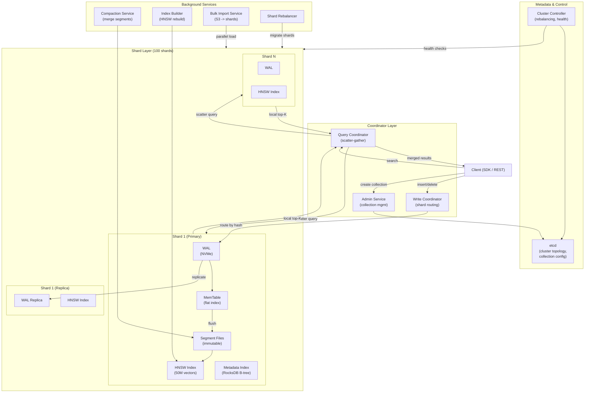
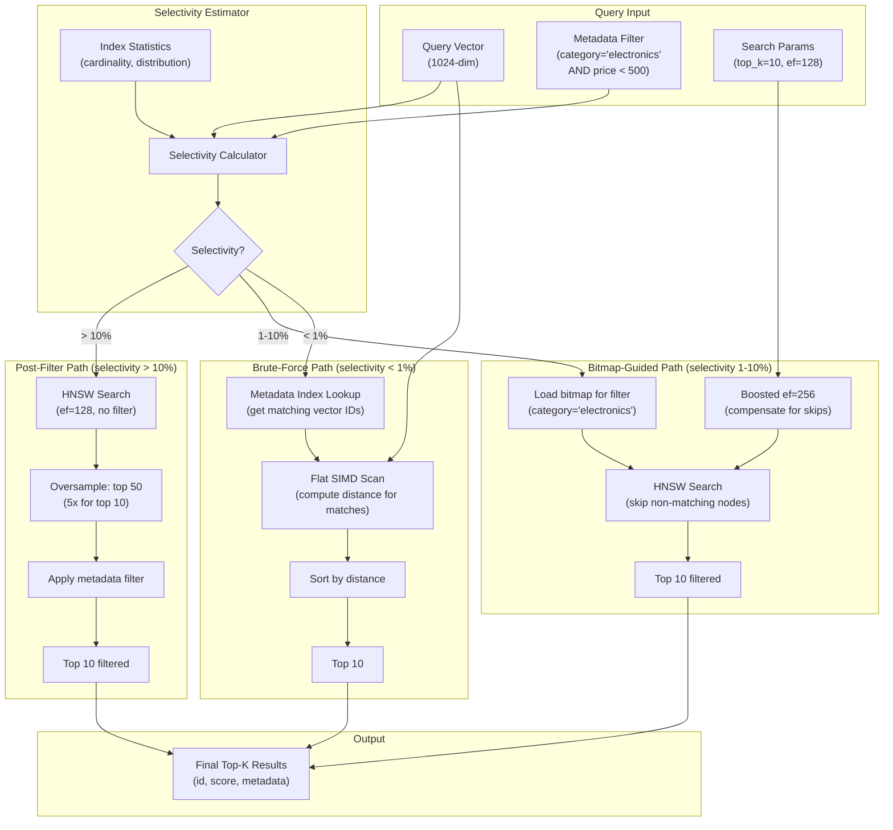
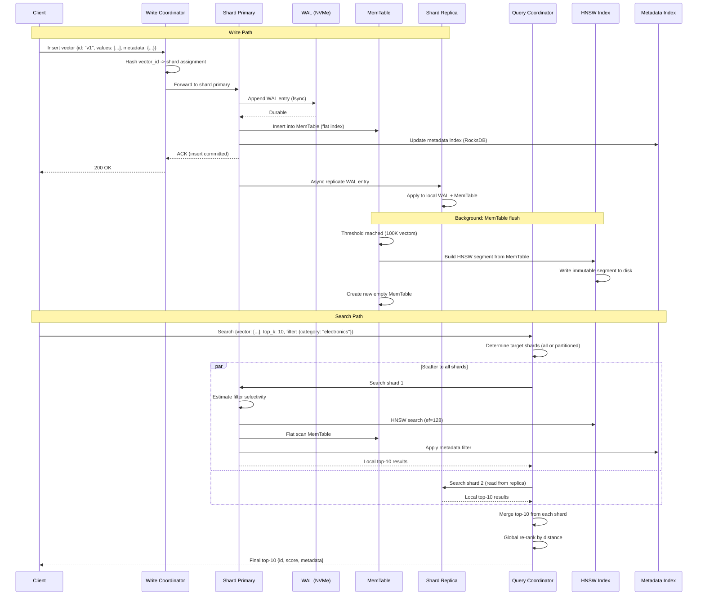

# Vector Database -- Architecture Diagrams

## 1. High-Level Architecture

## 2. Deep-Dive: HNSW Index Search with Hybrid Metadata Filtering

## 3. Critical Path: Vector Insert and Search Lifecycle

