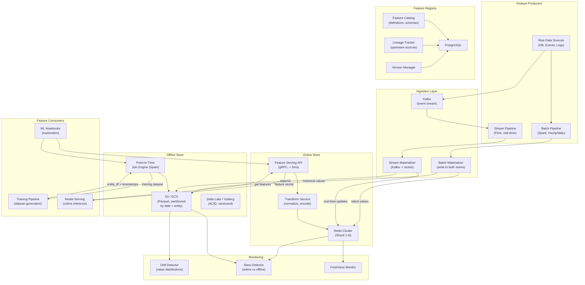
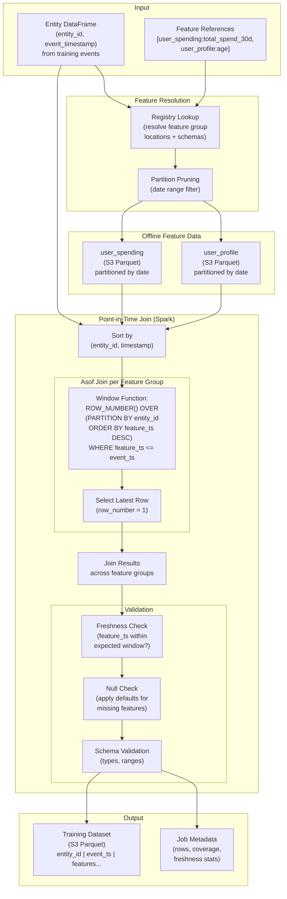
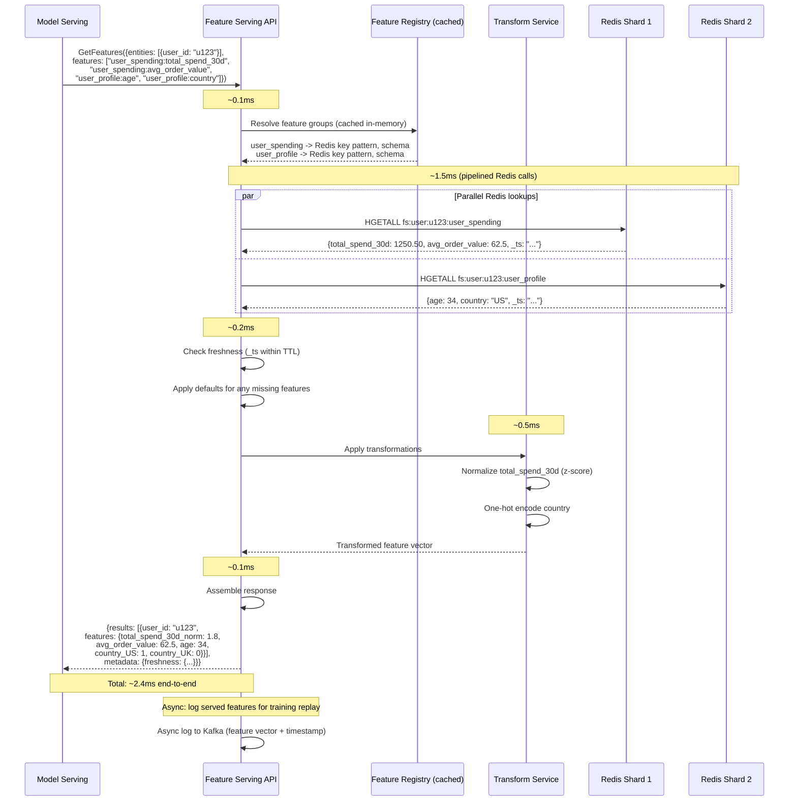

# Feature Store -- Architecture Diagrams

## 1. High-Level Architecture

```mermaid
flowchart TD
    subgraph Producers["Feature Producers"]
        BatchPipe["Batch Pipeline\n(Spark, hourly/daily)"]
        StreamPipe["Stream Pipeline\n(Flink, real-time)"]
        RawData["Raw Data Sources\n(DB, Events, Logs)"]
    end

    subgraph Registry["Feature Registry"]
        Catalog["Feature Catalog\n(definitions, schemas)"]
        Lineage["Lineage Tracker\n(upstream sources)"]
        Versioning["Version Manager"]
        PG["PostgreSQL"]
    end

    subgraph Ingestion["Ingestion Layer"]
        BatchIngest["Batch Materializer\n(write to both stores)"]
        StreamIngest["Stream Materializer\n(Kafka -> stores)"]
        Kafka["Kafka\n(event stream)"]
    end

    subgraph OnlineStore["Online Store"]
        Redis1["Redis Cluster\n(Shard 1-N)"]
        TransformSvc["Transform Service\n(normalize, encode)"]
        ServingAPI["Feature Serving API\n(gRPC, < 5ms)"]
    end

    subgraph OfflineStore["Offline Store"]
        S3["S3 / GCS\n(Parquet, partitioned\nby date + entity)"]
        DeltaLake["Delta Lake / Iceberg\n(ACID, versioned)"]
        PITJoin["Point-in-Time\nJoin Engine (Spark)"]
    end

    subgraph Consumers["Feature Consumers"]
        ModelServing["Model Serving\n(online inference)"]
        TrainingPipe["Training Pipeline\n(dataset generation)"]
        Notebook["ML Notebooks\n(exploration)"]
    end

    subgraph Monitoring["Monitoring"]
        Freshness["Freshness Monitor"]
        SkewDetect["Skew Detector\n(online vs offline)"]
        DriftDetect["Drift Detector\n(value distributions)"]
    end

    RawData --> BatchPipe
    RawData --> Kafka
    Kafka --> StreamPipe

    BatchPipe --> BatchIngest
    StreamPipe --> StreamIngest

    BatchIngest -->|"latest values"| Redis1
    BatchIngest -->|"historical values"| S3
    StreamIngest -->|"real-time updates"| Redis1
    StreamIngest -->|"append"| S3

    Catalog --> PG
    Lineage --> PG
    Versioning --> PG

    ModelServing -->|"get features"| ServingAPI
    ServingAPI --> TransformSvc
    TransformSvc --> Redis1
    ServingAPI -->|"feature vector"| ModelServing

    TrainingPipe -->|"entity_df + timestamps"| PITJoin
    PITJoin --> S3
    PITJoin -->|"training dataset"| TrainingPipe

    Notebook --> ServingAPI
    Notebook --> PITJoin

    Redis1 --> Freshness
    Redis1 --> SkewDetect
    S3 --> SkewDetect
    S3 --> DriftDetect
```

## 2. Deep-Dive: Point-in-Time Join Engine

```mermaid
flowchart TD
    subgraph Input["Input"]
        EntityDF["Entity DataFrame\n(entity_id, event_timestamp)\nfrom training events"]
        FeatureRefs["Feature References\n[user_spending:total_spend_30d,\nuser_profile:age]"]
    end

    subgraph Discovery["Feature Resolution"]
        RegLookup["Registry Lookup\n(resolve feature group\nlocations + schemas)"]
        PartitionPrune["Partition Pruning\n(date range filter)"]
    end

    subgraph OfflineData["Offline Feature Data"]
        FG1["user_spending\n(S3 Parquet)\npartitioned by date"]
        FG2["user_profile\n(S3 Parquet)\npartitioned by date"]
    end

    subgraph JoinEngine["Point-in-Time Join (Spark)"]
        SortMerge["Sort by\n(entity_id, timestamp)"]

        subgraph AsofJoin["Asof Join per Feature Group"]
            Window["Window Function:\nROW_NUMBER() OVER\n(PARTITION BY entity_id\nORDER BY feature_ts DESC)\nWHERE feature_ts <= event_ts"]
            LatestRow["Select Latest Row\n(row_number = 1)"]
        end

        JoinResult["Join Results\nacross feature groups"]

        subgraph Validation["Validation"]
            FreshnessCheck["Freshness Check\n(feature_ts within\nexpected window?)"]
            NullCheck["Null Check\n(apply defaults for\nmissing features)"]
            SkewCheck["Schema Validation\n(types, ranges)"]
        end
    end

    subgraph Output["Output"]
        TrainingDS["Training Dataset\n(S3 Parquet)\nentity_id | event_ts | features..."]
        Metadata["Job Metadata\n(rows, coverage,\nfreshness stats)"]
    end

    EntityDF --> RegLookup
    FeatureRefs --> RegLookup
    RegLookup --> PartitionPrune
    PartitionPrune --> FG1
    PartitionPrune --> FG2

    EntityDF --> SortMerge
    FG1 --> SortMerge
    FG2 --> SortMerge

    SortMerge --> Window
    Window --> LatestRow
    LatestRow --> JoinResult

    JoinResult --> FreshnessCheck
    FreshnessCheck --> NullCheck
    NullCheck --> SkewCheck

    SkewCheck --> TrainingDS
    SkewCheck --> Metadata
```

## 3. Critical Path: Online Feature Serving Request

```mermaid
sequenceDiagram
    participant MS as Model Serving
    participant FS as Feature Serving API
    participant Reg as Feature Registry (cached)
    participant Trans as Transform Service
    participant R1 as Redis Shard 1
    participant R2 as Redis Shard 2

    MS->>FS: GetFeatures({entities: [{user_id: "u123"}],<br/>features: ["user_spending:total_spend_30d",<br/>"user_spending:avg_order_value",<br/>"user_profile:age", "user_profile:country"]})

    Note over FS: ~0.1ms
    FS->>Reg: Resolve feature groups (cached in-memory)
    Reg-->>FS: user_spending -> Redis key pattern, schema<br/>user_profile -> Redis key pattern, schema

    Note over FS,R2: ~1.5ms (pipelined Redis calls)
    par Parallel Redis lookups
        FS->>R1: HGETALL fs:user:u123:user_spending
        R1-->>FS: {total_spend_30d: 1250.50, avg_order_value: 62.5, _ts: "..."}
    and
        FS->>R2: HGETALL fs:user:u123:user_profile
        R2-->>FS: {age: 34, country: "US", _ts: "..."}
    end

    Note over FS: ~0.2ms
    FS->>FS: Check freshness (_ts within TTL)
    FS->>FS: Apply defaults for any missing features

    Note over Trans: ~0.5ms
    FS->>Trans: Apply transformations
    Trans->>Trans: Normalize total_spend_30d (z-score)
    Trans->>Trans: One-hot encode country
    Trans-->>FS: Transformed feature vector

    Note over FS: ~0.1ms
    FS->>FS: Assemble response

    FS-->>MS: {results: [{user_id: "u123",<br/>features: {total_spend_30d_norm: 1.8,<br/>avg_order_value: 62.5, age: 34,<br/>country_US: 1, country_UK: 0}}],<br/>metadata: {freshness: {...}}}

    Note over MS,FS: Total: ~2.4ms end-to-end

    Note over FS: Async: log served features for training replay
    FS->>FS: Async log to Kafka (feature vector + timestamp)
```
