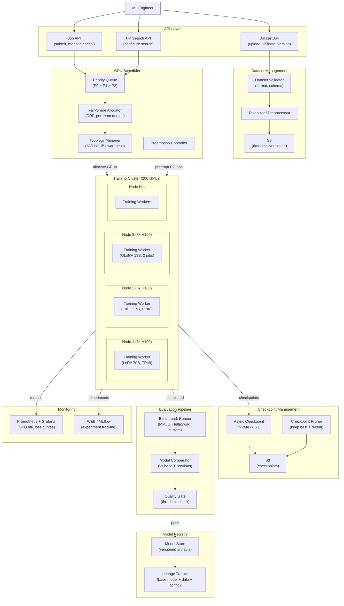
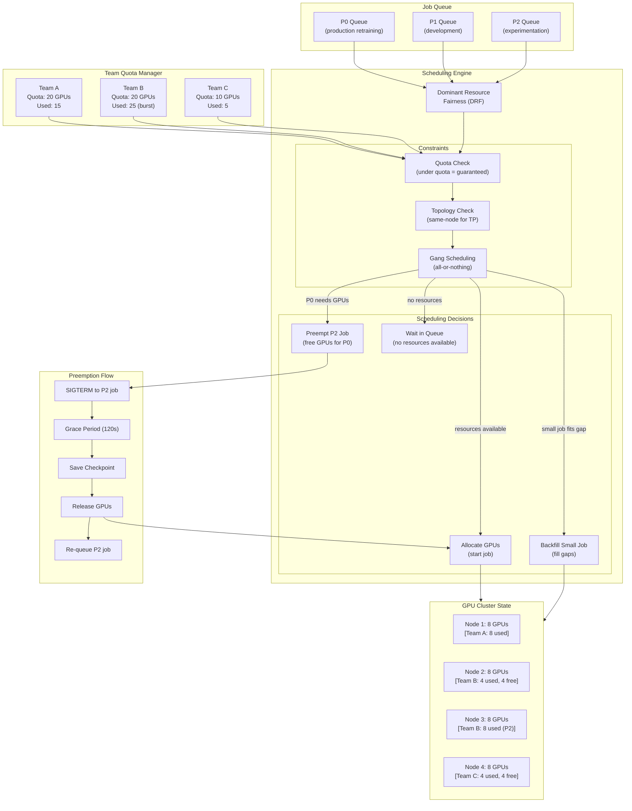
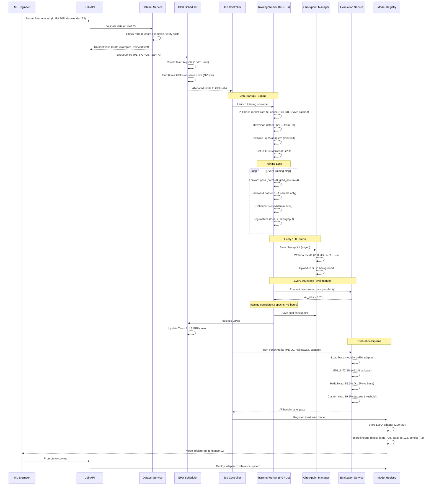

# Model Fine-Tuning Pipeline -- Architecture Diagrams

## 1. High-Level Architecture

## 2. Deep-Dive: GPU Scheduler with Fair-Share and Preemption

## 3. Critical Path: End-to-End Fine-Tuning Job Lifecycle

