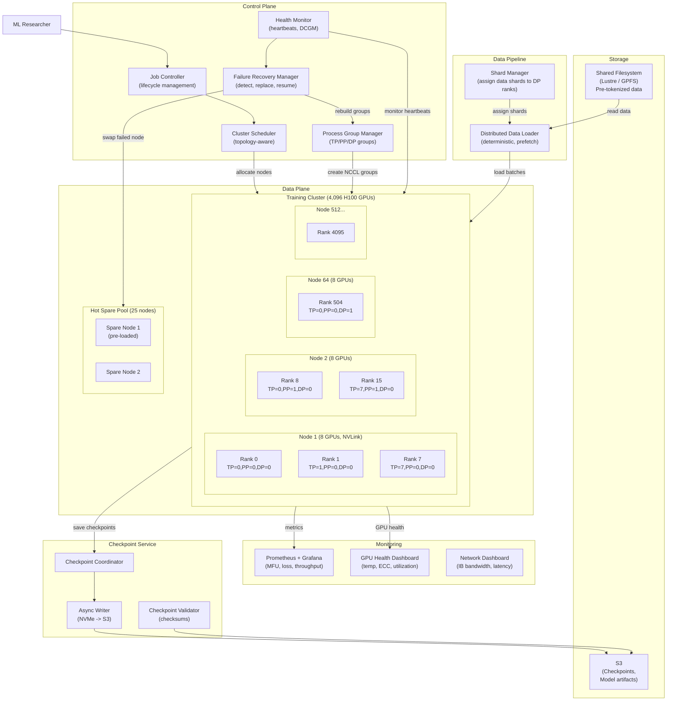
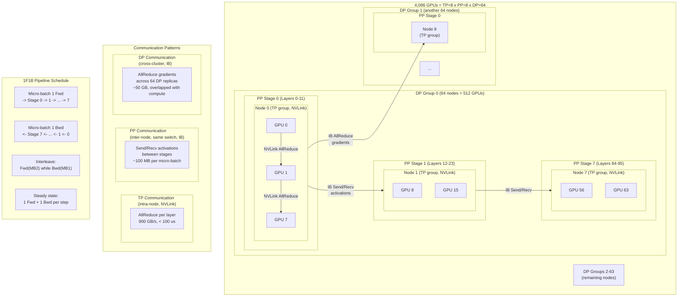
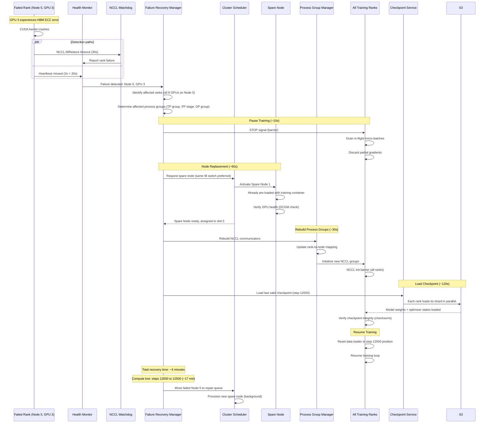

# Distributed Training Infrastructure -- Architecture Diagrams

## 1. High-Level Architecture

## 2. Deep-Dive: 4D Parallelism Layout and Communication

## 3. Critical Path: Failure Detection and Recovery

