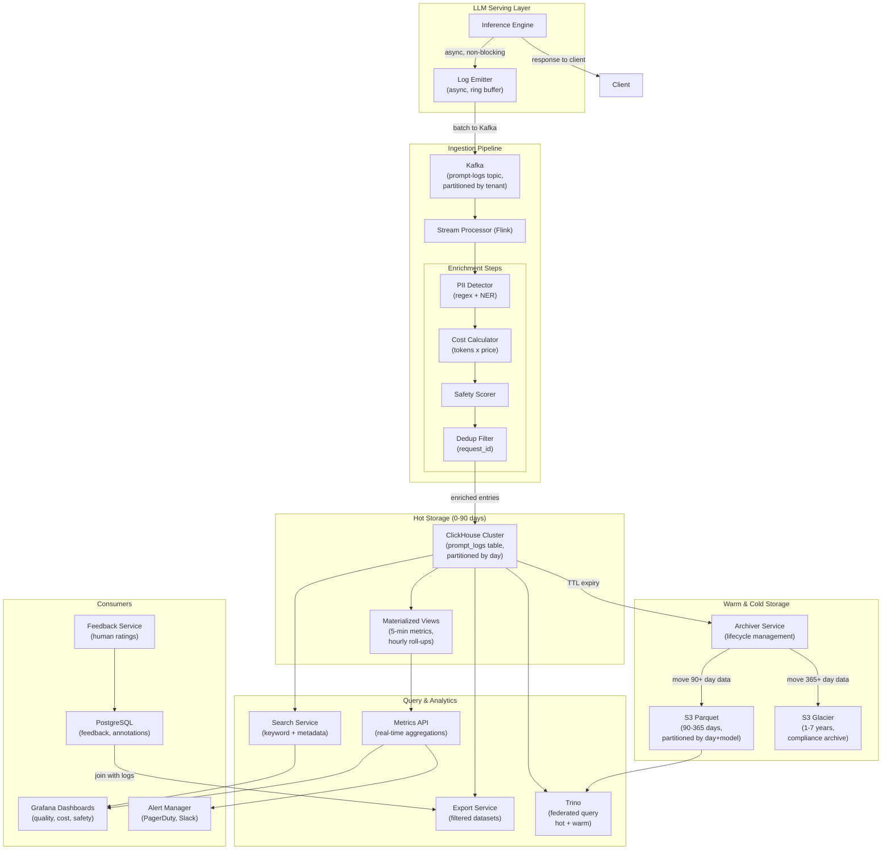
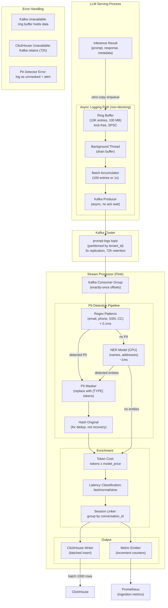
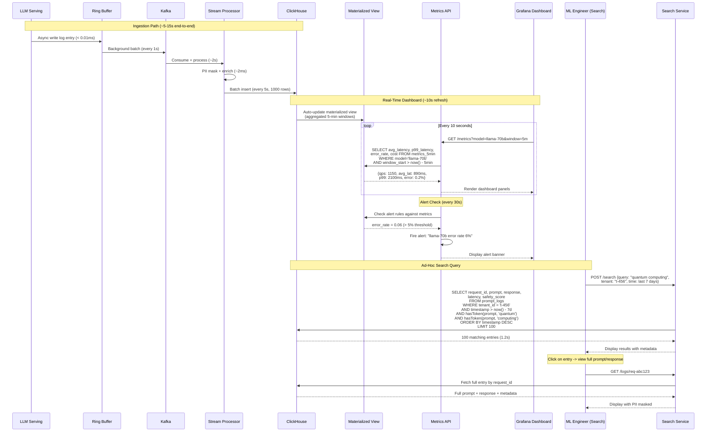

# Prompt Logging & Observability System -- Architecture Diagrams

## 1. High-Level Architecture

## 2. Deep-Dive: Async Ingestion Pipeline with PII Masking

## 3. Critical Path: Query and Real-Time Dashboard Refresh

