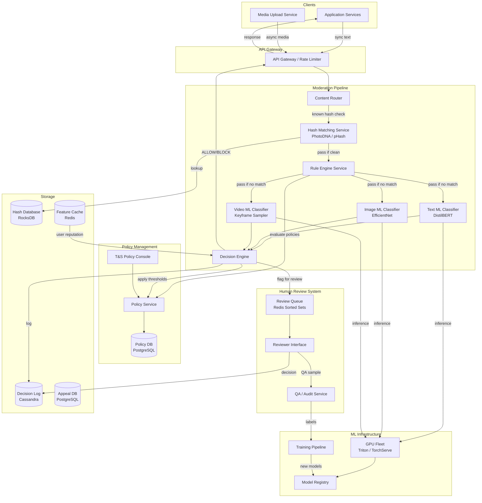
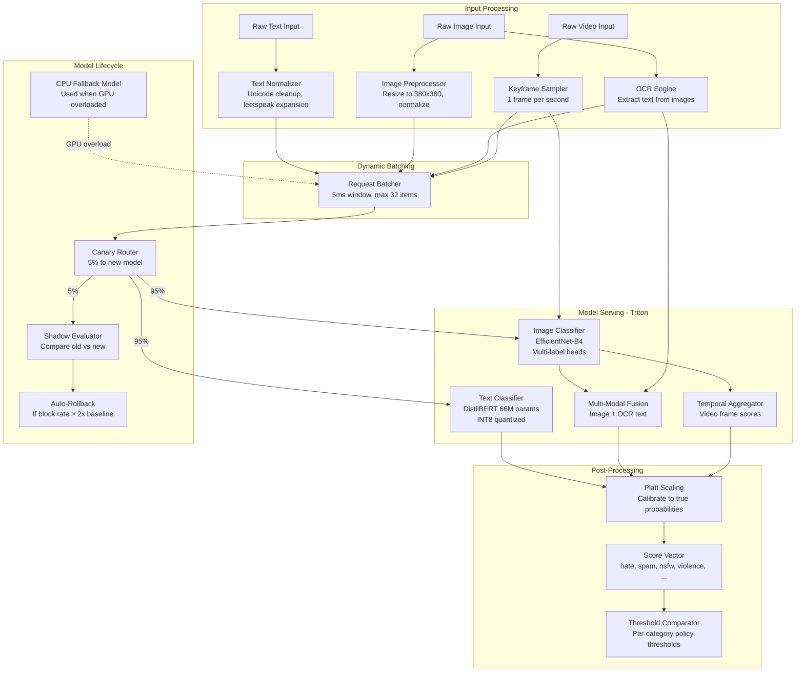
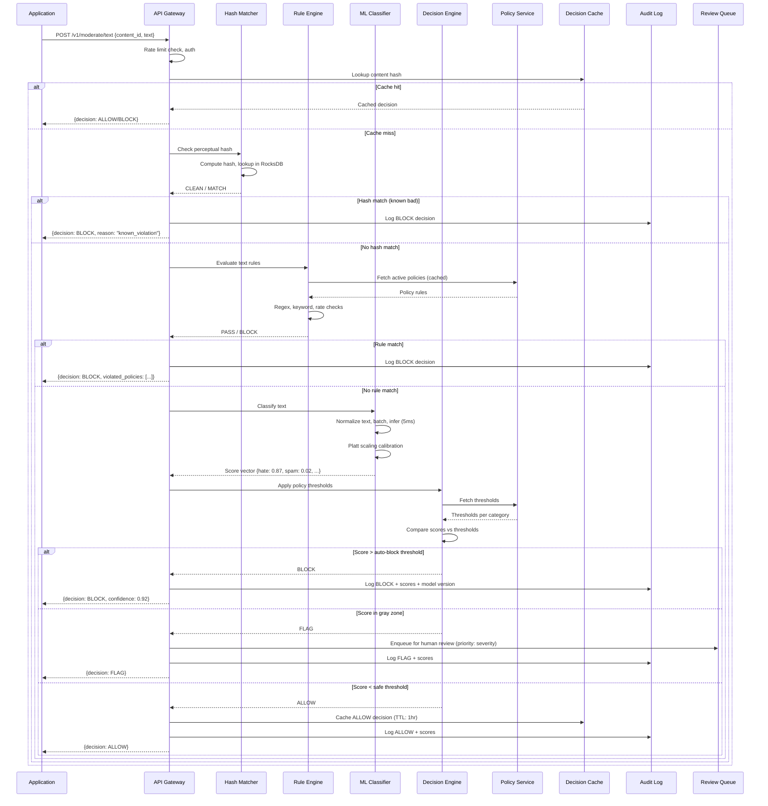

# Safety / Moderation Filtering System — Architecture Diagrams

## 1. High-Level Architecture

```mermaid
flowchart TB
    subgraph Clients
        APP[Application Services]
        UPLOAD[Media Upload Service]
    end

    subgraph API_Layer[API Gateway]
        GW[API Gateway / Rate Limiter]
    end

    subgraph Moderation_Pipeline[Moderation Pipeline]
        ROUTER[Content Router]
        HASH[Hash Matching Service<br/>PhotoDNA / pHash]
        RULE[Rule Engine Service]
        ML_TEXT[Text ML Classifier<br/>DistilBERT]
        ML_IMAGE[Image ML Classifier<br/>EfficientNet]
        ML_VIDEO[Video ML Classifier<br/>Keyframe Sampler]
        DECISION[Decision Engine]
    end

    subgraph Human_Review[Human Review System]
        QUEUE[Review Queue<br/>Redis Sorted Sets]
        REVIEWER_UI[Reviewer Interface]
        QA[QA / Audit Service]
    end

    subgraph Policy_Management[Policy Management]
        CONSOLE[T&S Policy Console]
        POLICY_SVC[Policy Service]
        POLICY_DB[(Policy DB<br/>PostgreSQL)]
    end

    subgraph Storage
        HASH_DB[(Hash Database<br/>RocksDB)]
        DECISION_LOG[(Decision Log<br/>Cassandra)]
        APPEAL_DB[(Appeal DB<br/>PostgreSQL)]
        FEATURE_CACHE[(Feature Cache<br/>Redis)]
    end

    subgraph ML_Infra[ML Infrastructure]
        GPU_FLEET[GPU Fleet<br/>Triton / TorchServe]
        MODEL_REGISTRY[Model Registry]
        TRAINING[Training Pipeline]
    end

    APP -->|sync text| GW
    UPLOAD -->|async media| GW
    GW --> ROUTER
    ROUTER -->|known hash check| HASH
    HASH -->|lookup| HASH_DB
    HASH -->|pass if clean| RULE
    RULE -->|evaluate policies| POLICY_SVC
    POLICY_SVC --> POLICY_DB
    RULE -->|pass if no match| ML_TEXT
    RULE -->|pass if no match| ML_IMAGE
    RULE -->|pass if no match| ML_VIDEO
    ML_TEXT -->|inference| GPU_FLEET
    ML_IMAGE -->|inference| GPU_FLEET
    ML_VIDEO -->|inference| GPU_FLEET
    GPU_FLEET --> MODEL_REGISTRY
    ML_TEXT --> DECISION
    ML_IMAGE --> DECISION
    ML_VIDEO --> DECISION
    DECISION -->|apply thresholds| POLICY_SVC
    DECISION -->|log| DECISION_LOG
    DECISION -->|flag for review| QUEUE
    DECISION -->|ALLOW/BLOCK| GW
    QUEUE --> REVIEWER_UI
    REVIEWER_UI -->|decision| DECISION_LOG
    REVIEWER_UI -->|QA sample| QA
    QA -->|labels| TRAINING
    TRAINING -->|new models| MODEL_REGISTRY
    CONSOLE --> POLICY_SVC
    FEATURE_CACHE -->|user reputation| DECISION
    GW -->|response| APP
```

## 2. Deep-Dive: ML Classification Pipeline

```mermaid
flowchart TB
    subgraph Input_Processing[Input Processing]
        TEXT_IN[Raw Text Input]
        IMG_IN[Raw Image Input]
        VID_IN[Raw Video Input]
        TEXT_NORM[Text Normalizer<br/>Unicode cleanup, leetspeak expansion]
        IMG_RESIZE[Image Preprocessor<br/>Resize to 380x380, normalize]
        VID_SAMPLE[Keyframe Sampler<br/>1 frame per second]
        OCR[OCR Engine<br/>Extract text from images]
    end

    subgraph Batch_Layer[Dynamic Batching]
        BATCHER[Request Batcher<br/>5ms window, max 32 items]
    end

    subgraph Model_Serving[Model Serving - Triton]
        TEXT_MODEL[Text Classifier<br/>DistilBERT 66M params<br/>INT8 quantized]
        IMG_MODEL[Image Classifier<br/>EfficientNet-B4<br/>Multi-label heads]
        MULTI_MODAL[Multi-Modal Fusion<br/>Image + OCR text]
        TEMPORAL[Temporal Aggregator<br/>Video frame scores]
    end

    subgraph Post_Processing[Post-Processing]
        CALIBRATE[Platt Scaling<br/>Calibrate to true probabilities]
        SCORE_VEC[Score Vector<br/>hate, spam, nsfw, violence, ...]
        THRESHOLD[Threshold Comparator<br/>Per-category policy thresholds]
    end

    subgraph Model_Management[Model Lifecycle]
        CANARY[Canary Router<br/>5% to new model]
        SHADOW[Shadow Evaluator<br/>Compare old vs new]
        ROLLBACK[Auto-Rollback<br/>If block rate > 2x baseline]
        FALLBACK[CPU Fallback Model<br/>Used when GPU overloaded]
    end

    TEXT_IN --> TEXT_NORM
    IMG_IN --> IMG_RESIZE
    IMG_IN --> OCR
    VID_IN --> VID_SAMPLE
    TEXT_NORM --> BATCHER
    IMG_RESIZE --> BATCHER
    OCR --> BATCHER
    VID_SAMPLE --> BATCHER
    BATCHER --> CANARY
    CANARY -->|95%| TEXT_MODEL
    CANARY -->|5%| SHADOW
    CANARY -->|95%| IMG_MODEL
    TEXT_MODEL --> CALIBRATE
    IMG_MODEL --> MULTI_MODAL
    OCR --> MULTI_MODAL
    MULTI_MODAL --> CALIBRATE
    VID_SAMPLE --> IMG_MODEL
    IMG_MODEL --> TEMPORAL
    TEMPORAL --> CALIBRATE
    CALIBRATE --> SCORE_VEC
    SCORE_VEC --> THRESHOLD
    SHADOW --> ROLLBACK
    FALLBACK -.->|GPU overload| BATCHER
```

## 3. Critical Path Sequence: Inline Text Moderation

```mermaid
sequenceDiagram
    participant App as Application
    participant GW as API Gateway
    participant Hash as Hash Matcher
    participant Rule as Rule Engine
    participant ML as ML Classifier
    participant Dec as Decision Engine
    participant Policy as Policy Service
    participant Cache as Decision Cache
    participant Log as Audit Log
    participant Queue as Review Queue

    App->>GW: POST /v1/moderate/text {content_id, text}
    GW->>GW: Rate limit check, auth

    GW->>Cache: Lookup content hash
    alt Cache hit
        Cache-->>GW: Cached decision
        GW-->>App: {decision: ALLOW/BLOCK}
    else Cache miss
        GW->>Hash: Check perceptual hash
        Hash->>Hash: Compute hash, lookup in RocksDB
        Hash-->>GW: CLEAN / MATCH

        alt Hash match (known bad)
            GW->>Log: Log BLOCK decision
            GW-->>App: {decision: BLOCK, reason: "known_violation"}
        else No hash match
            GW->>Rule: Evaluate text rules
            Rule->>Policy: Fetch active policies (cached)
            Policy-->>Rule: Policy rules
            Rule->>Rule: Regex, keyword, rate checks
            Rule-->>GW: PASS / BLOCK

            alt Rule match
                GW->>Log: Log BLOCK decision
                GW-->>App: {decision: BLOCK, violated_policies: [...]}
            else No rule match
                GW->>ML: Classify text
                ML->>ML: Normalize text, batch, infer (5ms)
                ML->>ML: Platt scaling calibration
                ML-->>GW: Score vector {hate: 0.87, spam: 0.02, ...}

                GW->>Dec: Apply policy thresholds
                Dec->>Policy: Fetch thresholds
                Policy-->>Dec: Thresholds per category
                Dec->>Dec: Compare scores vs thresholds

                alt Score > auto-block threshold
                    Dec-->>GW: BLOCK
                    GW->>Log: Log BLOCK + scores + model version
                    GW-->>App: {decision: BLOCK, confidence: 0.92}
                else Score in gray zone
                    Dec-->>GW: FLAG
                    GW->>Queue: Enqueue for human review (priority: severity)
                    GW->>Log: Log FLAG + scores
                    GW-->>App: {decision: FLAG}
                else Score < safe threshold
                    Dec-->>GW: ALLOW
                    GW->>Cache: Cache ALLOW decision (TTL: 1hr)
                    GW->>Log: Log ALLOW + scores
                    GW-->>App: {decision: ALLOW}
                end
            end
        end
    end
```
